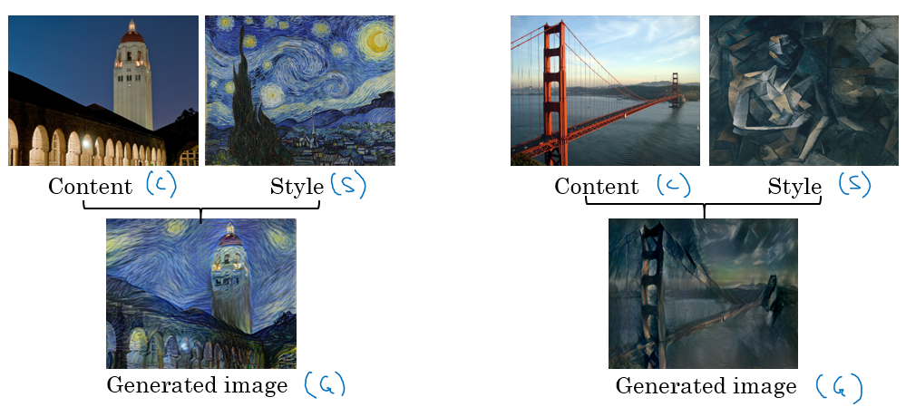

# Table of Contents

1. [Lecture-1 : Face Recognition](#lec1):
   1. [Face Verification vs Face Recognition](#lec1r1):
      1. [Face Verification](#lec1r1n1)
      2. [Face Recognition](#lec1r1n2)
2. [Lecture-2 : One Shot Learning](#lec2)
   1. [Learning a Similarity Function](#lec2r1)
3. [Lecture-3 : Siamese Network](#lec3)
4. [Lecture-4 : Triplet Loss](#lec4):
   1. [Learning objective](#lec4r1)
   2. [Loss function](#lec4r2)
5. [Lecture-5 : Face Verification and Binary Classification](#lec5):
   1. [Learning the similarity function ](#lec5r1)
6. [Lecture-7 : What do DeepConvNets actually learn?](#lec7)
7. [Neural Style Transfer](#Lec689):
   1. [Lecture-6 : What is a Neural style transfer](#lec6)
   2. [Lecture-8 : Neural Style Transfer Cost Function](#lec8)
   3. [Lecture-9 : Content Cost Function](#lec9)
   4. [Lecture-10 : Style Cost Function ](#lec10):
      1. [Meaning of style of an image](#lec10r1)
      2. [Intuition about style](#lec10r2)
      3. [Style Matrix](#lec10r3)

# Lecture-1 : Face Recognition

[please click here to watch the lecture video](https://www.youtube.com/watch?v=cOsMsPY0i_Y&list=PL1w8k37X_6L9YSIvLqO29S9H0aZ1ncglu&index=34&t=0s)

A *liveness detection* system was used for face-recognition at the entry-gate. What are these?

## Face verification vs. Face Recognition

### Face Verification

given input image, name/ID of a person, output whether the input image is of that person.

### Face Recognition

* database of K people
* get input image
* output ID if an input image belongs to any of those K people.
* worse problem than verification
* suppose K = 100, then the accuracy demand would be $\approx$ 99.99% (99 isn't high enough since it means that there is a chance that 1 out of 100 people wont be recognised)

# Lecture-2 : One Shot Learning

[please click here to watch the lecture video](https://www.youtube.com/watch?v=cxbSTfXddHU&list=PL1w8k37X_6L9YSIvLqO29S9H0aZ1ncglu&index=35&t=0s)

Recognise a person given just 1 input image corresponding to that person's face.

plain CNNs won't work, since they require large training set to yield higher accuracy. Moreover, if suppose this is used at an entry point, to let employees in. If a new employee, whose images haven't been ever fed into this CONVNET, is to be included into the valid list of faces(or rather classes), then the CONVNET has to be retrained again.

## Learning a Similarity Function

d(img$_{\textrm{1}}$, img$_{\textrm{2}}$) = degree of difference between the images. if d $\le \tau$ => same person, otherwise different.

after learning such a function, if suppose a new entrant arrives, just adding that person's image into the existing database is enough, we won't need to re-learn the function.

# Lecture-3 : Siamese Network

[please click here to watch the lecture video](https://www.youtube.com/watch?v=g3UGGAEbw_Q&list=PL1w8k37X_6L9YSIvLqO29S9H0aZ1ncglu&index=36&t=0s)

* ignore the output softmax layer for classification, focus on the last hidden layer composed of 128 neurons.
* let this 128-number vectorial representation be called f(X$^{[1]}$) for the input image x$^{[1]}$ , we will refer to this as the encoding of the input image.
* 
* the L2-norm of the difference in encoding of 2 input images is chosen as their similarity score.

[Taigman et. al., 2014. DeepFace closing the gap to human level performance](https://www.cv-foundation.org/openaccess/content_cvpr_2014/html/Taigman_DeepFace_Closing_the_2014_CVPR_paper.html)

Training involves the encoding results in a proper dissimilarity value(small if pictures are same. large if different).

# Lecture-4 : Triplet Loss

[please click here to watch the lecture video](https://www.youtube.com/watch?v=Hl8fjhNwOtg&list=PL1w8k37X_6L9YSIvLqO29S9H0aZ1ncglu&index=37&t=0s)

## Learning Objective

* look at an anchor image(A)(reference image), and compare it with other given images.
* positive(P) : same person, small dissimilarity, negative(N) : different person, large dissimilarity
* || f(A) - f(P) ||$^{2}$ - || f(A) - f(N) ||$^{2}$  + $\alpha$ $\le$ 0  , $\alpha$ = margin.(distance between positive and negative images should be greater than some lower-limit cutoff)
* the word *triplet* comes from the fact that while learning, we need to specify these 3-images as a triplet-tuple (A, P, N).
* [Schroff et al.,2015, FaceNet: A unified embedding for face recognition and clustering](https://arxiv.org/abs/1503.03832)

## Loss Function

$\cal{L}$(A, P, N) = max( $\lVert$ f(A) - f(P) $\rVert ^{2}$ - $\lVert$ f(A) - f(N) $ \rVert^{2}$  + $\alpha$,  0) , try to minimise this loss function, since if the objective is learnt, then the first quantity will be $\le$ 0, hence the loss value will be 0, but if its $\ge$0, then that means loss if positively high. 

J = $\sum\limits_{i=1}^{m} \cal{L}$(A$^{(\textrm{i})}$, P$^{(\textrm{i})}$, N$^{(\textrm{i})}$) . **training set** : 10K pictures of 1K people each.

Avoid randomly choosing A, P, N since there is a high chance that randomly chosen triplets will have the condition easily satisfied, thus leading to inadequate learning.

# Lecture-5 : Face Verification and Binary Classification 

[please click here to watch the lecture video](https://www.youtube.com/watch?v=GWa9xsMU0Pg&list=PL1w8k37X_6L9YSIvLqO29S9H0aZ1ncglu&index=38&t=0s)

## Learning the similarity function

* Another method would be to input the encoding of 2 images into a logistic classifier(sigmoid activation), such that $\hat{y}$ = 1 if person is the same, 0 otherwise. 
* hence we have a binary classification problem instead.
* 
* $\hat{\textrm{y}}$ = $\sigma(\sum\limits_{k=1}^{128}|\textrm{f(x}^{(i)})_{\textrm{k}} - \textrm{f(x}^{(j)})_{\textrm{k}}|)$ , sigmoid of element-wise difference of the encoding of the images to be compared.
* we could also treat these 128 numbers as features, hence $\hat{\textrm{y}}$ = $\sigma(\sum\limits_{k=1}^{128} \textrm{w}_{\textrm{i}}|\textrm{f(x}^{(i)})_{\textrm{k}} - \textrm{f(x}^{(j)})_{\textrm{k}}| + \textrm{b})$ 
* $\chi^2$ (kai-square)formula (Verify the formula online):
   $\hat{\textrm{y}}$ = $\sigma(\sum\limits_{k=1}^{128} \textrm{w}_{\textrm{i}}\frac{(\textrm{f(x}^{(i)})_{\textrm{k}} - \textrm{f(x}^{(j)})_{\textrm{k}})^{\textrm{2}}}{\textrm{f(x}^{(i)})_{\textrm{k}} + \textrm{f(x}^{(j)})_{\textrm{k}}} + \textrm{b})$ 
* now the input is a pair of images, and the output-label is 0 or 1.
* 1 small but useful optimisation would be to store the encoding of the image in the database, against whom an input-image would be compared against:
  * consider the face-recogniser that allows entry-exit of employees.
  * the input-image would be that of an incoming person, it would be compared with all the images corresponding to all employees, stored in some database.
  * this especially helps for a database with huge number of employees.

# Lecture-7 : What do DeepConvNets actually learn?

[please click here to watch the lecture video](https://www.youtube.com/watch?v=N-kmFnU0xEM&list=PL1w8k37X_6L9YSIvLqO29S9H0aZ1ncglu&index=39)

## Visualising what a deep network is learning

* consider an AlexNet like network
* [Zeiler and Fergus., 2013, Visualizing and understanding convolutional networks](https://arxiv.org/abs/1311.2901)
* consider 1 unit of the 1$^{\textrm{st}}$ layer:
  * 
  * a unit means all those operations that lead to the formation of 1 output channel(number of input-channels = 	n$_{C}^{[l-1]}$ , number of output channels = n$_{\textrm{C}}^{[\textrm{l}]} $ ).
  * hence, for a 3$\times$3 filter, the input image block would be divided into numerous 9-sized patches(3$\times$3$\times$n$_{\textrm{C}}^{[\textrm{l-1}]} $ ), to generate each output grid-cell(for 1 output channel).
  * out of these n$_{\textrm{H}}^{[\textrm{l}]} \times$n$_{\textrm{W}}^{[\textrm{l}]}$ output grid-cells for this output-channel, locate the maximum pixel value, and hence the corresponding image patch that gave this maximum value.
  * Repeat this for other units, i.e. other channels of the output(or rather all other kernels used, since number of kernels used in layer l = number of channels of the output, i.e. n$_{\textrm{C}}^{[\textrm{l}]}$).
* for the above image, it looks like the uppermost-leftmost patch looks for a line inclined at 135$^{\circ}$ to the horizontal axis:
  * and the patch just right of it looks for a line inclined at 45$^{\circ}$ to the horizontal axis.
  * the patch on the right look for green colour
  * the 4$^{\textrm{th}}$ patch favours orange images.
* for the various layers 1, 2, 3, 4, 5:
  * 
  * we saw rough lines and particularly favoured colours for layer 1
  * layer 2 had more complicated patches than layer 1, which suggests that it might be detecting complex shapes, w.r.t. layer 1.
  * layer 3 becomes more complicated than layer 2, it is favouring rounded shapes, people, complex textured surfaces.
  * layer 4 becomes more complicated than layer 3, it is favouring dogs, water, legs of birds .
  * layer 4 becomes more complicated than layer 4, it has become a dog-detector, keyboards and keyboard-like-texture, flower-detector .
* A good explanation on how to get **receptive field** given a layer :
  * 
  * From [A guide to receptive field arithmetic for Convolutional Neural Networks](https://medium.com/@nikasa1889/a-guide-to-receptive-field-arithmetic-for-convolutional-neural-networks-e0f514068807)

# Neural Style Transfer

## Introduction to Neural Transfer

[please click here to watch the lecture video](https://www.youtube.com/watch?v=idADYs20QKw&list=PL1w8k37X_6L9YSIvLqO29S9H0aZ1ncglu&index=38)

* generate artwork from a image
* 
* *redraw* image into a particular style of choice.
* C - content image, S - style image, G - generated image.
* 

## Cost Function

[please click here to watch the lecture video](https://www.youtube.com/watch?v=zOaNQ4iLCJI&list=PL1w8k37X_6L9YSIvLqO29S9H0aZ1ncglu&index=40)

J(G) = $\alpha$J$_\textrm{content}$(C, G) + $\beta$J$_{\textrm{style}}$(S, G) ; 

J$_\textrm{content}$(C, G) = measure of similarity of content between the content and the generated image(after style transfer)

J$_{\textrm{style}}$(S, G) = measure of similarity of style between the style and the generated image(after style transfer)

### Algorithm to generate an style-transferred image

1. Initialise G randomly , for eg. 100$\times$100$\times$3 :	
   1. 
2. use optimisation algorithm to minimise J(G)
3. learning procedure:
   1. 

## Content Cost Function

[please click here to watch the lecture video](https://www.youtube.com/watch?v=zBqUDzBOk6w&list=PL1w8k37X_6L9YSIvLqO29S9H0aZ1ncglu&index=41)

Say you use hidden layer **l**

- If l is chosen to be small (like choosing the 1$^{\textrm{st}}$ layer), the network would be forced to give output similar to the original content image. Question: why not use deeper values of l? 
- In practice l is not too shallow and not too deep , in the middle.

Use a pre-trained ConvNet(for instance a VGG net):

* if the activations(Look what are activations in the week-1 notes) of layer l on the C,G images , i.e. a$^{(C)[l]}$ and a$^{(G)[l]}$ respectively, are similar, both images have similar content.
* J$_{\textrm{content}}$(C, G) = $\sum\limits_{l}\frac{1}{2}\lVert$ a$^{(C)[l]} - $ a$^{(G)[l]}$ $\rVert ^{\textrm{2}}$   sum of squared-element-wise differences.

## Style Cost Function

[please click here to watch the lecture video]()

[research paper]()

### Meaning of *style* of an image

* suppose the activations of  layer l are used to measure *style*.
* *style* = use correlation between activations across all channels:
  * consider the activations across 2 channels.
  * for the same x,y pixel coordinate, we are finding the correlation-coefficient value between the pixel value across these 2 channels.
  * repeat this pairwise for all possible pairs of channels.

### Intuition about style of an image

* high correlations between 2 channels indicate that if a certain texture occurs in an image(texture refers to a particular channel's pixel orientation and distribution), then the other texture is highly likely to also occur.
* **unnormalised cross-covariance** is actually used, and not the actual calculation of any  correlation coefficients.
* Use this to check the generated image, G, whether a similar correlation is observed or not, to detect how much of the *style* has been **transferred**.

### Style Matrix

* a$_{i, j, k}^{[l]}$  = activation at i,j pixel coordinate, k$^{\textrm{th}}$ channel . the correlation(**unnormalised cross-covariance**) matrix G$^{[l]}$ is n$_{\textrm{C}}^{[l]} \times$ n$_{\textrm{C}}^{[l]}$ (the correlation with itself will also exist, hence instead of $\frac{n(n-1)}{2}$ it will be n$\times$n .)
* G$_{k,k'}^{[l]}$ = $\sum\limits_{i=1}^{\textrm{n}_\textrm{H}}\sum\limits_{j=1}^{\textrm{n}_\textrm{W}} \textrm{a}^{[l]}_{i, j, k} \textrm{a}^{[l]}_{i, j, k'}$  
* compute the same for the generated image, G.
* G$_{k,k'}^{[l](S)}$ = $\sum\limits_{i=1}^{\textrm{n}_\textrm{H}}\sum\limits_{j=1}^{\textrm{n}_\textrm{W}} \textrm{a}^{[l](S)}_{i, j, k} \textrm{a}^{[l](S)}_{i, j, k'}$  , G$_{k,k'}^{[l](G)}$ = $\sum\limits_{i=1}^{\textrm{n}_\textrm{H}}\sum\limits_{j=1}^{\textrm{n}_\textrm{W}} \textrm{a}^{[l](G)}_{i, j, k} \textrm{a}^{[l](G)}_{i, j, k'}$  
* such a  matrix is usually called *gram matrix*.
* J$_{\textrm{style}}^{[l]}$(S, G) = $N \lVert \textrm{G}_{k, k'}^{[l](S)} - \textrm{G}_{k, k'}^{[l](G)} \rVert^{2}_{F} = N \sum\limits_{k=1}^{n_{C}}\sum\limits_{k'=1}^{n_{C}} (G^{[l](S)}_{k, k'} - G^{[l](G)}_{k, k'})^{2}$. 
* N = normalisation constant, N = $(\frac{1}{2n_{H}^{[l]}n_{W}^{[l]} n_{C}^{[l]}})^{2}$ 
* F denotes the frobenius norm, since these are matrices. 
* visually pleasant results are observed if style matrices from multiple layers are calculated 
  * J$_{\textrm{style}}^{[l]}$(S, G) = $\sum\limits_{l}\lambda^{[l]}J_{style}^{[l]}(S, G)$ , $\lambda$ is a hyperparameter for each layer.
  * this allows both complex layers and simple layers to be included while finding the *style*