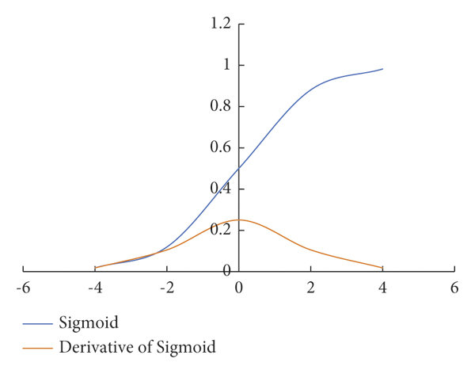
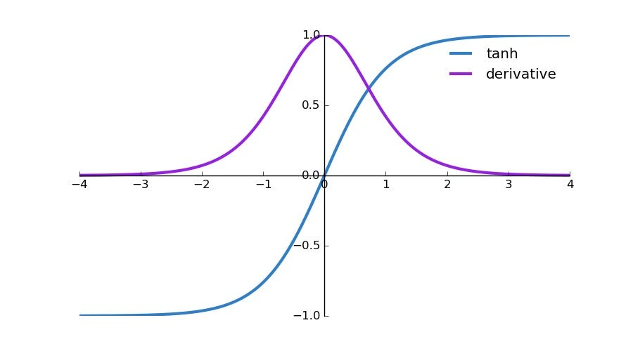
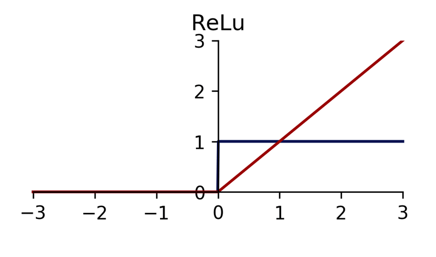
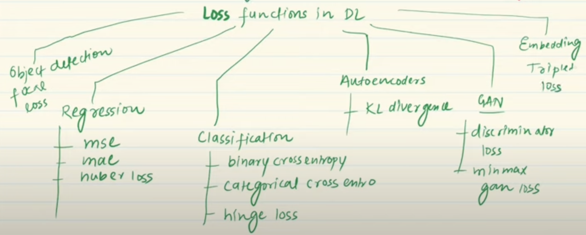

# Perceptron
1. single layer NN
2. activation = Step function S; S = (`sum >= 0 ? 1 : 0`)
    1. sum = $\sum w_ix_i$
3. basically a binary classifier.
4. **Drawback** : can only work in problems where the samples are distributed in a cluster format, i.e. all positive samples are on one side of the d-dimensional space, and the negative on the other.
    1. this can be verified as a 2D feature set problem, such that the perceptron becomes z = (Ax + By) >= 0 , x and y are the features.
    2. would fail/perform poorly, say when positive samples are inside a d-dimensional closed region(such as a sphere) and all negative samples are outside of it.
5. for binary classification, hinge-loss (seen in SVM) is used, with y = (-1, 1) and step function as (-1, 1) \[instead of (0,1)\].
    1. $\mathcal{L} = \sum\limits_{i=1}^n max(0, -y_i f(x_i))$ , $f(x_i) = \sum\limits_{j=1}^d w_jx_{i, j}$
    2. when $y_i f(x_i) \ge 0$ then $\mathcal{L} = 0$ (meaning both are of the same sign, i.e. perfect binary classification).
    3. when $y_i f(x_i) \lt 0$ then $\mathcal{L} = -y_i f(x_i)$ (meaning both are of the opposite sign, i.e. perfect mislabelling).
    4. as for gradient update step, 
        1. $\frac{\partial \mathcal{L}}{\partial w_j} = 0 $ if $y_i f(x_i) \ge 0$, since loss is constant at 0.
        2. If $y_i f(x_i) \lt 0$, $\frac{\partial \mathcal{L}}{\partial w_j} = \frac{\partial \mathcal{L}}{\partial f(x_i)}\times \frac{\partial f(x_i)}{\partial w_j}  = -y_i x_{i, j}$
        3. for this perceptron, f(x) is assumed to be Linear function.
6. Perceptron can morph into classic ML models as follows:
    1. by itself, if the step function is used in the -1,1 format, then its a linear SVM.
    2. if instead of step function, sigmoid is used for activation, with hinge-loss replaced by binary cross entropy, this becomes a logistic regressor.
    3. if softmax is used for activation, with categorical cross-entropy as loss, this becomes a multi-class classifier.
    4. if MSE if used as loss, this becomes a linear regressor (assuming linear activation).

# Multi-Layer Perceptron
- rather than the `out_dim = 1` , here `out_dim` can be anything.
- for each layer, total trainable parameters = `out_dim x in_dim + out_dim`, since each neuron of this layer is outputing a term, it will have its bias term as well.
    - `out_dim` = #neurons in this layer.
- perceptrons linked one after the other, outputting either a softmax (classification) or ReLU (regression) activation layer.
- loss function is task dependent.

# Activation Functions
- all layers are linearly activated --> solving a linear regression/classification, where the weight matrix can be expressed as the params of all layers.
- these help capture non-linearity, catering to **non-linearly separable problems**.
- should be differentiable since in backprop step gradient calculation is required.
- it helps if its zero-centred(mean = 0) , as explained in the [tanh](#tanh) section, it makes gradients have different signs which ensures different kinds of updates(increment/decrement) experienced per parameter.
- saturating functions (range is confined, for instance sigmoid -> (0,1), tanh -> (-1,1)), might lead to vanishing gradient problem.

## Sigmoid
- $\sigma(x) = \frac{1}{1+e^{-x}}$
- this is how gradients vanish (larger values of x) \

- non-zero centred (mean isn't 0, rather integrating from $-\infty$ to $+\infty$ gives almost $+\infty$).
- even using this in a single early layer can lead to slow convergence due to its nature of pushing x closer to extremes(0 or 1).
    - for the same layer, all params will either be increased or decreased (as explained in the [tanh](#tanh) section), depending on the sign of all common terms in the expanded form of gradient using chain rule.

## Hyperbolic Tan (tanh)
- $tanh(x) = \frac{e^{2x}-1}{e^{2x}+1} = \frac{1-e^{-2x}}{1+e^{-2x}}$
- 
- this is zero centred, i.e. mean = 0
    - $\bar{f(x)} = \frac{1}{b-a}\int\limits_a^b tanh(x) = \frac{1}{b-a} tanh^{-1}(x) |_a^b = \frac{1}{b-a} \frac{1}{2}ln\left( \frac{1+x}{1-x}\right) |_a^b = \frac{1}{2(b-a)} ln\left( \frac{(1+b)(1-a)}{(1-b)(1+a)}\right)$
    - $b \rightarrow +\infty, a \rightarrow -\infty \Rightarrow = \frac{1}{2\times 2\times \infty} \times 0 = 0$
    - due to this, some gradients (on expanding the chain rule and expressing gradients as $a_{21}, a_{22}$, outputs from previous layer) can be positive and others negative due to these O values being + or - due to the range of tanh. this ensures updates in different directions for all parameters, which may be required as per their location in the loss-curve.
    
- vanishing gradient is only seen for large absolute values of x, since the gradient tends to 0.

## Rectified Linear (ReLU)
- $f(x) = max(0, x)$
- 
- gradient doesn't vanish always
- faster convergence.HOW?

# Loss Functions

1. Loss Function = evaluated over a single sample, **Cost function** = over the entire batch, hence the *1/n* and *summation* terms appear.

## MSE - Mean Squared Error
1. would've preferred MAE, but this is a convex function (also *differentiable*), hence applicability of GD (Refer to Proof of WHY GD WORKS, ASSUMPTIONS TAKEN).
2. insensitive to outliers, i.e. $y_t$=1000, $y_o$=500 means huge loss, as opposed to generic case of $y_t, y_o$=(10,5). Hence **makes** the model **deviate** from true nature of most of the data.

## Huber Loss
1. $\mathcal{L} = \begin{cases}\frac{1}{2}(y-\hat{y})^2 & \textrm{for} \left|y-\hat{y}\right| \le \delta \\ \delta \left|y-\hat{y}\right| - \frac{1}{2}\delta^2 \end{cases}$
2. the comparison with $\delta$ is basically an outlier check, if a point is an outlier the loss function becomes a modified MAE, **without** any **issues of non-convexity** and **non-differentiability**.

## Binary Cross Entropy
1. another term for log-loss used in logistic regressor.
2. this is also convex, as its 2nd derivative is non-negative.
    1. when evaluated for single-layer NN, w.r.t. any weight parameter $w_j$, it turns out to be $x_{i,j}^2.\hat{y_j}(1-\hat{y_j})$, with $y_j$ being in the limit (0, 1) due to sigmoid activation.

## Categorical Cross Entropy
1. multi-class version of the above, also used as Softmax Logistic Regression.
2. target variable supplied while training needs to be one-hot encoded.

## Sparse categorical cross entropy
1. target variable supplied while training needs to be label encoded.

# Back Propagation
1.  