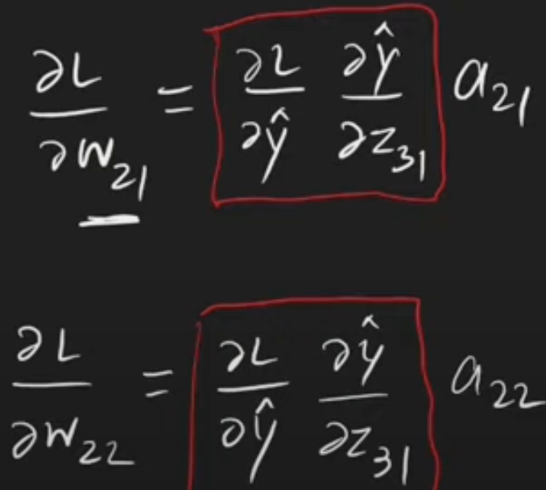
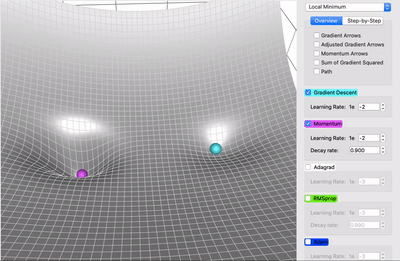

# Introduction
- the point of ML/DL is not only finding $f(X) \rightarrow Y$, i.e. the relationship/mapping between a representation and the output, 
    - its also to *learn* a *new representation* based on the given representation, which could potentially be more useful to learn the mapping to the final output.
- for example, in the given image, Cartesian coordinates is the given representation, Polar coordinates is the learned representation, which has a clearer relationship with the output , i.e. color (class): 
- **why is deep learning *deep***
    - depth implies depth of the computational graph. this is basically the no. of computations done sequentially, and not parallely. In the following logistic regression's computational graph, observe that the multiplications of $w_1$ with $x_1$ and $w_2$ with $x_2$ are not placed one after the other (sequential) instead are placed s.t. they will occur simultaenously, i.e. are parallel. \
    It has a depth of 2 
    - depth could also imply the *depth of the graph describing the concepts are related to each other*. This is called depth by *deep probabilistic modeling*.\
    This will be much lower than the above computational graph.
        - take a CNN for instance, say the first layer detects edges and the other detects corners.
        - corners are formed by 2 intersecting edges, hence the concept-based depth = 2, whereas the computational graph depth = 2n.
- 

# Expected Dataset size
- As of 2016, a rough rule of thumb is that a supervised deep learning algorithm will generally achieve acceptable performance with around 5,000 labeled examples per category, and will match or exceed human performance when trained with a dataset containing at least 10 million labeled examples. 

# Matrices
- $f(A)_{ij}$ = i,j'th element of the matrix obtained after applying function $f$ to matrix $A$.

## Addition of a vector with a matrix
- $\mathbf{C}, \mathbf{A}$ : matrix, $\mathbf{b}$: vector (upper-case: matrices, lower-case: vectors, vectors will be always of shape (n,) , single dimensional, but a columnar representation)
- $\mathbf{C}= \mathbf{A} + \mathbf{b} \Rightarrow C_{ij} = A_{ij} + b_j$
- This implicit copying of b to many locations is called *broadcasting*.

## Element-wise product, i.e. *Hadamard* Product
- $\mathbf{C}= \mathbf{A}\odot \mathbf{B} \Rightarrow C_{ij} = A_{ij} \times B_{ij}$

# Tensors
- array with variable no. of axes, represented by $\mathcal{A}$ 

# Perceptron
1. single layer NN
2. activation = Step function S; S = (`sum >= 0 ? 1 : 0`)
    1. sum = $\left(\sum\limits_{i=1}^{d} w_ix_i\right) + b$, i: $i^{th}$ feature
    2. the original single layer perceptron, introduced by Frank Rosenblatt in 1953, used step function as its activation function
3. basically a binary classifier.
4. observe that this activation function is non-differentiable at x = 0. $\begin{align} RHD: \mathcal{f'}(0) = \lim\limits_{h\to 0^+}\dfrac{\mathcal{f}(0+h) - \mathcal{f}(0)}{h} = \frac{1-1}{h} = \frac{0}{0} \text{ indeterminate form, using L'Hopital's rule } = \frac{0}{1} = 0 \\ LHD: \mathcal{f'}(0) = \lim\limits_{h\to 0^-}\dfrac{\mathcal{f}(0+h) - \mathcal{f}(0)}{h} = \frac{0 - 1}{h} = +\infty \end{align}$
    1. hence, gradient descent wasn't used in the parameter update equation
    2. they instead calculated the error: $e = y - S$, then used this in place of the gradient in the update equation: $w_{new} = w_{old} - \eta e\mathbf{x}$, $\mathbf{x}$ being the feature vector used of the current sample whose prediction and error was just calculated. 
    3. Note: **update step** is calculated for each **individual sample**.
5. **Drawback** : can only work in problems where the samples are distributed in a cluster format, i.e. all positive samples are on one side of the d-dimensional space, and the negative on the other.
    1. this can be verified as a 2D feature set problem, such that the perceptron becomes z = (Ax + By) >= 0 , x and y are the features. (when d = 2, i.e. x-axis : feature-1, y-axis: feature-2, then this SLP functions like a hyperplane dividing the feature space into 2 regions: class 1 and class 0)
    2. would fail/perform poorly, say when positive samples are inside a d-dimensional closed region(such as a sphere) and all negative samples are outside of it (just like a hyperplane, as was observed in SVMs).
6. for binary classification, hinge-loss (seen in SVM) is used, with y = (-1, 1) and step function as (-1, 1) \[instead of (0,1)\]. (since SVMs also had classes as +1 and -1, hinge loss suited there, and suits w.r.t. this new step function definition)
    1. $\mathcal{L} = \sum\limits_{i=1}^n max(0, -y_i f(x_i))$ , $f(x_i) = \sum\limits_{j=1}^d w_jx_{i, j}$
    2. when $y_i f(x_i) \ge 0$ then $\mathcal{L} = 0$ (meaning both are of the same sign, i.e. perfect binary classification).
    3. when $y_i f(x_i) \lt 0$ then $\mathcal{L} = -y_i f(x_i)$ (meaning both are of the opposite sign, i.e. perfect mislabelling).
    4. as for gradient update step, 
        1. $\frac{\partial \mathcal{L}}{\partial w_j} = 0 $ if $y_i f(x_i) \ge 0$, since loss is constant at 0.
        2. If $y_i f(x_i) \lt 0$, $\frac{\partial \mathcal{L}}{\partial w_j} = \frac{\partial \mathcal{L}}{\partial f(x_i)}\times \frac{\partial f(x_i)}{\partial w_j}  = -y_i x_{i, j}$
        3. for this perceptron, f(x) is assumed to be Linear function.
6. Perceptron can morph into classic ML models as follows:
    1. when the step function is used in the -1,1 format, they behave similar to linear SVM(not identical because SVMs are based on the maximum margin principle, whereas no such basis for single layer perceptrons with this step function).
    2. if instead of step function, sigmoid is used for activation, with hinge-loss replaced by binary cross entropy, this becomes a logistic regressor.
    3. if softmax is used for activation, with categorical cross-entropy as loss, this becomes a multi-class classifier.
    4. if MSE if used as loss, this becomes a linear regressor (assuming linear activation).

# Multi-Layer Perceptron
- Frank Rosenblatt's definition only support 1 output neuron, but for an MLP, the `out_dim` can be anything.
- Frank Rosenblatt's definition only supported 1 layer, here there can be multiple layers.
- for each layer, total trainable parameters = `out_dim x in_dim + out_dim`, since each neuron of this layer is outputing a term, it will have its bias term as well.
    - `out_dim` = #neurons in this layer.
- loss function is task dependent.

# Activation Functions

## Why activation functions?
- absence of an activation function $\rightarrow$ all layers are linearly activated $\rightarrow$ solving like a linear regressor/classifier, where the weight matrix of this effective linear regressor/classifier can be expressed in terms of the parameters (weights, biases) of all layers.
- **non-linear activation** functions help **capture non-linearity**, catering to **non-linearly separable problems**.
- should be differentiable since in backprop step gradient calculation is required.
- it helps if its zero-centred(mean = 0) , as explained in the [tanh](#tanh) section, it makes gradients have different signs which ensures different kinds of updates(increment/decrement) experienced per parameter.
- saturating functions (range is confined, for instance sigmoid -> (0,1), tanh -> (-1,1)) might lead to vanishing gradient problem.

## Sigmoid
- $\sigma(x) = \frac{1}{1+e^{-x}} \quad , \nabla\sigma(x) = \sigma(x)(1-\sigma(x))$, 
- this is how gradients vanish (larger values of x, **vanishing gradient problem in sigmoid**) \

- non-zero centred (mean isn't 0, rather integrating from $-\infty$ to $+\infty$ gives almost $+\infty$).
- even using this in a single early layer can lead to slow convergence due to its nature of pushing x closer to extremes(0 or 1).
    - for the same layer, all params will either be increased or decreased (as explained in the [tanh](#tanh) section), depending on the sign of all common terms in the expanded form of gradient using chain rule.
- also notice that the gradient ranges from 0 to 0.25
    - don't forget multiplication with the learning rate, which itself is quite small.
    - **0.25** is itself **quite small**, hence the **product of learning rate and the max. gradient** of sigmoid may still be very **small**, thus causing **small updates**, thus leading to **slower convergence**.
    - and if say multiple layers have sigmoid activation, this 0.25 will be multiplied those many times, hence the weight updates become even slower.

## Hyperbolic Tan (tanh)
- $tanh(x) = \frac{e^{2x}-1}{e^{2x}+1} = \frac{1-e^{-2x}}{1+e^{-2x}} \quad , \nabla tanh(x) = \dfrac{-1}{(1+e^{2x})^2}\left(\left(1+e^{2x}\right)\left(2e^{2x}\right) - \left(e^{2x}-1\right)\left(2e^{2x}\right) \right) = -\dfrac{4e^{2x}}{(1+e^{2x})^2} = -\dfrac{2.2e^{2x}}{(1+e^{2x})^2} = \dfrac{(  (e^{2x}+1) - (e^{2x} - 1) )((e^{2x}+1) + (e^{2x} - 1) )}{(1+e^{2x})^2} = -\dfrac{((1+e^{2x})^2)-((e^{2x}-1)^2)}{(1+e^{2x})^2} = 1 - \dfrac{(e^{2x}-1)^2}{(1+e^{2x})^2} = 1-tanh(x)^2$ 
    - 
- vanishing gradient is attained much faster than sigmoid
    - compare the slope of the two activation functions: 
    - since tanh is steeper, for much smaller values of x, its gradient reaches 0 compared to that of sigmoid.
- this is zero centred, i.e. mean = 0
    - $\bar{f(x)} = \dfrac{\int\limits_{a}^b f(x) p(x) dx}{\int\limits_{a}^b p(x) dx} = \dfrac{\int\limits_{a}^b\dfrac{ f(x)}{b-a} dx}{\int\limits_{a}^b \dfrac{ 1}{b-a}  dx} = \frac{1}{b-a} \int\limits_{a}^b f(x) dx$ 
        - this is mean in a fixed interval, keep in mind since all values are equally likely, uniform distribution was chosen
        - hence it seems as if mean value is essentially *area under the curve*. (this is because of the uniform distribution assumption)
    - $\bar{f(x)} = \frac{1}{b-a}\int\limits_a^b tanh(x) = \frac{1}{b-a} tanh^{-1}(x) |_a^b = \frac{1}{b-a} \frac{1}{2}ln\left( \frac{1+x}{1-x}\right) |_a^b = \frac{1}{2(b-a)} ln\left( \frac{(1+b)(1-a)}{(1-b)(1+a)}\right)$
    - $b \rightarrow +\infty, a \rightarrow -\infty \Rightarrow = \frac{1}{2\times 2\times \infty} \times 0 = 0$
    - due to this, some gradients (on expanding the chain rule and expressing gradients as $a_{21}, a_{22}$, outputs from previous layer) can be positive and others negative due to these O values being + or - due to the range of tanh. this ensures updates in different directions for all parameters, which may be required as per their location in the loss-curve. \
    

### Importance of mean-centering
- mean centering ensure that the gradient can take both positive and negative values, which is useful for balanced weight updates.

### Importance of different-direction exploration
- point of optimisation is to explore the loss landscape as much as possible and as efficiently as possible
- if gradients are such that they force to explore only in a fixed direction,
    - say the gradient is always negative, thus forcing us to always increase $w$ in the update equation $w_{new} = w_{old} - \eta\times \dfrac{\partial \mathcal{L}}{w}$ (always go to right)
    - assume the following loss landscape 
    - the problem with having always negative gradient is as we move right , the step size will decrease because the magnitude of the gradient becomes small, hence we will be stuck in this local minima.
    - if say we had the ability to explore the other direction, i.e. moving left, we could've found the 2nd minima, which is better than the current minima we are stuck at.
- we get this ability on choosing an activation function that is mean centered
    - being mean centered allows for positive and negative activation function values, in turn allowing for positive and negative gradients
    - weights can be updated in both directions, allowing the model to learn more flexibly. 
    - For example, in some parts of the network, the weights should increase, and in other parts, they should decrease, leading to a more effective and diverse search of the weight space.
- especially in deeper layers where opposite changes in weights might be necessary for learning more nuanced representations, having this ability becomes critical. 
- Example-1: sigmoid in deeper layer  
- Example-2: tanh in deeper layer 
- Example-3: sigmoid in early layer
    - won't be affecting weight updates of subsequent layers
    - for the previous layers, the same explanation as seen in example-1 will hold.
- Example-4: tanh in early layer 
    - essentially will/could affect the weight update direction of subsequent deeper layers as well
- Example-5: tanh followed by sigmoid 
- Example-6: sigmoid followed by tanh
    - the inputs to the tanh layer will always be positive.
    - so, the **weights of** the `tanh` **matter** here, if they are somehow able to make the sum effectively negative, then tanh and all subsequent and preceding layers get to enjoy the ability of different-direction updates.
- all sigmoid,tanh possibilities will be repeated in ReLU,tanh pairs as well.
    - but for Leaky ReLU, since it can output negative values, it itself behaves similar to a mean-centered activation function, and doesn't restrict tanh's different-direction update granting ability.
- keep in mind, even the linear activation function is mean-centered.

    

## Rectified Linear (ReLU)
- $f(x) = max(0, x)$   ,   
- gradient doesn't vanish always
- faster convergence.
    - keep in mind, faster convergence also includes total computation time to achieve that convergence, and not just the no. of gradient descent steps required.
    - since ReLU mitigates the vanishing gradient problems, the *updates* will be significant, thus theoretically bringing the model weights to their optimal value
    - since ReLU is basically computing maximisation, it is computationally much faster than sigmoid or tanh, that compute exponentiation of e.
        - this is because $e$ can be raised to whatever during forward pass and backpropagation.
        - 

### Dying ReLU Problem
- dead neurons, i.e. irrespective of input $O^{k-1,k}$ to $k^{th}$ ReLU activated layer, output $O^{k, k+1}$ has some columns as $\mathbf{0}$ vectors.
    - a dead neuron will stay dead forever: 
- Reasons
    - high learning rate, thus causing faster reductions in weights, making them negative and possibly $Z_1$ negative.
    - high negative bias, making $Z_1$ negative.
- hence, use variants of ReLU instead.

## Leaky ReLU
- $f(x) = max(0.01x, x)$
- now even if learning rate is high or bias is highly negative, activation would just spew a small negative number, and the gradient will be non-zero(0.01).

## Parametric ReLU
- $f(x) = \begin{cases} x & x > 0 \\ ax & \textrm{otherwise} \end{cases}$
- a : trainable hyperparameter.

## Exponential Linear Unit
- $f(x) = \begin{cases} x & x > 0 \\ \alpha \left(e^x-1\right) & \textrm{otherwise} \end{cases}$ 
- this is differentiable as well (at x=0), $lt._{x\rightarrow 0} \left( \frac{e^x-1}{x}\right)$
- evaluation of exponential makes this comparatively more computationally expensive.

## The science of layer index vs activation function to use
Finish this

# Loss Functions

1. Loss Function = evaluated over a single sample, **Cost function** = over the entire batch, hence the *1/n* and *summation* terms appear.

## MSE - Mean Squared Error
1. would've preferred MAE, but this is a convex function (also *differentiable*), hence applicability of GD (Refer to Proof of WHY GD WORKS, ASSUMPTIONS TAKEN).
2. insensitive to outliers, i.e. $y_t$=1000, $y_o$=500 means huge loss, as opposed to generic case of $y_t, y_o$=(10,5). Hence **makes** the model **deviate** from true nature of most of the data.

## Huber Loss
1. $\mathcal{L} = \begin{cases}\frac{1}{2}(y-\hat{y})^2 & \textrm{for} \left|y-\hat{y}\right| \le \delta \\ \delta \left|y-\hat{y}\right| - \frac{1}{2}\delta^2 \end{cases}$
2. the comparison with $\delta$ is basically an outlier check, if a point is an outlier the loss function becomes a modified MAE, **without** any **issues of non-convexity** and **non-differentiability**.
3. **Use this when**
    1. Your data contains outliers, and you don’t want them to dominate the loss.
    2. You want a balance between sensitivity to small errors and robustness to large errors.
    3. Your dataset could be/is chaotic.

## Binary Cross Entropy
1. another term for log-loss used in logistic regressor.
2. this is also convex, as its 2nd derivative is non-negative.
    1. when evaluated for single-layer NN, w.r.t. any weight parameter $w_j$, it turns out to be $x_{i,j}^2.\hat{y_j}(1-\hat{y_j})$, with $y_j$ being in the limit (0, 1) due to sigmoid activation.

## Categorical Cross Entropy
1. multi-class version of the above, also used as Softmax Logistic Regression.
2. target variable supplied while training needs to be one-hot encoded.
3. in `pytorch`, `torch.nn.CrossEntropyLoss()` criterion handles softmaxing and loss calculation, whereas for `keras`, you have to set activation of the last dense layer as `softmax` and then use the `categorical_crossentropy` as `loss` argument while compiling the model.
3. use this when
    1. 

## Sparse categorical cross entropy
1. target variable supplied while training needs to be label encoded.
2. use this when
    1. 

# Back Propagation

## Notations
1. $\mathcal{L}$: loss function, i.e. evaluated for a sample.
2. $\mathcal{C}$: cost function, i.e. evaluated for all samples, arithmetic mean of loss across all samples.
3. superscript l $\Rightarrow ^l$ : for l $^{th}$ layer.
4. subscript (j, k) $\Rightarrow _{j, k}$ : from j $^{th}$ input to k $^{th}$ output neuron.
5. parenthesized subscript ((i)) $\Rightarrow _{(i)}$ : for training sample i.
6. input matrix for layer l: $I^l$
    1. term $I^l_{j, (i)}$ represents the j $^{th}$ input to layer l from training sample i. this is the i $^{th}$ row j $^{th}$ column term in this matrix.
7. g: activation function , g' : derivative of this activation function.
8. output matrix for layer l: $O^l$
    1. term $O^l_{k, (i)}$ represents the k $^{th}$ output to layer l from training sample i. this is the i $^{th}$ row k $^{th}$ column term in this matrix.
9. Weight matrix for layer l: $W^l$
    1. term $W^l_{j, k}$ represents the weight from j $^{th}$ input to k $^{th}$ output at layer l. this is the j $^{th}$ row k $^{th}$ column term in this matrix.
    2. this is of order $in^l, out^l$
10. Z: pre-activate neuron output, represented by $Z^l$
    1. term $Z^l_{k, (i)}$ represents the k $^{th}$ output to layer l from training sample i. this is the i $^{th}$ row k $^{th}$ column term in this matrix.
    1. $O^l_{k, (i)} = g^L\left(Z^l_{k, (i)} \right)$
11. \# input-dimensions at layer l: $in^l$ , \# output-dimensions at layer l: $out^l$ , input to layer l is matrix $I^l$.

## At Last Layer

**Steps to calculate gradients of weights at the last layer.**
1. Considering last layer will have only 1 neuron.
2. $\nabla W^L = \begin{bmatrix} \frac{\partial \mathcal{C}}{\partial w^L_{1,1}} \\ \frac{\partial \mathcal{C}}{\partial w^L_{2,1}} \\ \vdots \\ \frac{\partial \mathcal{C}}{\partial w^L_{in_l,1}} \end{bmatrix}$ , $\frac{\partial \mathcal{C}}{\partial w^L_{1,1}} = \frac{1}{n}\sum\limits_{i=1}^n \frac{\partial \mathcal{L}}{\partial \hat{y}_i}.\frac{\partial \hat{y}_i}{\partial z_i}.\frac{\partial z_i}{\partial w^L_{1,1}}$ (chain rule)
3. Compute gradient of loss w.r.t. $\hat{y}$, based on derivative of loss function w.r.t. $\hat{y}$.
    1. for instance, w.r.t. MSE, $\frac{\partial \mathcal{L}}{\partial \hat{y}} = -2(y-\hat{y})$.
    2. $\frac{\partial \mathcal{C}}{\partial w^L_{1,1}} = \frac{1}{n}\sum\limits_{i=1}^n -2(y_i - \hat{y}_i).\frac{\partial \hat{y}_i}{\partial z_i}.\frac{\partial z_i}{\partial w^L_{1,1}}$ (chain rule)
    3. the matrix $\frac{\partial \mathcal{L}}{\partial \hat{y}}$ = $\begin{bmatrix} -2(y_1-\hat{y}_1) \\ -2(y_2-\hat{y}_2) \\ \vdots \\ -2(y_n-\hat{y}_n)  \end{bmatrix}$
4. Compute $\left(\frac{\partial \hat{y}}{\partial z} \right)$ derivative of output ($\hat{y}$) w.r.t. pre-activated z from the last layer(L $^{th}$ layer).
    1. this is simply g'(z), wherein $z^L_{1, (i)} = \sum\limits_{j=1}^{in^L} I^L_{j, (i)} w^L_{j, 1}$ (output from 1st neuron for training sample i)
    2. $\frac{\partial \mathcal{C}}{\partial w^L_{1,1}} = \frac{1}{n}\sum\limits_{i=1}^n -2(y_i - \hat{y}_i).g'^L(z^L_{1, (i)}).\frac{\partial z^L_{1, (i)}}{\partial w^L_{1,1}}$ (chain rule)
    3. the matrix $\frac{\partial \mathcal{\hat{y}}}{\partial z}$ = $\begin{bmatrix} g'^L(z^L_{1, (1)}) \\ g'^L(z^L_{1, (2)}) \\ \vdots \\ g'^L(z^L_{1, (n)})  \end{bmatrix}$ , where (,i) notation means quantity for the i $^{th}$ training sample.
5. Compute $\left(\frac{\partial z}{\partial w^L_{1,1}} \right)$ : derivative of pre-activated z w.r.t. weights of the last layer(L $^{th}$ layer).
    1. $z^L_{1, (i)} = \sum\limits_{j=1}^{in^L} I^L_{j, (i)} w^L_{j, 1} \Rightarrow \frac{\partial z^L_{1, (i)}}{\partial w^L_{1,1}} = I^L_{1, (i)} $
    2. $\frac{\partial \mathcal{C}}{\partial w^L_{1,1}} = \frac{1}{n}\sum\limits_{i=1}^n -2(y_i - \hat{y}_i).g'^L(z^L_{1, (i)}).I^L_{1, (i)}$ (chain rule)
6. $\therefore, \nabla W^L = \begin{bmatrix} \frac{1}{n}\sum\limits_{i=1}^n -2(y_i - \hat{y}_i).g'^L(z^L_{1, (i)}).I^L_{1, (i)} \\ \frac{1}{n}\sum\limits_{i=1}^n -2(y_i - \hat{y}_i).g'^L(z^L_{1, (i)}).I^L_{2, (i)} \\ \vdots \\ \frac{1}{n}\sum\limits_{i=1}^n -2(y_i - \hat{y}_i).g'^L(z^L_{1, (i)}).I^L_{in^L, (i)} \end{bmatrix} $, $\nabla \hat{Y} = \begin{bmatrix} -\frac{2}{n}(y_1-\hat{y}_1) \\ -\frac{2}{n}(y_2-\hat{y}_2) \\ \vdots \\ -\frac{2}{n}(y_n-\hat{y}_n)  \end{bmatrix} , g'^L(Z^L) = \begin{bmatrix} g'^L(z^L_{1, (1)}) \\ g'^L(z^L_{1, (2)}) \\ \vdots \\ g'^L(z^L_{1, (n)}) \end{bmatrix}$
    1. Element-wise matrix multiplication $F^L = \nabla \hat{Y} \odot g'^L(Z^L) = \begin{bmatrix} -\frac{2}{n}(y_1-\hat{y}_1)g'^L(z^L_{1, (1)}) \\ -\frac{2}{n}(y_2-\hat{y}_2)g'^L(z^L_{1, (2)}) \\ \vdots \\ -\frac{2}{n}(y_n-\hat{y}_n)g'^L(z^L_{1, (n)}) \end{bmatrix} $, with $I^L = \begin{bmatrix} I^L_{1, (1)} & I^L_{2, (1)} & \cdots & I^L_{in^L, (1)} \\ I^L_{1, (2)} & I^L_{2, (2)} & \cdots & I^L_{in^L, (2)} \\ \vdots & \vdots & \cdots & \vdots \\ I^L_{1, (n)} & I^L_{2, (n)} & \cdots & I^L_{in^L, (n)}  \end{bmatrix}$
    2. $(I^L)^T.F^L = \nabla W^L$
7. **The steps**
    1. Compute $\hat{Y}$ during forward pass
    2. during forward pass at layer L, store input $I^L$ and activation-derivative matrix $g'^L(Z^L)$
    3. $\nabla W^L = (I^L)^T.F^L$

## At previous layers, for eg. (L-1)'th layer
1. $W^{L-1} = \begin{bmatrix} w^{L-1}_{1,1} & w^{L-1}_{1,2} & \cdots & w^{L-1}_{1, out^{L-1}} \\ w^{L-1}_{2,1} & w^{L-1}_{2,2} & \cdots & w^{L-1}_{2, out^{L-1}} \\ \vdots \\ w^{L-1}_{in^{L-1},1} & w^{L-1}_{in^{L-1},2} & \cdots & w^{L-1}_{in^{L-1}, out^{L-1}} \end{bmatrix}, \nabla W^{L-1} = \begin{bmatrix} \frac{\partial \mathcal{C}}{\partial w^{L-1}_{1,1}} &  \frac{\partial \mathcal{C}}{\partial w^{L-1}_{1,2}} & \cdots & \frac{\partial \mathcal{C}}{\partial w^{L-1}_{1, out^{L-1}}} \\ \frac{\partial \mathcal{C}}{\partial w^{L-1}_{2,1}} & \frac{\partial \mathcal{C}}{\partial w^{L-1}_{2,2}} & \cdots & \frac{\partial \mathcal{C}}{\partial w^{L-1}_{2, out^{L-1}}} \\ \vdots \\ \frac{\partial \mathcal{C}}{\partial w^{L-1}_{in^{L-1},1}} & \frac{\partial \mathcal{C}}{\partial w^{L-1}_{in^{L-1},2}} & \cdots & \frac{\partial \mathcal{C}}{\partial w^{L-1}_{in^{L-1}, out^{L-1}}} \end{bmatrix}, \frac{\partial \mathcal{C}}{\partial w^{L-1}_{j,k}} = -\frac{1}{n}\sum \limits_{i=1}^n \frac{\partial \mathcal{L}}{\partial \hat{y}_i}.\frac{\partial \hat{y}_i}{\partial z_i^L}.\frac{\partial z_i^L}{\partial I^L_{k,(, i)}}.\frac{\partial I^L_{k,(, i)}}{\partial w^{L-1}_{j, k}}$ (chain rule)
    1. why $I^L_{k,(, i)}$ ? : because the k'th neuron of (L-1)'th layer also contributes to only the first(and only) neuron of L'th layer.

2. $z^L_i = \sum\limits_{j=1}^{in^L} I^L_{j, (i)} w^L_{j, 1} $, we need derivative for at value k, which is $w^L_{k,1}$
3. $I^L_{k,(i)} = g^{L-1}(z^{L-1}_{k, (i)})$ and $z^{L-1}_{k, (i)} = \sum\limits_{j=1}^{in^{L-1}} I^{L-1}_{j, (i)} w^{L-1}_{j, k} , \therefore \, , \, \frac{\partial I^L_{k,(, i)}}{\partial w^{L-1}_{j, k}} = g'^{L-1}(z^{L-1}_{k, (i)}).I^{L-1}_{j, (i)} \Rightarrow \frac{\partial \mathcal{C}}{\partial w^{L-1}_{j,k}} = -\frac{2}{n}\sum \limits_{i=1}^n (y_i - \hat{y}_i) g'^L(z^L_{1,(i)})w^{L}_{k, 1}g'^{L-1}(z^{L-1}_{k, (i)}).I^{L-1}_{j, (i)}$
4. we already have $F^L$, now look at the same-row (say first row) terms of $\nabla W^{L-1}$, the $w^L_{k, 1}$ term is different only when the column changes, it doesn't depend on which row of $\nabla W^{L-1}$ we are at.
    1. Take a look at $P^{L-1} = F^L.(W^L)^T = \begin{bmatrix} -\frac{2}{n}(y_1-\hat{y}_1)g'^L(z^L_{1, (1)}) \\ -\frac{2}{n}(y_2-\hat{y}_2)g'^L(z^L_{1, (2)}) \\ \vdots \\ -\frac{2}{n}(y_n-\hat{y}_n)g'^L(z^L_{1, (n)}) \end{bmatrix}. \begin{bmatrix} w^L_{1,1} & w^L_{2,1} & \cdots & w^L_{in^L,1} \end{bmatrix} = \begin{bmatrix} -\frac{2}{n}(y_1-\hat{y}_1)g'^L(z^L_{1, (1)}).w^L_{1,1} & -\frac{2}{n}(y_1-\hat{y}_1)g'^L(z^L_{1, (1)}).w^L_{2,1} & \cdots & -\frac{2}{n}(y_1-\hat{y}_1)g'^L(z^L_{1, (1)}).w^L_{in^L,1} \\ -\frac{2}{n}(y_2-\hat{y}_2)g'^L(z^L_{1, (2)}).w^L_{1,1} & -\frac{2}{n}(y_2-\hat{y}_2)g'^L(z^L_{1, (2)}).w^L_{2,1} & \cdots & -\frac{2}{n}(y_2-\hat{y}_2)g'^L(z^L_{1, (2)}).w^L_{in^L,1} \\ \vdots \\ -\frac{2}{n}(y_n-\hat{y}_n)g'^L(z^L_{1, (n)}).w^L_{1,1} & -\frac{2}{n}(y_n-\hat{y}_n)g'^L(z^L_{1, (n)}).w^L_{2,1} & \cdots & -\frac{2}{n}(y_n-\hat{y}_n)g'^L(z^L_{1, (n)}).w^L_{in^L,1} \end{bmatrix} $
    2. **Note: All of this is calculated in Layer L itself.**, P = matrix from previous layer , here previous layer for layer l is layer l+1 since backprop happens in the reverse direction.
    3. $P^{L-1}$ is of order n x $in^L$ = n x $out^{L-1}$
5. Observe $Z^{L-1} = (n, out^{L-1})$, which means $g'^{L-1}(Z^{L-1}) = \begin{bmatrix} g'^{L-1}(z^{L-1}_{1, (1)}) & g'^{L-1}(z^{L-1}_{2, (1)}) & \cdots & g'^{L-1}(z^{L-1}_{out^{L-1}, (1)}) \\ g'^{L-1}(z^{L-1}_{1, (2)}) & g'^{L-1}(z^{L-1}_{2, (2)}) & \cdots & g'^{L-1}(z^{L-1}_{out^{L-1}, (2)}) \\ & & \vdots & \\ g'^{L-1}(z^{L-1}_{1, (n)}) & g'^{L-1}(z^{L-1}_{2, (n)}) & \cdots & g'^{L-1}(z^{L-1}_{out^{L-1}, (n)}) \end{bmatrix}$ is of the same order, and $I^{L-1} = (n, in^{L-1})$
6. compute $F^{L-1} = g'^{L-1}(Z^{L-1})\odot P^{L-1}$
7. compute $\nabla W^{L-1} = (I^{L-1})^T.F^{L-1}$

**Note:** $P^L = \begin{bmatrix} -\frac{2}{n}(y_1-\hat{y}_1) \\ -\frac{2}{n}(y_2-\hat{y}_2) \\ \vdots \\ -\frac{2}{n}(y_n-\hat{y}_n)  \end{bmatrix}$

## Parallelisation - Forward Prop and Backprop
- forward prop can be parallelised across samples of a given mini-batch
    - i.e. each sample can be processed parallely by the NN
- backprop can be parallelised across samples of a given mini-batch
    - *parameter level*: gradients for each parameter of a given layer can be computed parallely 
        - since the parameters of the shallow layer  will require the gradients of the parameters of the deeper layers, this aspect will remain sequential.
        - but for the params of the same layer, these won't have any further dependency, hence will be computed parallely.
    - *sample level*: the same argument made in forward prop holds true
        - gradients for each sample can be calculated (just like how the loss was calculated)
        - they then will be aggregated for that mini-batch (just like how the loss was calculated)

# Gradient Descent Types

## Batch
1. all samples taken per epoch update.
2. is faster in terms of algorithmic speed, since lesser number of updates to be performed( = `n_epochs`)
3. is slower in terms of convergence, i.e. reaching an optimum.
4. validation loss decreased in a smooth manner.

## Stochastic
1. for each epoch, a loop = `n_samples` is run wherein the training data is shuffled and a random sample (**stochasticity**) is drawn.
    1. gradient update is carried out on this drawn sample.
2. is slower in terms of algorithmic speed, since higher number of updates to be performed( = `n_epochs * n_samples`).
3. is faster in terms of convergence, i.e. reaching an optimum, due to those higher number of updates being performed.
4. validation loss decreased in a jagged manner.
  1. advantage: avoids being trapped within a local basin.

## Mini-batch
1. `n_samples` divided into `n_batches`, each containing `batch_size` samples.
2. for each batch, perform batch GD.

# Improving performance of an NN

## Vanishing Gradient problem
1. gradient becomes extremely small, hence weight doesn't *change*. (basically seeming as if gradient=0, i.e. reached optimum point)
2. sigmoid and tanh activations suffer from this.

### How to spot
1. loss doesn't change
2. weights don't change

### How to avoid/solve this
1. reduce model complexity (reduce depth, make a shallow NN)
2. avoid using sigmoid/tanh activations, use something instead.
3. proper weight initialization (glorat, xavier initialization)
4. batch normalization.
5. using a residual network.

## Number of hidden layers
1. each successive hidden layer usually recognizes patterns more complex than its preceding layer.
    1. for instance, say a face recognition model has 3 layers.
    2. layer-1: captures lines
    3. layer-2: captures shapes created by an arrangement of those lines
    3. layer-3: captures a face like complex shape created by its component shapes (nose, eyes, lips etc.)
2. more hidden layers could cause overfitting, hence the point where overfitting appears is where we stop adding more hidden layers.

## Batch size
1. large --> faster training, but poor convergence.
2. for large batch-size, *warming up* the learning rate can be used.
    1. for initial epochs, use a small learning rate, for later ones use a large value.

## Early Stopping
1. prevention of overfitting
2. monitored metric shouldn't stop changing by a delta value(shouldn't stop improving)

## Batch normalization
1. typically used within the hidden layers of a neural net
2. helps with resolving vanishing and exploding gradient problems
3. used to normalize the activation-outputs of the preceding layer
4. some activation outputs may be too large in magnitude, hence causing 
5. Not just the input feature matrix, but activation matrix output from each layer is also normalized before feeding into the subsequent layer.
    1. Tanh and sigmoid activations already take care of this.
    2. Needed implementation for activation functions not having a fixed range of values.

### Covariate Shift
1. shift in the distribution of features going from train to test set.
    1. in other words, the behavior of samples in test set never seen in train set.

### Internal Covariate Shift
1. The distribution of inputs to hidden layers changes constantly, with each epoch.
2. Hence, for some epochs a particular deeper hidden layer might see a particular distribution of activations, and the same layer can then see a different distributions owing to its previous layers undergoing weight updates.
3. this is a problem because:
    1. the subsequent layers' weights have to constantly adjust to the changing input-distribution.
    2. Imagine each layer is trying to learn to map its inputs to the right outputs. \
    But if the inputs (activations) to each layer keep changing during training, then each layer has to keep readapting to this moving target. \
    That’s a pain and slows down convergence.
    3. for **activations** such as **sigmoid, tanh** , if these layers are receiving this unnormalized input, the inputs could probably be large in magnitude (thus unactivated outputs could be large-positive or large-negative numbers) leading to activated outputs being pushed close to 1 or 0(sigmoid)/-1(tanh), thus causing vanishing gradients in this and all the preceding layers(chain rule of backpropagation will affect all early layers).
    4. for **activations** such as **ReLU, Leaky ReLU, ELU**, BN will control the input that goes into these layers, thereby preventing explosion of the activated outputs (large positive inputs could potentially cause large activated outputs from these layers which in backprop will affect the gradients of the current and early layers, possibly exploding them). \
    The exploding gradients problem could still be caused if the weights of these (ReLU, Leaky ReLU, ELU) layers are poorly initialised thus end up being high in magnitude.
4. hence BN **stabilises activations**

3. to tackle this, **lower learning rate** should be used.

### Technique
1. per layer, standardize the outputs, i.e. $\mu^l = 0, \sigma^l = 1$. ($z^l \rightarrow g^l(z^l) \rightarrow g^{l, N}(z^l) = I^{l+1}$)
2. we can also standardize the unactivated outputs, and then apply activation and send to next layer. ($z^l \rightarrow z^{l, N} \rightarrow g^l(z^{l, N}) = I^{l+1}$)
3. We need to use a `BatchNormalization()` layer in keras.
4. $\mu^l_{B, j} = \frac{1}{m} \sum\limits_{i=1}^m z^l_{j, (i)}$ (mean of activations for this batch)
    1. $\sigma^l_{B, j} = \sqrt{\frac{1}{m} \sum\limits_{i=1}^m \left(z^l_{j, (i)} - \mu^l_{B, j} \right)}$ (standard deviation of activations for this batch)
5. $z^{l, N}_{j, (i)} = \frac{z^l_{j, (i)} - \mu^l_{B, j}}{\sigma^l_{B, j} + \epsilon}$ , where $\epsilon$ is a small number to avoid making the denominator 0.
6. For each batch, an exponential moving average and exponential moving standard deviation are maintained per neuron.
    1. These values are then **used as $\mu$ and $\sigma$ per layer per neuron while batch-normalizing on data to be predicted**.

### Scaling and Shifting normalized value
1. $z^{l, N}_{j, (i)} \rightarrow \Gamma^l_jz^l_{j, (i)} + \Beta^l_j$
2. this is scaling and shifting the obtained normalized value.
3. introducing the scaling factor offers the network the capability to fine-tune activations beyond just mean and variance adjustment, potentially aiding in more effective representation learning and regularization.
4. 

## Dropout
1. randomly shutoff neurons of selected layers.
2. usually done at each epoch.
3. this works/is done so that heavy importance on a particular neuron is penalised.
    1. which is anyways what regularization(L1, L2) aimed at as well.
4. weights while testing/prediction is `(1-p)xtraining_weights` , `p = dropout_ratio`.
    1. p = probability of dropping out, 1-p : probability of staying.
5. small p --> overfit , large p --> underfit.
6. 
7. slower convergence.
8. training_loss calcuated while fitting $\ne$ actual loss of NN on the same dataset.
    1. this will cause issues in knowing the derivative values exactly, hence cause issue in debugging the entire NN.

## Weight initialization
1. why **0 initialization** is a **problem**
    1. Consider ReLU activation
        1. dead neurons (z in g(z) is 0, hence g(z) is also 0, hence g'(z) is 0)
    2. Consider Tanh and Sigmoid activations
        1. z in g(z) is 0, hence g(z) is also 0($e^0$ and $e^{-0}$), hence g'(z) is 1.
        2. z in g(z) (Sigmoid) is 0, hence g(z) is 0.5, hence g'(z) is 0.25.
        3. hence, derivatives aren't a problem.
    3. Recall the backpropagation steps.
        1. The inputs to all layers except the input layer are null matrices.
        2. Hence the matrix $\nabla W^l = (I^l)^T.F^l$ also becomes a null matrix.
        3. Gradient is 0, means all hyperparameters will stay the same, i.e. 0.
2. why **constant number initialization** is a **problem** - for any layer
    1. weights from the same input neuron/input are trained in the same way, hence have same values.
    2. again, the hidden layer becomes like a single-neuron layer.
    3. Input matrix to the first layer ($I^1$) is the feature matrix.
        1. input to 2nd layer: $I^2 = \begin{bmatrix} g^1(w^1 \sum\limits_{j=1}^{in^1} x_{j, (1)}) & g^1(w^1 \sum\limits_{j=1}^{in^1} x_{j, (1)}) & \cdots & g^1(w^1 \sum\limits_{j=1}^{in^1} x_{j, (1)}) \\ g^1(w^1 \sum\limits_{j=1}^{in^1} x_{j, (2)}) & g^1(w^2 \sum\limits_{j=1}^{in^1} x_{j, (2)}) & \cdots & g^1(w^1 \sum\limits_{j=1}^{in^1} x_{j, (2)}) \\ & & \vdots & \\ g^1(w^1 \sum\limits_{j=1}^{in^1} x_{j, (n)}) & g^1(w^1 \sum\limits_{j=1}^{in^1} x_{j, (n)}) & \cdots & g^1(w^1 \sum\limits_{j=1}^{in^1} x_{j, (n)}) \end{bmatrix} $
        2. input to 3rd layer: $I^3 = \begin{bmatrix} g^2 \left(w^2 in^2 g^1(w^1 \sum\limits_{j=1}^{in^1} x_{j, (1)}) \right) & g^2 \left(w^2 in^2 g^1(w^1 \sum\limits_{j=1}^{in^1} x_{j, (1)})\right) & \cdots & g^2 \left(w^2 in^2 g^1(w^1 \sum\limits_{j=1}^{in^1} x_{j, (1)})\right) \\ g^2 \left(w^2 in^2 g^1(w^1 \sum\limits_{j=1}^{in^1} x_{j, (2)})\right) & g^2 \left(w^2 in^2 g^1(w^2 \sum\limits_{j=1}^{in^1} x_{j, (2)})\right) & \cdots & g^2 \left(w^2 in^2 g^1(w^1 \sum\limits_{j=1}^{in^1} x_{j, (2)})\right) \\ & & \vdots & \\ g^2 \left(w^2 in^2 g^1(w^1 \sum\limits_{j=1}^{in^1} x_{j, (n)})\right) & g^2 \left(w^2 in^2 g^1(w^1 \sum\limits_{j=1}^{in^1} x_{j, (n)})\right) & \cdots & g^2 \left(w^2 in^2 g^1(w^1 \sum\limits_{j=1}^{in^1} x_{j, (n)})\right) \end{bmatrix} $
        
        3. So the pattern is that all elements of the same row are the same.
    4. Now, consider the last layer, L.
        1. $F^L = \begin{bmatrix} f^L_{(1)} \\ f^L_{(2)} \\ \vdots \\ f^L_{(n)} \end{bmatrix}, I^L = \begin{bmatrix} -- & I^L_{(1)} & --  \\ -- & I^L_{(2)} & --  \\ & \vdots & \\ -- & I^L_{(n)} & --  \end{bmatrix}, \nabla W^L = (I^L)^T.F^L = \begin{bmatrix} \sum\limits_{i=1}^n I^L_{(i)}f^L_{(i)} \\ \sum\limits_{i=1}^n I^L_{(i)}f^L_{(i)} \\ \vdots \\ \sum\limits_{i=1}^n I^L_{(i)}f^L_{(i)} \end{bmatrix}$
        2. since the initial weights for matrix $W^L$ were the same, the final weights are also the same.
    5. Now, consider the second last layer , L-1
        1. $P^{L-1} = F^L.(W^L)^T = \begin{bmatrix} f^L_{(1)} \\ f^L_{(2)} \\ \vdots \\ f^L_{(n)} \end{bmatrix} \begin{bmatrix} w^L & w^L & \cdots & w^L \end{bmatrix} = \begin{bmatrix} -- & w^Lf^L_{(1)} & --  \\ -- & w^Lf^L_{(2)} & --  \\ & \vdots & \\ -- & w^Lf^L_{(n)} & --  \end{bmatrix}_{n \times out^{L-1}} $,   Let $\, p^{L-1}_{(i)} = w^Lf^L_{(i)}$
        2. Even $g'^{Z-1}(Z^{L-1})$ has the pattern of all elements of the same row being the same.
        3. $F^{L-1} = g'^{L-1}(Z^{L-1})\odot P^{L-1} = \begin{bmatrix} ---f^{L-1}_{(1)}--- \\ ---f^{L-1}_{(2)}--- \\ \vdots \\ ---f^{L-1}_{(n)}--- \end{bmatrix} $
        4. $\nabla W^{L-1} = (I^{L-1})^T.F^{L-1} = \begin{bmatrix} -- & I^{L-1}_{(1)} & --  \\ -- & I^{L-1}_{(2)} & --  \\ & \vdots & \\ -- & I^{L-1}_{(n)} & --  \end{bmatrix}^T.F^{L-1} = \begin{bmatrix} \sum\limits_{i=1}^n I^{L-1}_{(i)}f^{L-1}_{(i)} \\ \sum\limits_{i=1}^n I^{L-1}_{(i)}f^{L-1}_{(i)} \\ \vdots \\ \sum\limits_{i=1}^n I^{L-1}_{(i)}f^{L-1}_{(i)} \end{bmatrix}$

        2. since the initial weights for matrix $W^{L-1}$ were the same, the final weights are also the same.
    6. Now, consider the first layer, l=1
        1. $\nabla W^{1} = (I^{1})^T.F^{1} = \begin{bmatrix} x_{1, 1} & \cdots & x_{1, in^1}  \\ x_{2, 1} & \cdots & x_{2, in^1}  \\ & \vdots & \\ x_{n, 1} & \cdots & x_{n, in^1}  \end{bmatrix}^T.F^{1} = \begin{bmatrix} \sum\limits_{i=1}^n x_{i, 1}f^{1}_{(i)} & \sum\limits_{i=1}^n x_{i, 1}f^{1}_{(i)} & \cdots & \sum\limits_{i=1}^n x_{i, 1}f^{1}_{(i)} \\ \sum\limits_{i=1}^n x_{i, 2}f^{1}_{(i)} & \sum\limits_{i=1}^n x_{i, 2}f^{1}_{(i)} & \cdots & \sum\limits_{i=1}^n x_{i, 2}f^{1}_{(i)} \\ & & \vdots & \\ \sum\limits_{i=1}^n x_{i, in^1}f^{1}_{(i)} & \sum\limits_{i=1}^n x_{i, in^1}f^{1}_{(i)} & \cdots & \sum\limits_{i=1}^n x_{i, in^1}f^{1}_{(i)} \end{bmatrix}$
        2. Here, the gradient matrix of the first layer shows the input-matrix pattern of all elements of a row being the same, but elements of the same column can very well be different.
        3. Post weight-update, each row of the weight matrix will be different from each other, but within row all elements are the same.
    7. This makes outputs from all neurons the same, for a given training sample.
    8. Hence all neurons can basically be replaced by a single neuron.
    9. Therefore, if constant number initialization is used, regardless of number of units specified per layer, all layers become as if they only have 1 neuron.

3. small and large random initializations are to be avoided, since they shift the values to 0/1/-1 depending upon activation = sigmoid,tanh,relu.

## Xavier Normal Initialization
1. a.k.a. Glorot Normal Initialization
2. apt with tanh activation as hidden layer
3. variance of randomly initialized weights should be $\frac{1}{in^l + out^l}$.

## Xavier/Glorot Uniform Initialization
1. the default initilization technique used in `keras Dense` layer.

## He Normal Initialization
1. apt with ReLU activation as hidden layer
2. variance of randomly initialized weights should be $\frac{1}{in^l}$.

# Optimizers in Keras

## Exponentially Weighted Moving Average(EWMA)
1. $V_{t} = \beta V_{t-1} + (1-\beta)\theta_t$
2. variation of $V_t$ with $\beta$: 
    1. higher $\beta$: more importance given to previous moving average, 
    2. lower $\beta$: more importance given to current new term, 

## Momentum Optimization
1. used to handle non-convex loss functions
    1. loss function is a function of all hyperparams across all layers.
    2. this can easily make the loss function, whose formula may be convex, a non-convex function
        1. but the plot of the function be as if it contains several local minima and/or maxima.
    3. to optimize this created *non-convex* loss function is where momentum is used.
2. Compute an EWMA of past gradients.
    1. gradients for each hyperparam is the $\theta_t$ expression in the formula for EWMA in the previous subsection.
3. Hence, the update equation for hyperparams becomes $W_t = W_{t-1} - V_{t-1}$
    1. $V_{t} = \beta V_{t-1} + \eta\nabla W_t$
    2. This $\beta$ term is called the ***decaying factor***.
        1. the smaller it is, the bigger the decay.
        2. the reason behind calling it decay is that if the search starts going in the opposite direction, effects of much earlier values will be controlled by it, and newer values(responsible for bringing the search back to optimum) will have a greater contribution towards velocity.
        This *decreased/negative* velocity will bring a reverse change to the weights.
        2. the more closer to 1 it is, the lesser the decay.
        3. at =1, there's no decay, all EWMA terms have the same weightage.
        4. $\beta$ can be imagined as an inverse of the friction coefficient, i.e., higher the $\beta$ lower is the friction. 
           
           
        5. In the following scenario, momentum is disadvantagous because the optimizer cross the optimum, oscillates back into the optima, crossing it again from the other side, and *wastes time* in this oscillating before final convergence.
4. Observe that if momentum is 0($\beta = 0$), the update equations becomes the vanilla gradient descent.
5. Reduction in decay factor(from 1) increases friction thereby decreasing the repeated oscillations, but an increased friction means lesser capability/higher tendency to cross/stay in a local minima.

## Nesterov Accelerated Gradient (NAG)
1. $W_{la}$ (look-ahead) $ = W_t - \beta V_{t-1}$
2. $V_t  = \beta V_{t-1} + \eta \nabla W_{la}$
    1. $\nabla W_{la}$ means calculate the gradient when the hyperparams are updated to their respective look-ahead values.
3. On combining the above 2 requations, we get: $V_t = (W_t - W_{la}) + \eta \nabla W_{la}$
4. $W_{t+1} = W_t - V_t$
5. This can be understood as looking ahead where the search lands up with momentum(velocity) = $V_{t-1}$ , calculating velocity at this new point, and using this to arrive at the actual next point the search should end up at.

## Geometrical intuition of why NAG has lesser convergence time than vanilla momentum
1. 
2. The *look ahead* value beforehand decreases the *velocity/momentum* hence the search instead of experiencing the 4a+4b in 2 different jumps, directly experiences it in a single step.
    1. This means less time spent in futile oscillations $\rightarrow$ faster convergence.
3. But this could also mean that **it has a higher tendency of being stuck in a local optima**.

## Adaptive Gradient (AdaGrad)
1. Learning rate is adapted as per *situation*.
2. Works better when features have sparsity.
3. different learning rates for different params(within the same layer)
    1. if the update step is larger ($\nabla W$) , then $\eta$ is smaller
4. $W_{t+1} = W_t - \eta \frac{\nabla W_t}{\sqrt{V_t + \epsilon}}$
    1. **Before this**, $V_t = V_{t-1} + (\nabla W_t)^2$
    2. this is how the learning rate gets scaled as per gradient value for that hyperparam.
5. A vanishing gradient like situation can be seen for non-sparse datasets.
    1. with a higher number of epochs, the $V_t$ becomes huge, hence the learning rate is scaled down which causes minimal update in hyperparam value.

## Root Mean-Square Prop
1. $V_t = \beta V_{t-1} + (1-\beta)(\nabla W_t)^2$
2. $W_{t+1} = W_t - \eta \frac{\nabla W_t}{\sqrt{V_t + \epsilon}}$
3. The older the epoch at which the gradient was calculated, the lesser $(1-\beta)^t$ will be its contribution to the momentum term $V_t$.
    1. this controls the value of $V_t$, thus controlling the denominator and the *effective learning rate*.

## Adam
1. Using first and second moments of gradient.
2. $W_{t+1} = W_t - \eta \frac{\hat{m_t}}{\sqrt{\hat{V_t} + \epsilon}}$
    1. $\hat{m_t} = \frac{m_t}{1-\beta_1^t} \,\,\, , \,\,\, m_t = \beta_1 m_{t-1} + (1-\beta_1)\nabla W_t \,\, , \,\, \beta_1^t = 1-(1-\beta_1)^t $
    2. $\hat{V_t} = \frac{V_t}{1-\beta_2^t} \,\,\, , \,\,\, V_t = \beta_2 V_{t-1} + (1-\beta_2)\nabla W_t \,\, , \,\, \beta_2^t = 1-(1-\beta_2)^t $

# Keras 
- Sequential model ---> Model (is the base class) --> Trainable, Layer (are the bases of Model)
    - Trainable is keras.backend dependent.
        - = [Tensorflow Keras Engine Model](https://github.com/tensorflow/tensorflow/blob/master/tensorflow/python/keras/engine/training.py#L131) for `from tensorflow.keras.models import Sequential`
            - `fit()`--> `make_train_function()` --> `one_step_on_data()` (usually) --> `train_step()` --> `trainable_variables` of a layer are updated.
- the Layer class has weights, of which some are `trainable=True`, others `trainable=False`.
- after importing a module, use the .__file__ property to know the file location.
    - for instance `import tensorflow.keras.models as tfkm; tfsq.__file__` gives `/usr/local/lib/python3.10/dist-packages/keras/api/_v2/keras/models/__init__.py` as output.

## Keras Tuner
1. used to search for best hyperparameter values.
2. Uses entire dataset as a single batch while performing `tuner.search()` function, hence slow and takes more resources for larger datasets.
3. [API url](https://keras.io/api/keras_tuner/)
