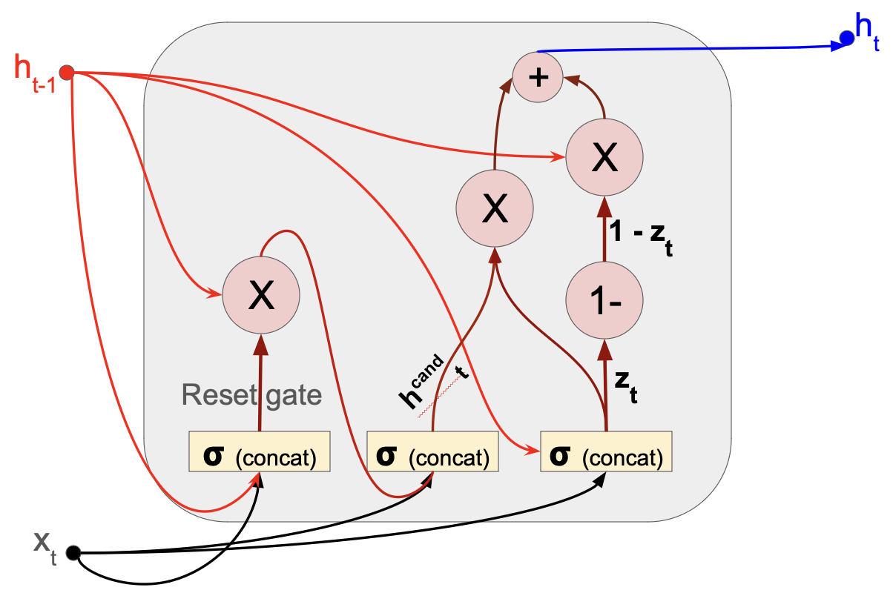
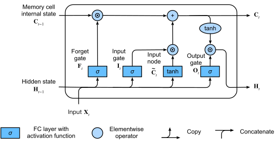
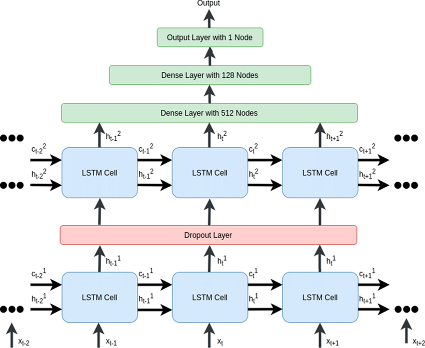
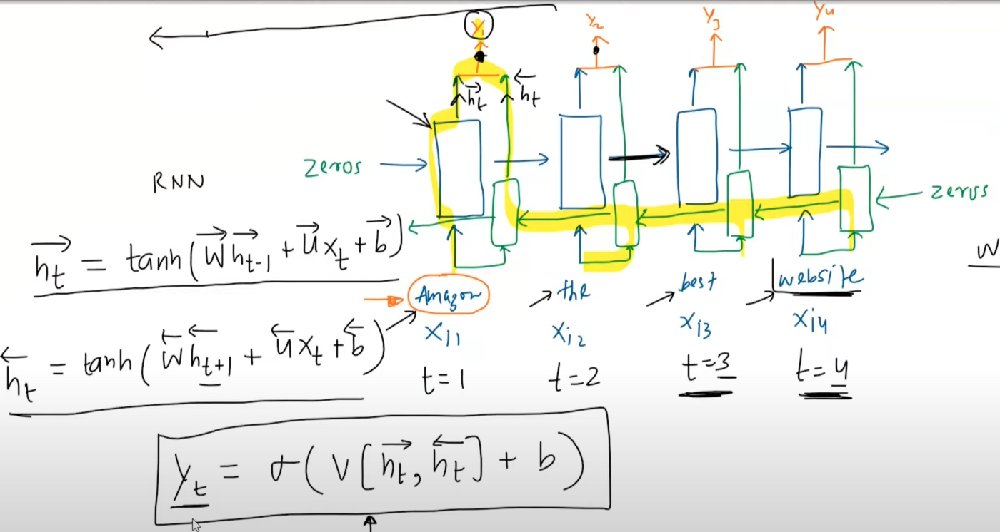
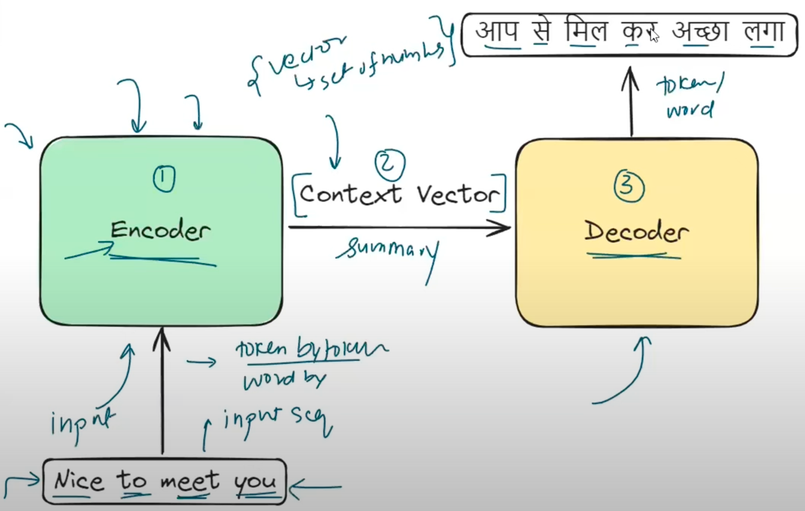
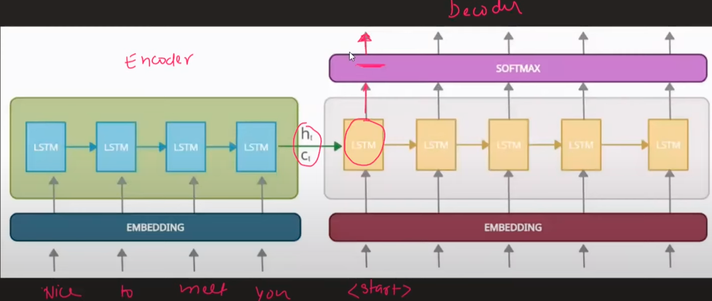
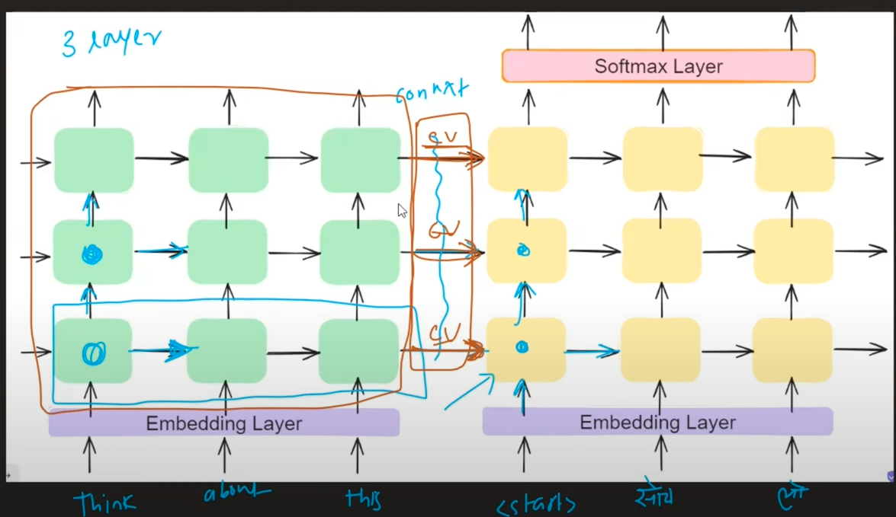

# Table of Contents
1. [Introduction](#intro)
2. [Forward Propagation](#forward_prop)
3. [Many to One RNN Arch](#many_to_one_arch)
4. [One to Many RNN Arch](#one_to_many_arch)
5. [Many to many RNN Arch](#many_to_many_arch)
6. [Problems with RNN](#rnn_problems)
    1. [Long term dependencies](#long_term_dep)
    2. [Unstable gradients](#unstable_grad)
7. []
8. []
9.
10. [Bi-directional RNNs](#bi_rnn)
11. [Sequence to Seqeunce](#seq2seq)
    1. []
    2. []
    3. []
    4. [BLEU Score](#bleu)

# Introduction

- sequential data, not necessarily words.
    - could be video, i.e. a sequence of images.
    - CNNs could be made recurrent - RNNs.
- ANNs cannot be used when input data is of variable size.
    - this is where RNNs come into picture.
    - Verify this, because padding(even for an RNN) is done for input sample, and the input layer can usually have a fixed number of units/weights.
- 
    - This is a simple recurrent layer.
    - along with the input vector being connected(weight matrix shaped (5,3)), the neurons within the layer are connected themselves to each other (weight matrix shaped (3,3)).
    - this *recurrent* connection is what sends the output(activated) from 1st word when the 2nd input, i.e. 2nd word (sample = sentence) is being processed by the layer.
        - **for the first word, this input happens to be random/null vector**.
- the layer also possesses activation function.

# Forward Propagation
1. 
    1. sigmoid because sentiment analysis is binary classification.
2. $O_1$ : output from 1st word of a given sample(sentence).
3.  

# Many to One RNN Arch
1. Sequence of words(many) is fed, and output is a single integer/scalar value(one)(as opposed to a vector).
2. Sentiment Analysis
    1. based on text, predict sentiment of text
3. Rating
    1. based on movie review, star-rating prediction

# One to Many RNN Arch
1. Non-sequential data as input(it doesn't have  a sense of timesteps)
2. Output is a time-step based value, i.e. a vector.
    1. an example of `return_sequences=True`
3. Image captioning
    1. given an image(time-less, stationery data), output a caption, i.e. a sequence of words.

# Many to many RNN Arch
1. Seq2Seq model
2. same and variable length many to many
    1. output may or may not have the same number of timesteps as the input sequence. 
    2. Machine translation = variable length many to many task.
        1. read the entire input sequence, then start outputing the output sequence.
        2. solved using encoder-decoder architecture.

# Problems with RNN

## Long term dependencies
- short-term memory loss
    - context of earlier words lost while processing larger sequences.
    - try simulating this by comparing RNN, GRU/LSTMs
- this is seen as vanishing gradient problems while training/fitting on samples with longer sequences.
    - while evaluating the gradient, unrolling the RNN is required.
    - keeping in mind that for a single-RNN layer model, W is same across all layers.
    - its gradient is a sum of product of gradients at each layer computed in the backward direction, starting from *impact* of the last sequence( $x^1_{s, (1)}$ ).
    - the *first* sequence($x^1_{1, (1)}$) has many partial-derivatives multiplied to it, and if these are small, the contribution to the ultimate $\nabla(\mathcal{L}(W))$ value being equally small.
    - verify this by using the imdb dataset with <b>max_seq_len=10,20,50,100,200,500,1000</b>. Use only those training + testing sequences having length >= 1000, so that no masking layer becomes usefull.

## Unstable gradients
- exploding gradient in RNNs.
- if the partial-derivatives in the expanded expression of $\nabla(\mathcal{L}(W))$ relevant for the early sequences are larger(rather than being smaller), then this problem arises.

# GRUs
- Gated Recurring Unit.
- only maintains hidden state.
- Reset gate output has same dimensionality as that of $h_{t-1}$, hence the termwise product is possible.
- although the calculations involved in generating reset gate and $z_t$ are the same, they are purposely used as different layers.
- 

# LSTMs
- **Long-Short term memory**: retention of short-term and long-term context(STC, LTC).
- 
- 
- $h_{t-1}$: short-term memory , $c_{t-1}$: cell state(long-term memory) , 
- each layer-conputation now returns 2 *things*(as opposed to 1 in a simpleRNN): \[hidden_state, cell_state\].
    - this is per input-sequence.
- both states are d-dimensional vectors.
- the X and + are point-wise ops.
    - i.e. the vectors $C_{t-1}$ and $f_t$ are multiplied/added termwise.
    - tanh is also applied in a termwise fashion.
- the $\sigma$ represents an NN layer with sigmoid as the activation function.
    - $X_t$ is t'th sequence input, $h_{t-1}$ is output from previous timestep.
    - assuming $X_t$'s dimensionality is m, the $\sigma$ represents a layer of dimensionality $(d+m) \times d$, s.t. the output from this layer is a d-dimenional vector. the input to this layer happens to be a concat of $\left[X_t, h_{t-1}\right]$
    - this output vector will undergo termwise multiplication with context-vector from last timestep within the forget-gate.
- sigmoid activation function will return a vector with all terms within 0 and 1.
    - each dimension of the cell-state vector as part of the forget-gate will undergo elementwise multiplication with these \[0,1\]-valued vectors.
    - the higher the value the more info from that dimension of the cell-state vector will be retained.
    - the lower the value the lesser info from that dimension of the cell-state vector will be retained, in other words *more will be forgotten*.
- within the input gate, the $i_t$ is the \[0,1\]-valued vector that decides how much of the candidate cell state vector $\bar{C_t}$ is allowed to pass through and how much is chucked out.
    - controlled by the elementwise product of $i_t$ and $\bar{C_t}$
- on evaluating both these gates, the d-dimensional vectors obtained as a result undergo termwise addition to form the cell-state vector for this timestep, $C_t$.
- final output $h_t$ is calculated by
    - elementwise tanh on $C_t$ generates a d-dimensional vector. the vector is a \[-1, 1\] valued vector.
    - sigmoid on $\left[X_t, h_{t-1}\right]$ generates another d-dimensional vector
    - these 2 d-dimensional vectors undergo elementwise product.
    - *how much* of current cell state goes into output vector.

# Stacked RNNs
- stacked LSTMs/GRUs
- \
    - the $h_t$ of LSTM-1 becomes the $x_t$ for LSTM-2.
- lower layers - basic features, upper layers - high-level features. much similar to early vs later Conv-layers.

# Bi-directional RNNs
- when future inputs affect past outputs
    - 5 $^{th}$ input sequence affects the 3 $^{rd}$ output sequence.
- NER is a relevant task.
    - more particularly, what kind of named entity.
    - for instance:
        - sent1: I love amazon, its a great river.
        - sent2: I love amazon, its an amazing website.
        - sent1: amazon is a place, sent2: its an ORG.
- POS tagging is another application.
- Machine translation.
- Sentiment analysis.
    - compare performance with uni-directional RNNs.
- Time series forecasting is a relevant application. How?
- 
- output sequences from both directions are used to generate the predicted output.

# How does dropout work in RNNs?

# Sequence to Seqeunce
- process a seqeunce completely and then output a new sequence, which could have a different length than that of the input sequence.
- examples
    - Machine translation
    - text summarization
    - Question-answer
    - chatbot
    - speech to text

## Encoder-Decoder Arch
1. Encoder: generates a training vector, called **context vector**, per input sequence.
2. Decoder: processes this vector and generates an output sequence
3. 
4. The $h_t$ and $c_t$ generated at the final timestep from the encoder processing the input sequence constitutes the **context vector**.
5. The \<start\> token is sent as the first timestep input to the decoder.
    1. Ideally the output generated from timestep $t$ is sent to timestep $t+1$, till the \<end\> token is produced as the output.
4. Teacher Forcing
    1. Occurs in the decoder.
    2. act of sending the one-hot vector/embedding of the true next word, as opposed to that of the predicted next word by the decoder.
    3. in the example below, for the sample translating "Think about it" $\Rightarrow$ "सोच लो", rather than sending the one-hot encoding of **लो**(prediction) to the next timestep, that of **सोच**(true/target) is sent.
    4. This is done because the decoder, if given its own predictions,could learn incorrect patterns.
5. Hence, during training, Teacher Forcing in decoder prevents output of timestep $t-1$ to be used as input for timestep $t$.
6. Notice that there's a softmax layer from the output of the decoder.
    1. this is basically the representation of a Dense layer that has \#neurons = vocabulary size of sequence to be predicted.
    2. The hidden state of each decoder-cell passes through this and a `(vocab-size,1)` shaped vector, called **logits**,  is generated.
    3. **logits** is then activated using a softmax layer/function, so that probabilities for each token in the output-sequence vocabulary can be computed.
    4. The sequence-ID with the highest likelihood: predicted token.

## Improvements

### Embeddings

### Deep LSTMs
- 
- Each level will send/receive $h_t,c_t$ to the same level in/from the other network.
- Summary is stored in a denser manner, hence this works for large-text inputs.

## BLEU(BiLingual Evaluation Understudy) Score
- evaluating prediction against multiple valid/good translations(target) for the same input sentence.
- Task: French to English, input: "Le chat est sur le tapis"
    - Ref 1: "The cat is on the mat"
    - Ref 2: "There is a cat on the mat"
    - Ref means possibly correct target output.
-  understudy to humans.
- Machine Translation prediction: "the the the the the the the"
    - for a given n-gram, precision is defined as:
        - $count$: frequency of that n-gram in the prediction.
        - $count_{clip}$: highest frequency of that n-gram across all references.
        - for the above prediction, $\frac{count_{clip}}{count} \left(\textrm{the}\right) = \frac{2}{7}$, 2 since the first reference has the unigram *the* occurring twice.
- for an n-gram, the precision is given by $p_n$.
- for a given MT prediction with sequence length $c$, BLEU score is given by $exp.\left(\frac{1}{W} \left(\sum\limits_{n=1}^c w_n p_n\right)\right); W = \sum w_n$:
    - $w_n$: weight of that n-gram precision value.
- it was observed that for smaller c, i.e. smaller generated sequences, BLEU score was generally high, hence a length-based penalty term, **brevity penalty**,  was also added.
- **Modified BLEU** = $exp.\left(BP\right) exp.\left(\frac{1}{W} \left(\sum\limits_{n=1}^c w_n p_n\right)\right); BP = \begin{cases}1 & c > r \\ 1-\frac{c}{r} & c \le r\end{cases}$, where r = length of reference/target sequence.

## Beam Search
- output not any but the most relevant translation.
- beam width B.
- enlist B most likely first-timestep prediction.
- this violates Teacher Forcing, since the prediction from previous timestep is sent as input to the next timestep.
    - for instance, say B-most likely predictions for first timestep(after the context vector is generated by the encoder) are $\left[ y^{<1>}_1, y^{<1>}_2 \cdots y^{<1>}_B \right]$
    - each of these are sent as inputs for finding softmax probabilities of the $2^{nd}$ timestep prediction, thus we have $B\times$ vocab.size(translated corpus) probabilites.
    - of all these *bi-grams*, the B-most likely bigrams will be stored, and the $2^{nd}$ word of these bigrams will be sent as input for $3^{rd}$ timestep prediction.

# Attention Mechanism
- Problem with the Encoder-Decoder Arch
    - for longer sentences, difficult to encode the entire sentence in a single context vector.
    - token generated from the decoder might be dependent only a few encoder-tokens, but still the model is forced to read the entire input sentence in a *static manner*(one-time).
- hence model needs to be told to pay *attention* to a *specific subsequence* in the encoder-input inorder to generate each decoder-sequence.
- in actuality, instead of subsequence of the encoder-input, we rather use the hidden states generated from processing those relevant subsequence timesteps.
- each decoder cell receives a weighted sum of hidden states from encoder.
    - since we actually don't know which specific encoder-subsequences are important/need to be paid attention to(entirely task dependent).
- $a_j = \sum\limits_{i=1}^{sl} \alpha_{j,i}h_i$
    - $a_j$: context vector provided to $j^{th}$ decoder-sequence.
    - $sl$: source sequence length.
    - $\alpha_{j,i}$: weight of $i^{th}$ hidden state to compute the $j^{th}$ decoder sequence.
    - $h_i$: $i^{th}$ hidden state.
- now the decoder cell, in addition to its own hidden and cell states, has context vector as well.
    - usually the encoder and decoder are assigned the same number of units, thus making their hidden and cell states(all four vectors) of the same dimensionality.
- Hence we now have $sl \times tl$ new variables.
    - this *matrix* can be visualized as a heatmap where y-axis: target($tl$) and x-axis: source($sl$), with the numbers being $\alpha_{j,i}$ values. 
- Whatever has been previously said(predicted by decoder) should impact the weights of sequences in the encoder-input sequence.
    - Lets discuss using the translation from English to Hindi: "Turn off the lights." $\rightarrow$ लाइट बंद करॊ।
    - If लाइट has already been output by the decoder, then the weights corresponding to the encoder-input sequence *lights* should be reduced to *theoretically 0*, which will in turn increase weights of other sequences in the encoder input.
    - Likewise, if the model was going for the translation *बंद करॊ लाइट।* , such that the decoder has already generated *बंद* as the first output sequence, then the weights of *off* should be drastically reduced and of *turn* to be the highest.
- Hence $e_{ij} = f(s_{j-1}, h_i)$, where $s_{j}$ : hidden+cell state from timestep j at decoder, which will be fed as input to timestep j+1.
    - $\alpha_{j,i} = \frac{e_{ij}}{\sum\limits_{i=1}^{sl} e_{ij}}$, making $\alpha_{j,i}$ always in $[0, 1]$
    - Hence, $\alpha_{j,i}$ becomes the *softmax* target variables.
- The **technical term** for $\alpha_{j,i}$ is **alignment scores**.
    
# Bahdanau Attention
- find $\mathcal{f}$ wherein $\alpha_{j,i} = \mathcal{f}(h_i, s_{j-1})$
- a feed-forward(ANN in other words) is used to *predict/approximate* this $\mathcal{f}$.
- Inputs to each decoder-cell(timestep): $h_i, s_{j-1}$: both of these are vectors.
- Also referred to as *Additive Attention*

# Luong Attention
- $\alpha_{j,i} = \mathcal{f}(h_i, s_j)$, i.e. depends on current state.
- $e_{j,i} = h_i, s_j^T.h_i$, dot product will exist only if dimensionality is same, since both are vectors.
- $\alpha_{j,i}$ will be given by the softmax($e_{j,i}$).
- avoids training the parameters of the feed-forward NN used in Bahdanau attention.
- since the $j^{th}$ cell has already finished computation(that's how $s_j$ is formed), the $c_j$ eventually generated is concatenated with $j^{th}$ hidden state *of the decoder* , right before feeding into the feed-forward dense layer that evaluates softmax probabilities for each token in the output-sequence vocabulary.
    - This technically increases the number of parameters since the weight matrix of this dense layer becomes larger.
    - But the increase is only for the first layer of this feed-forward network, as opposed to having a completely new feed-forward NN as observed in Bahdanau Attention.
- Due to the scalar/dot-product used, this attention mechanism is called *Multiplicative Attention*.
- Hence, **the computational efficiency benefits still stay**.

# Limitations of Attention Mechanism
- Sequential training, i.e. training by sending each token one after the other.
- Slows down performance when trained on huge datasets.
    - in usual ANN/CNNs , the training time is $O(batch\_size)$ (samples within a batch processed parallely)
    - in Seq2Seq+Attention however, the training time is actually $O(batch\_size \times (train\_seq\_len + test\_seq\_len))$
    - addition because first the train_seq will be processed token-by-token, generating the hidden states.
        - after that the test-sequence will be processed token-by-token, using these generated hidden states.
        - hence, even encoder and decoder cannot be parallelized, encoder will always precede decoder.
    - This issue is why the training time on huge datasets is computationally infeasible/not worth the effort.
    - This again means *transfer learning* cannot be used for this architecture.
        - i.e. train a big CNN on a big dataset such as ImageNet, and then use this to fine-tune on a particular task.
    