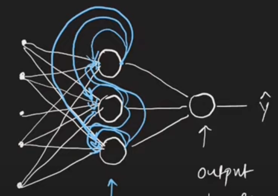
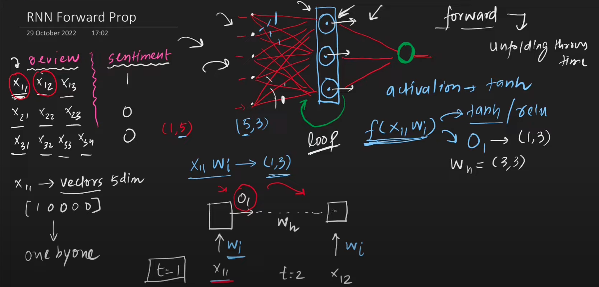
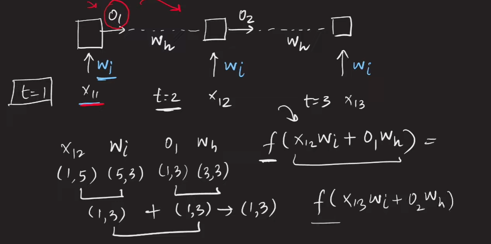
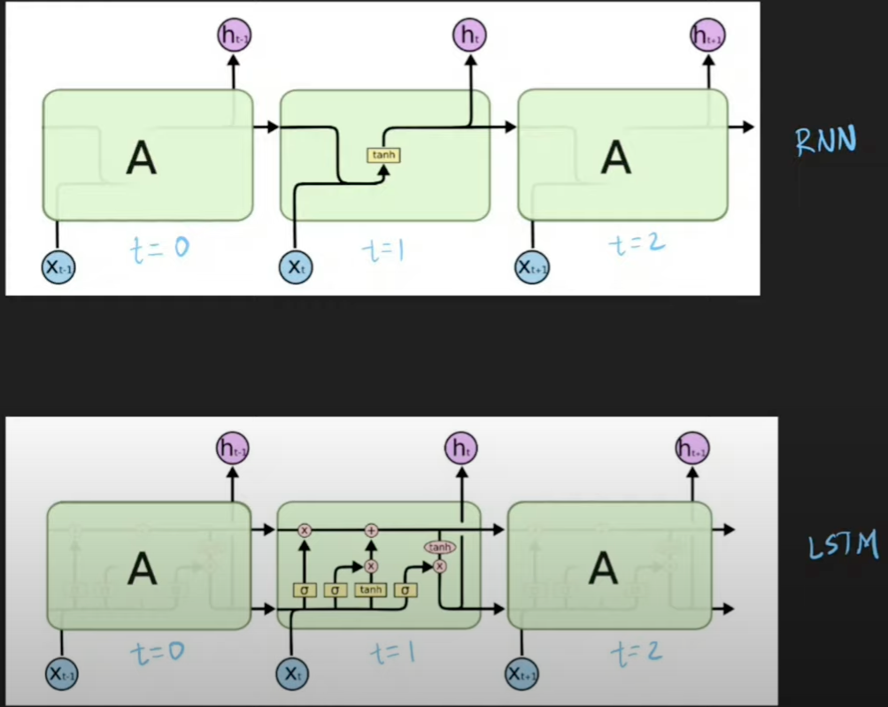

# Table of Contents
1. [Introduction](#intro)
2. [Forward Propagation](#forward_prop)
3. [Many to One RNN Arch](#many_to_one_arch)
4. [One to Many RNN Arch](#one_to_many_arch)
5. [Many to many RNN Arch](#many_to_many_arch)
6. [Problems with RNN](#rnn_problems)
    1. [Long term dependencies](#long_term_dep)
    2. [Unstable gradients](#unstable_grad)

# Introduction

- sequential data, not necessarily words.
    - could be video, i.e. a sequence of images.
    - CNNs could be made recurrent - RNNs.
- ANNs cannot be used when input data is of variable size.
    - this is where RNNs come into picture.
    - Verify this, because padding(even for an RNN) is done for input sample, and the input layer can usually have a fixed number of units/weights.
- 
    - This is a simple recurrent layer.
    - along with the input vector being connected(weight matrix shaped (5,3)), the neurons within the layer are connected themselves to each other (weight matrix shaped (3,3)).
    - this *recurrent* connection is what sends the output(activated) from 1st word when the 2nd input, i.e. 2nd word (sample = sentence) is being processed by the layer.
        - **for the first word, this input happens to be random/null vector**.
- the layer also possesses activation function.

# Forward Propagation
1. 
    1. sigmoid because sentiment analysis is binary classification.
2. $O_1$ : output from 1st word of a given sample(sentence).
3.  

# Many to One RNN Arch
1. Sequence of words(many) is fed, and output is a single integer/scalar value(one)(as opposed to a vector).
2. Sentiment Analysis
    1. based on text, predict sentiment of text
3. Rating
    1. based on movie review, star-rating prediction

# One to Many RNN Arch
1. Non-sequential data as input(it doesn't have  a sense of timesteps)
2. Output is a time-step based value, i.e. a vector.
    1. an example of `return_sequences=True`
3. Image captioning
    1. given an image(time-less, stationery data), output a caption, i.e. a sequence of words.

# Many to many RNN Arch
1. Seq2Seq model
2. same and variable length many to many
    1. output may or may not have the same number of timesteps as the input sequence. 
    2. Machine translation = variable length many to many task.
        1. read the entire input sequence, then start outputing the output sequence.
        2. solved using encoder-decoder architecture.

# Problems with RNN

## Long term dependencies
- short-term memory loss
    - context of earlier words lost while processing larger sequences.
    - try simulating this by comparing RNN, GRU/LSTMs
- this is seen as vanishing gradient problems while training/fitting on samples with longer sequences.
    - while evaluating the gradient, unrolling the RNN is required.
    - keeping in mind that for a single-RNN layer model, W is same across all layers.
    - its gradient is a sum of product of gradients at each layer computed in the backward direction, starting from *impact* of the last sequence( $x^1_{s, (1)}$ ).
    - the *first* sequence($x^1_{1, (1)}$) has many partial-derivatives multiplied to it, and if these are small, the contribution to the ultimate $\nabla(\mathcal{L}(W))$ value being equally small.
    - verify this by using the imdb dataset with <b>max_seq_len=10,20,50,100,200,500,1000</b>. Use only those training + testing sequences having length >= 1000, so that no masking layer becomes usefull.

## Unstable gradients
- exploding gradient in RNNs.
- if the partial-derivatives in the expanded expression of $\nabla(\mathcal{L}(W))$ relevant for the early sequences are larger(rather than being smaller), then this problem arises.

# LSTMs
- **Long-Short term memory**: retention of short-term and long-term context(STC, LTC).
- 
- $h_{t-1}$: short-term memory , $c_{t-1}$: cell state(long-term memory) , 
- each layer-conputation now returns 2 *things*(as opposed to 1 in a simpleRNN): \[hidden_state, cell_state\].
    - this is per input-sequence.
- both states are d-dimensional vectors.
- the X and + are point-wise ops.
    - i.e. the vectors $C_{t-1}$ and $f_t$ are multiplied/added termwise.
    - tanh is also applied in a termwise fashion.
- the $\sigma$ represents an NN layer with sigmoid as the activation function.
    - $X_t$ is t'th sequence input, $h_{t-1}$ is output from previous timestep.
    - assuming $X_t$'s dimensionality is m, the $\sigma$ represents a layer of dimensionality $(d+m) \times d$, s.t. the output from this layer is a d-dimenional vector. the input to this layer happens to be a concat of $\left[X_t, h_{t-1}\right]$
    - this output vector will undergo termwise multiplication with context-vector from last timestep within the forget-gate.
- sigmoid activation function will return a vector with all terms within 0 and 1.
    - each dimension of the cell-state vector as part of the forget-gate will undergo elementwise multiplication with these \[0,1\]-valued vectors.
    - the higher the value the more info from that dimension of the cell-state vector will be retained.
    - the lower the value the lesser info from that dimension of the cell-state vector will be retained, in other words *more will be forgotten*.
- within the input gate, the $i_t$ is the \[0,1\]-valued vector that decides how much of the candidate cell state vector $\bar{C_t}$ is allowed to pass through and how much is chucked out.
    - controlled by the elementwise product of $i_t$ and $\bar{C_t}$
- on evaluating both these gates, the d-dimensional vectors obtained as a result undergo termwise addition to form the cell-state vector for this timestep, $C_t$.
- final output $h_t$ is calculated by
    - elementwise tanh on $C_t$ generates a d-dimensional vector. the vector is a \[-1, 1\] valued vector.
    - sigmoid on $\left[X_t, h_{t-1}\right]$ generates another d-dimensional vector
    - these 2 d-dimensional vectors undergo elementwise product.
    - *how much* of current cell state goes into output vector.