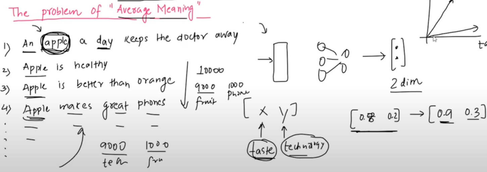
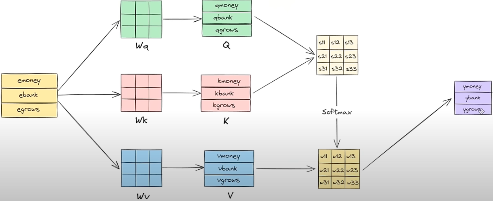

# Disadvantages
- [watch this section](https://youtu.be/BjRVS2wTtcA?t=3030&si=FdujH4Uel7TXPGim)

# Introduction
## Problems With Static Word Embeddings
- A word can have different meanings.
    - apple: fruit, company.
- Embeddings will be formed from the dataset.
- the dataset may contain meaning-imbalance.
    - more samples could exist using the word in its first meaning than other meaning(s).
    - this would cause features(in the total embedding space) that represent that particular meaning to be of way higher value compared to those features that form other meanings.
    - 
    - observe the higher contribution(value) of the *taste* feature than the *technology* feature.
- now if on a test dataset, if for many samples another meaning of the word is used, then the embedding generated will provide **incorrect contextual information** to the Seq2Seq architecture.
    - the model will think that *apple* is still being referred to as a fruit, but the test-dataset could be on characteristics of the apple company.
- Hence, **embeddings** need to be **contextual** inorder to pass correct contextual+semantical information to the model.

# Capturing *Contextual* Word Embeddings

## Introduction
- Whatif word embeddings are calculated for each sentence?
    - this is intuitive because the sentence would tell us in what context is the word used.
    - Take the case of the sentences: "Apple is a delicious fruit." and "Apple makes the best smartphones."
    - the other tokens present in the sentence tell us which meaning of the word *apple* is used.
- assume static embeddings of the tokens as $e_{apple}, e_{is}, \cdots e_{makes}, e_{the}, \cdots e_{smartphones}$
- define contextual embeddings as:
    - for sentence-1: $y_{apple} = wt_1.e_{apple} + wt_2.e_{is} + wt_3.e_{a} + wt_4.e_{delicious} + w_5.e_{fruit}$
    - similarly, for sentence-2: $y_{apple} = \sum\limits_{i=apple}^{smartphones}wt'_i.e_i$
- if we let $wt_1 = e_{apple}.e^T_{apple}, wt_2 = e_{apple}.e^T_{is} \cdots wt_5 = e_{apple}.e^T{fruit}$, now the weights make logical sense.
    - compare this with weights for apple w.r.t. the 2$^{nd} sentence.
    - w.r.t. features in the embeddings that capture eatable vs tech based information,
        - eatable-features-strength(1$^{st}$ sentence) = $wt_5.e_{fruit, eatable} + wt_1.e_{apple, eatable}$, whereas eatable-features-strength(2$^{nd}$ sentence) = $wt_1.e_{apple, eatable}$, because logically the static embedding for smartphones won't have higher contributions from eatable-based features.
        - similarly, tech-features-strength(1$^{st}$ sentence) = $wt_1.e_{apple, tech}$, whereas tech-features-strength(2$^{nd}$ sentence) = $wt_1.e_{apple, tech} + wt_5.e_{smartphones,tech}$, because logically the static embedding for fruit won't have higher contributions from tech-based features.
        - hence, this has made contextual embedding of the same word apple different in both sentences.
- these *weights* are called *attention scores*.

## Concept of Query, Key and Value Vectors

### Intuition
- suppose you're searching for a job online
- you have your profile, a company/opening has their profile, and in case of a match, you are assessed to see how fit you are for that role.
- while searching, you would know what you're searching for, mainly a job profile and not a candidate profile
    - hence *search*(job profile) would be different from *query*(yourself).
- likewise, when the company/opening-profile is querying the database, they would be searching something they themselves aren't(candidate profile, and not a job profile).
- when a match is found, *your value* will decide the strength of the match. and your value(the idea/meaning/contents) is way different from a candidate/opening profile.
- hence, in either scenario, when a particular *user* is *querying*, that is different from when they are being *searched* for, and completely different from what *value* they possess post *match finding*.

## Problem with earlier definition of Contextual Embeddings
- the manner of defining contextual embeddings has 1 flaw: all query,search,value vectors are the same for the same word.
    - when *apple* is being searched for vs when its *querying* vs when its *value* is being used to compute contextual embedding for itself/other tokens, all cases use the same static $e_{apple}$
    - query-vector: when weights are being found to find the contextual embedding of this token.
    - search-vector: when weights are being computed using the embeddings of this token.
    - value-vector: when weights are being used with the embeddings of this token to find contextual embeddings of this/some other token.
- similar to the example discussed in Intuition section, a word should have 3 possibly distinct representations as per the usage:
    - query-vector: as a query
    - search-vector: when being searched
    - value-vector: whose value is used to generate contextual embedding for some token.

## Solution
- Have 3 possibly different matrices: $W_q, W_s, W_v$
- w.r.t. our apple example($1^{st}$ sentence):
    - $q_{apple} = (e_{apple})_{1\times d}(W_q)_{d\times o}$
    - $s_{apple} = (e_{apple})_{1\times d}(W_s)_{d\times o}$
    - $v_{apple} = (e_{apple})_{1\times d}(W_v)_{d\times o}$
    - similary query,search and value vectors will be generated for other tokens.
    - $w'_i = q_{apple}.s_{i^{th} token}^T, wt_i = \frac{exp^{w'_i}}{\sum\limits_{i=apple}^{fruit}exp^{w'_i}}$, i.e. once dot-products are computed, we use softmax for normalizing *similarity* found.
    - $y_{apple} = \sum\limits_{i=apple}^{fruit}wt_i.v_{i^{th} token}$
- for each sentence, this can be represented in a matrix-multiplication manner:
    - vertically stack all static embeddings of all tokens of a sentence in the same order as that in the sentence($sl \times d$).
    - multiply with 3 matrices to obtain the corresponding query,search,value vector representations($sl \times o$).
    - compute $QK^T$ followed by row-wise softmax computations($sl \times sl$)
    - use $(SV)_{sl \times o}$ to obtain the contextual embeddings.
    - 
- This can be for multiple sentences at the same time(parallelization).
- As for the what these **matrices will be**, these are treated as **trainable parameters**.

