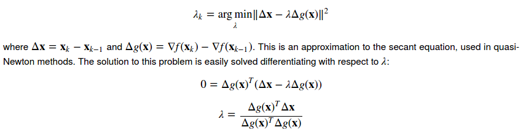

# Table of Contents

1. [Biological inspiration of activation Functions](#bio-insp-af)
2. [Activation Functions](#af)
   1. [step](#step)
   2. [sigmoid](#sigmoid)
3. [Steepest Descent](#sd)
   1. [Convergence Proof](#sd-proof)
      1. [convexity assumption](#convex)
      2. [Lipschitz continuous gradient assumption](#lcg)
      3. [3-point identity proof](#3pointidentityrproof)
      4. [Descent Lemma ](#descent-lemma)
      5. [Lemma-5](#lemma-5)
      6. [Final Convergence Criterion](#cc)
   2. [Cauchy approach of finding learning rate](#cauchy-find-learning-rate)
   3. [Barzilai and Borwein approach of finding learning rate](#bb-approach)
4. [Back-Propagation](#backprop)
5. [References](#references)

# Biological inspiration of activation Functions

- in biological neurons, electrical signals are conducted only when  the neuronal membrane potential rises above  a certain threshold potential value.
- A function that takes the input signal and generates an output signal, but takes into account some kind of threshold is called an activation function. 

# Activation functions

## step

- once the threshold input is reached, output jumps up.

## sigmoid

- smoother than the step function 
- 
  - e = 2.71828
  - x = w1x1 + w2x2 ... wnxn , if this sum is smaller than some threshold, the *neuron* will *not fire*, if its larger, then 
- 

y = WX , X is n x 1 input and W is m x n weight matrix, since y can have dimensions that are different in number than that of X.

y can either be the final output or the next layer. layer l having n neurons has to be connected to layer l+1 having m neurons, hence the weight is  a matrix(unlike a vector in linear regression).

- after generating this matrix , X (l+1) , apply the activation function on each element, and the obtained vector is passed in as input to the next layer.
  

- The middle layers are also known as hidden layers, and the name just stuck because the outputs of the middle layer are not necessarily made apparent as (final)outputs, so are *hidden*.

# Steepest Descent

- correctness of this algorithm

  - [taylor series involved](https://math.stackexchange.com/questions/4151297/different-form-of-taylor-series-in-leibniz-notation)
  - [Main source for the following proof](https://1202kbs.github.io/GD/) 

- ## Convergence Proof

  - ### convexity assumption

    - the error/cost/loss function of the neural network is assumed to be convex in nature.
    - 
    - this essentially means that the line joining any 2 points on the function will always lie above its own curve in between these 2 points. Mathematically, this means that 
    - in our case, , i.e. x and y are vectors of dimensionality d and f generates a scalar using a vector as an input.
      
    - this can also be explained in the following form, also known as the **first-order condition** of a convex function 
    - intuitive explanation pending
      - [first order condition explained graphically](http://www.princeton.edu/~aaa/Public/Teaching/ORF523/S16/ORF523_S16_Lec7_gh.pdf)
      - prove this for 2 dimensional vectors, you have already done it with 1-D vectors ?
      - this is called the [first-order condition](http://www.ifp.illinois.edu/~angelia/L3_convfunc.pdf) using the [convex function definition](https://www.tutorialspoint.com/convex_optimization/convex_optimization_differentiable_function.htm).
    - the following is the proof for the fact that if a function obeys this first-order condition, it is also a convex function
    - 
    - 

  - ### Lipschitz continuous gradient assumption

    - the gradient of the cost/error/loss function is assumed to be Lipschitz continuous.
       , where L is a positive constant known as the **Lipschitz constant**.
    - a Lipschitz continuous function can be explained in the [following graphical manner](https://www.youtube.com/watch?v=aWQbFU_eXvE)
      - 
      - the slope of any line joining two points on the function will have an absolute value of its slope at most L.
      - this means that if a point is chosen at random and a line of slope greater than L or less than -L is drawn, then **if it is Lipschitz continuous**, the line **will not cut the function at any other point**.

    - how to test if a function holds lipschitz condition or not?

  - ### 3-point identity proof

    - Bra-ket notation in vectors
    - 
    - 

  - ### Descent Lemma 

    - 
    - **Proof**
      
    - 

  - ### Lemma-5

    - Couldn't think of a better name, hence lemma-5.
    - 
    - **Proof**:
      
    - intuitive explanation remaining!!!!
    - see, you need  and  since z and  will be substituted with  and  (as will be seen in the [next section](#cc)) , and these will cancel out on summing across all iterations, hence while arriving at this identity, think of these 2 magnitude terms being involved in the inequality.

  - ### Final Convergence Criterion

    - x\* is the optimal point, i.e. the point at which the loss function is the least.
    -  
    - 

  - 

- 

- ## Cauchy approach of finding learning rate

  - One of the most obvious choices of *λ* is to choose the one that minimizes the objective function:
    *λ**k*=argmin*λ**f*(**x***k*−*λ*∇*f*(**x***k*))
  - This approach is conveniently called the steepest descent method.  
  - Although it seems to the best choice, it converges only linearly (error ∝1/*k*) and is very sensitive to ill-conditioning of problems.

- ## Barzilai and Borwein approach of finding learning rate

  - An [approach proposed in 1988](http://pages.cs.wisc.edu/~swright/726/handouts/barzilai-borwein.pdf) is to find the step size that minimizes:
    

# Back-Propagation

- 
- 

# References

- Make Your Own Neural Network by Tariq Rashid