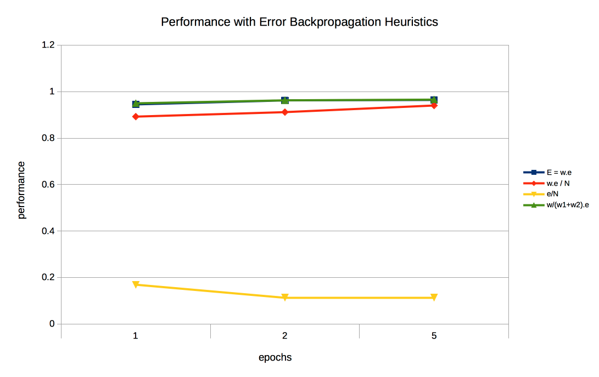
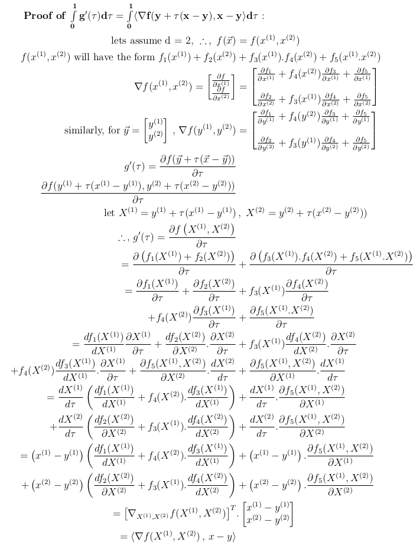

# Table of Contents

1. [Neural Nets - Introduction](#nnintro)
2. [Biological inspiration of activation Functions](#bio-insp-af)
3. [Activation Functions](#af)
   1. [step](#step)
   2. [sigmoid](#sigmoid)
4. [Back-Propagation](#backprop)
5. [Steepest Descent](#sd)
   1. [Convergence Proof](#sd-proof)
      1. [convexity assumption](#convex)
      2. [Lipschitz continuous gradient assumption](#lcg)
      3. [3-point identity proof](#3pointidentityrproof)
      4. [Descent Lemma ](#descent-lemma)
      5. [Lemma-5](#lemma-5)
      6. [Final Convergence Criterion](#cc)
   2. [Cauchy approach of finding learning rate](#cauchy-find-learning-rate)
   3. [Barzilai and Borwein approach of finding learning rate](#bb-approach)
6. [Gradient Descent Practical Approach](#gd_practical)
7. [Problem of saturation due to large weights/inputs/outputs](#saturation)
8. [Initializing Weights](#weights-init)
9. [References](#references)

# Neural Nets - Introduction

- 
  - , `i` means the layer supplying the signal, and `j` means the layer receiving the signal.
- 
  - in the case above, where the dimensionality of input, hidden and output layers is known(all are 3)
    
  - the 1/... term is the **activation function**.
- 

# Biological inspiration of activation Functions

- in biological neurons, electrical signals are conducted only when  the neuronal membrane potential rises above  a certain threshold potential value.
- A function that takes the input signal and generates an output signal, but takes into account some kind of threshold is called an activation function. 

# Activation functions

## step

- once the threshold input is reached, output jumps up.

## sigmoid

- smoother than the step function 
- 
  - e = 2.71828
  - x = w1x1 + w2x2 ... wnxn , if this sum is smaller than some threshold, the *neuron* will *not fire*, if its larger, then 
- 

y = WX , X is n x 1 input and W is m x n weight matrix, since y can have dimensions that are different in number than that of X.

y can either be the final output or the next layer. layer l having n neurons has to be connected to layer l+1 having m neurons, hence the weight is  a matrix(unlike a vector in linear regression).

- after generating this matrix , X (l+1) , apply the activation function on each element, and the obtained vector is passed in as input to the next layer.
  

- The middle layers are also known as hidden layers, and the name just stuck because the outputs of the middle layer are not necessarily made apparent as (final)outputs, so are *hidden*.

# Back-Propagation

- 
- 
  - error is distributed amongst the nodes of the hidden layer, i.e. the nodes that provide the input signal to the output layer
  - 
- 
- The normalizing is removed for convenience, and the following image(borrowed from [this blogpost](http://makeyourownneuralnetwork.blogspot.com/2016/07/error-backpropagation-revisted.html)), wherein the blue and green are almost indistinguishable , where the former denotes the non-normalized error and the latter the normalized one.
  
  - still search WHY this works?
- 
- The way in which these weights are updated is using gradient descent.

# Steepest Descent

- this is the **theoretical way** of using gradient descent.

- correctness of this algorithm

  - [taylor series involved](https://math.stackexchange.com/questions/4151297/different-form-of-taylor-series-in-leibniz-notation)
  - [Main source for the following proof](https://1202kbs.github.io/GD/) 

- 

  - we increase z in the opposite direction to the gradient, i.e. a positive gradient means we reduce z, and a negative gradient means we increase z.

- ## Convergence Proof

  - ### convexity assumption

    - the error/cost/loss function of the neural network is assumed to be convex in nature.
    - 
    - this essentially means that the line joining any 2 points on the function will always lie above its own curve in between these 2 points. Mathematically, this means that 
    - in our case, , i.e. x and y are vectors of dimensionality d and f generates a scalar using a vector as an input.
      
    - this can also be explained in the following form, also known as the **first-order condition** of a convex function 
    - **Intuitive explanation**
      - [first order condition explained graphically](https://people.seas.harvard.edu/~yaron/AM221-S16/lecture_notes/AM221_lecture8.pdf)
      - The first order Taylor expansion at any point(R.H.S.) is a global under-estimator of the function(L.H.S.) .
      - this is called the [first-order condition](http://www.ifp.illinois.edu/~angelia/L3_convfunc.pdf) using the [convex function definition](https://www.tutorialspoint.com/convex_optimization/convex_optimization_differentiable_function.htm).
    - the following is the proof for the fact that if a function obeys this first-order condition, it is also a convex function
    - 
    - 

  - ### Lipschitz continuous gradient assumption

    - the gradient of the cost/error/loss function is assumed to be Lipschitz continuous.
       , where L is a positive constant known as the **Lipschitz constant**.
    - a Lipschitz continuous function can be explained in the [following graphical manner](https://www.youtube.com/watch?v=aWQbFU_eXvE)
      - 
      - the slope of any line joining two points on the function will have an absolute value of its slope at most L.
      - this means that if a point is chosen at random and a line of slope greater than L or less than -L is drawn, then **if it is Lipschitz continuous**, the line **will not cut the function at any other point**.

    - how to test if a function holds lipschitz condition or not?

  - ### 3-point identity proof

    - Bra-ket notation in vectors
    - 
    - 

  - ### Descent Lemma 

    - 
    - **Proof**
      
    - 
    - 
    - Hence, proving descent lemma requires **gradient of** the error/loss/**cost function** to be **Lipschitz continuous**.

  - ### Lemma-5

    - Couldn't think of a better name, hence lemma-5.
    - 
    - **Proof**:
      
    - intuitive explanation remaining!!!!
    - see, you need  and  since z and  will be substituted with  and  (as will be seen in the [next section](#cc)) , and these will cancel out on summing across all iterations, hence while arriving at this identity, think of these 2 magnitude terms being involved in the inequality.
    - moreover, L.H.S. will need to have  , since will be substituted by  , and ultimately we have to compare the loss function value at the n'th iteration vs. the loss function at the optima.
      - and R.H.S. will have to be 

  - ### Final Convergence Criterion

    - z\* is the optimal point, i.e. the point at which the loss function is the least.
    - 
      
    - 

  - 

- therefore, a cost/error/loss function **requires** 

  - **itself to be convex** and
  - **its gradient to be Lipschitz continuous**.

- 

- ## Cauchy approach of finding learning rate

  - One of the most obvious choices of *λ* is to choose the one that minimizes the objective function:
    *λ**k*=argmin*λ**f*(**x***k*−*λ*∇*f*(**x***k*))
  - This approach is conveniently called the steepest descent method.  
  - Although it seems to the best choice, it converges only linearly (error ∝1/*k*) and is very sensitive to ill-conditioning of problems.

- ## Barzilai and Borwein approach of finding learning rate

  - An [approach proposed in 1988](http://pages.cs.wisc.edu/~swright/726/handouts/barzilai-borwein.pdf) is to find the step size that minimizes:
    

- 

# Gradient Descent Practical Approach

- 
- A similar error slope for the weights between the input and hidden layers.
- 
  - here the forward prop happens from layer `i` to layer `j` ,and the backprop from` j` to `i`.
  - 
- 
- 
  - this is the weight matrix update equation.
  - observe that the partial differential of error(E) w.r.t. the weights has a negative sign, and the weight update equation also has a negative sign, hence these 2 cancel out, and thus we end up with a delta-change on the LHS.
  - errors are produced from the next(succeeding) layer, whereas the output vector() is produced from the input(preceding) layer.
  - 
- 

# Problem of saturation due to large weights/inputs/outputs

- If the inputs are large, the activation function gets very flat.
  - large inputs will cause the  expression to become large, thus the sigmoid will reach 1, and the expression  will tend to 0.
  - thus, the [expression of the gradient](#gradient_expression) will also tend to 0.
- A very flat activation function is problematic because we use the gradient to learn new weights.
  
-  This is called saturating a neural network. Hence, the inputs should be kept small.
- even tan(h) suffers from saturation of weights, i.e. gradient tending to 0.
  ![This is the rendered form of the equation. You can not edit this directly. Right click will give you the option to save the image, and in most browsers you can drag the image onto your desktop or another program.](https://latex.codecogs.com/gif.latex?%5Cbegin%7Balign*%7D%20%5Ctextrm%7Btanh%28x%29%7D%20%26%3D%20%5Cfrac%7Be%5E%7B2x%7D-1%7D%7Be%5E%7B2x%7D&plus;1%7D%20%5C%5C%20%5Cfrac%7Bd%28%5Ctextrm%7Btanh%28x%29%7D%29%7D%7Bdx%7D%20%26%3D%20%5Cfrac%7B%28e%5E%7B2x%7D&plus;1%29%282e%5E%7B2x%7D%29%20-%20%28e%5E%7B2x%7D-1%29%282e%5E%7B2x%7D%29%20%7D%7B%28e%5E%7B2x%7D&plus;1%29%5E2%7D%20%3D%20%5Cfrac%7B4e%5E%7B2x%7D%7D%7B%28e%5E%7B2x%7D&plus;1%29%5E2%7D%20%5C%5C%20%26%3D%20%5Cfrac%7B2%7D%7Be%5E%7B2x%7D&plus;1%7D%5Ccdot%20%5Cfrac%7B2e%5E%7B2x%7D%7D%7Be%5E%7B2x%7D&plus;1%7D%20%5C%5C%20%5Ctextrm%7B1%20&plus;%20tanh%28x%29%7D%20%26%3D%201%20&plus;%20%5Cfrac%7Be%5E%7B2x%7D-1%7D%7Be%5E%7B2x%7D&plus;1%7D%20%3D%20%5Cfrac%7B2e%5E%7B2x%7D%7D%7Be%5E%7B2x%7D&plus;1%7D%20%5C%5C%20%5Ctextrm%7B1%20-%20tanh%28x%29%7D%20%26%3D%201%20-%20%5Cfrac%7Be%5E%7B2x%7D-1%7D%7Be%5E%7B2x%7D&plus;1%7D%20%3D%20%5Cfrac%7B2%7D%7Be%5E%7B2x%7D&plus;1%7D%20%5C%5C%20%5Ctherefore%5C%2C%2C%5C%2C%20%5Cfrac%7Bd%28%5Ctextrm%7Btanh%28x%29%7D%29%7D%7Bdx%7D%20%26%3D%20%28%5Ctextrm%7B1&plus;tanh%28x%29%7D%29%28%5Ctextrm%7B1%20-%20tanh%28x%29%7D%29%20%5Cend%7Balign*%7D)
  - too large inputs will cause tanh(x) tend to 1, thus leading the differential to 0.
  - too negative inputs will cause it to tend to -1, thus leading the differential to 0.
- A good recommendation is to re-scale inputs into the range 0.0 to 1.0.
- Even Outputs having large values cause saturation problems.
- ReLU function on the other hand, **partially saturates**, hence makes a better candidate for an activation function.
  - 
  - at-least for large positive values of z, the gradient(=1) does not saturate.
  - 
- 

# Initializing Weights

- a rough thumb rule is to initialize all weights depending on the total number of links in between the current and the next layer.
- all the elements of the weight matrix could be sampled from a normal distribution with mean=0 and standard deviation = **inverse** of **square-root** of the number of links.
  - for instance, in our above example, number of links from input to hidden layer are 3 x 3 = 9.
  - hence the weight matrix could be randomly sampled from 
- the **intuition** behind this is that as the number of links increases, so does the sum  .
  - after normalizing the feature vector, i.e. all values of X in the range \[-1,1\], large values of W are the only one that can cause the sum to explode and the gradients to thus saturate.
  - hence, scaling the values of W according to the number of links can easily control this saturation.
- complete history LEFT !!!!

# References

- Make Your Own Neural Network by Tariq Rashid