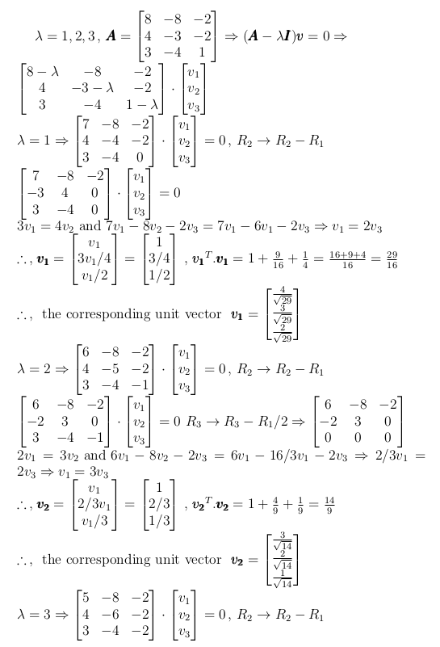
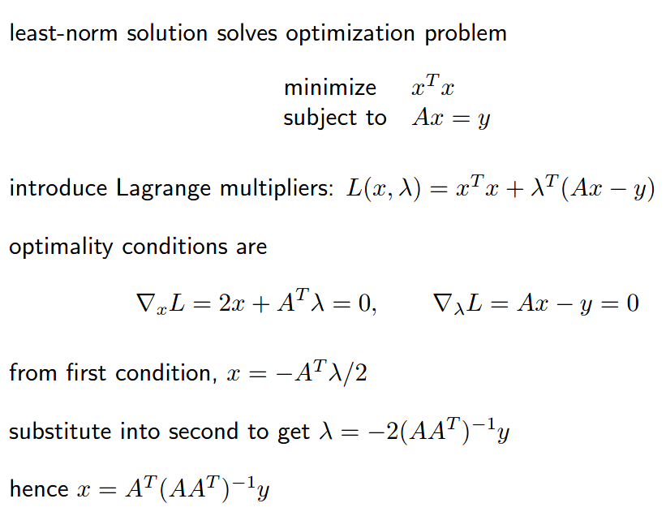
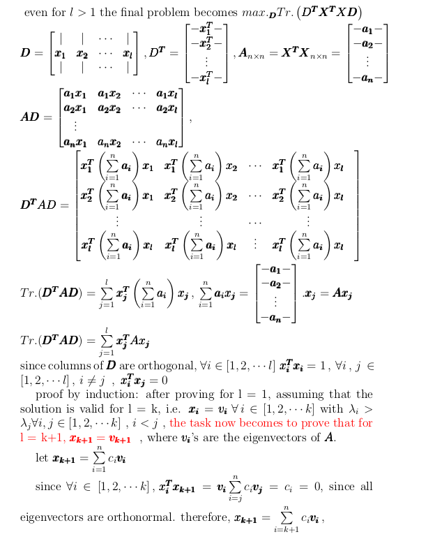

# Table of Contents

1. [Notations](#notations)
  
   1. [Norms](#norms)
   2. [Diagonal, Symmetric and orthogonal matrices](#dso)
   
2. [System of linear equations](#linear-equations-system)
  
   1. [Gaussian elimination](#gauss-elimination)
   2. [Determinant of a matrix](#determinant)
      1. [Physical meaning of determinant](#physical-meaning-of-determinant)
   3. [Finding Inverse](#inverse)
      1. [Singular Matrix](#singular)
   4. [Linear dependence and Span](#span)
   5. [EigenDecomposition](#eigendecomposition)
      1. [finding eigenvalues and eigenvectors through characteristic equation](#characteristic-equation)
      2. [Positive Semi-Definite](#psd)
      3. [Positive Definite](#pd)
   6. [Singular Value Decomposition](#svd)
   8. [The Moore-Penrose Pseudoinverse](#pseudoinverse)
   
3. [Trace Operator](#trace)

4. [Principal Component Analysis](#pca)

   1. [Deriving the encoding function](#derive-coding)

   2. [Deriving the decoding matrix](#decoding_matrix)

      1. [Solving for l=1](#solving_basic_case)

      2. [General Proof using Mathematical Induction](#general-proof)

         

# Notations

- matrices - uppercase bold math fonts, vectors - lowercase bold math fonts.
- addition of matrix and vector
  - 
  - this copying of $\pmb{b}$ is called as **broadcasting** the vector.
- matrix product is also known as **element-wise** product or **Hadamard** product. 

## Norms

- the  norm : 
- the   (pronounced as L-two-norm) is called the **euclidean norm**, or magnitude of a vector. the **squared** euclidean norm is obtained from .
- Sometimes, the size of the vector is measured by counting its number of nonzero elements. 
  - this is **informally** referred to as  **norm**.
- a **max norm** is called the , maximum **absolute** value amongst all component values.
- the size of a **matrix** can also be measured by something called as a **frobenius norm**. 
  - this is analogous to the  norm of a vector
- The **dot product of two vectors** can be rewritten **in terms of norms** : 

## Diagonal, Symmetric and orthogonal matrices

- diagonal matrices - **if and only if** , i.e. **elements not in the principle diagonal should definitely be 0**.
- diag() = diagonal matrix with diagonal elements = elements of the vector  , or 
- It is possible to construct a rectangular diagonal matrix, though non-square diagonal matrices do not have inverses.
  - for instance 
- symmetric matrix , can only happen if m = n , in , which means that 
- 2 vectors   and  are orthogonal to each other if  , i.e. their dot product is 0.
- a **square matrix** is said to be ***orthogonal*** if: 
  - this implies that 
  - observe that for such a matrix,  all **rows** are **orthonormal** and **columns** are **orthonormal**.
    - **orthonormality** is for vectors, and it means that all vectors have $L^2$ norm = 1 and are pairwise orthogonal.
    - 
    - ![This is the rendered form of the equation. You can not edit this directly. Right click will give you the option to save the image, and in most browsers you can drag the image onto your desktop or another program.](https://latex.codecogs.com/gif.latex?%5Cpmb%7BA%7D%20%3D%20%5Cbegin%7Bbmatrix%7D%20%7C%20%26%20%7C%20%26%20%5Ccdots%20%26%20%7C%20%5C%5C%20%7C%20%26%20%7C%20%26%20%5Ccdots%20%26%20%7C%20%5C%5C%20C_1%20%26%20C_2%20%26%20%5Ccdots%20%26%20C_n%20%5C%5C%20%7C%20%26%20%7C%20%26%20%5Ccdots%20%26%20%7C%20%5C%5C%20%7C%20%26%20%7C%20%26%20%5Ccdots%20%26%20%7C%20%5Cend%7Bbmatrix%7D%20%5C%2C%2C%5C%2C%20%5Cpmb%7BA%5ET%7D%20%3D%20%5Cbegin%7Bbmatrix%7D%20--C_1--%20%5C%5C%20--C_2--%20%5C%5C%20%5Cvdots%20%5C%5C%20--C_n--%20%5Cend%7Bbmatrix%7D%20%5Cnewline%20%5Cpmb%7BA%5ET%7D%20%5Codot%20%5Cpmb%7BA%7D%20%3D%20%5Cbegin%7Bbmatrix%7D%20C_1%5E2%20%26%20C_1C_2%20%26%20%5Ccdots%20%26%20C_1C_n%20%5C%5C%20C_2C_1%20%26%20C_2%5E2%20%26%20%5Ccdots%20%26%20C_2C_n%20%5C%5C%20%5Cvdots%20%5C%5C%20C_nC_1%20%26%20C_nC_2%20%26%20%5Ccdots%20%26%20C_n%5E2%20%5Cend%7Bbmatrix%7D%20%3D%20%5Cbegin%7Bbmatrix%7D%201%20%26%200%20%26%200%20%5Ccdots%20%26%200%20%5C%5C%200%20%26%201%20%26%200%20%5Ccdots%20%26%200%20%5C%5C%20%5Cvdots%20%5C%5C%200%20%26%200%20%26%200%20%5Ccdots%20%26%201%20%5Cend%7Bbmatrix%7D%20%5Cnewline%20C_i%5E2%20%3D%201%20%5C%2C%2C%5C%2C%20C_iC_j%20%3D%200)
    - 
- 

# System of linear equations

- , where  and  are known and  is to be found out.
- 
  
- therefore, we have n variables with m constraints.

## Gaussian elimination

- remaining !!!
- https://math.ryerson.ca/~danziger/professor/MTH141/Handouts/Slides/gauss.pdf

## Determinant of a matrix

- ![This is the rendered form of the equation. You can not edit this directly. Right click will give you the option to save the image, and in most browsers you can drag the image onto your desktop or another program.](https://latex.codecogs.com/gif.latex?det%5Cleft%28%5Cbegin%7Bbmatrix%7D%20a%20%26%20b%20%5C%5C%20c%20%26%20d%20%5Cend%7Bbmatrix%7D%20%5Cright%20%29%20%3D%20%5Cbegin%7Bvmatrix%7D%20a%20%26%20b%20%5C%5C%20c%20%26%20d%20%5Cend%7Bvmatrix%7D%20%3D%20ad%20-%20bc%20%5Cnewline%20det%5Cleft%28%5Cbegin%7Bbmatrix%7D%20a%20%26%20b%20%26%20c%20%5C%5C%20d%20%26%20e%20%26%20f%20%5C%5C%20g%20%26%20h%20%26%20i%20%5Cend%7Bbmatrix%7D%20%5Cright%20%29%20%3D%20%5Cbegin%7Bvmatrix%7D%20a%20%26%20b%20%26%20c%20%5C%5C%20d%20%26%20e%20%26%20f%20%5C%5C%20g%20%26%20h%20%26%20i%20%5Cend%7Bvmatrix%7D%20%3D%20a%5Cbegin%7Bvmatrix%7D%20e%20%26%20f%20%5C%5C%20h%20%26%20i%20%5Cend%7Bvmatrix%7D%20-%20b%20%5Cbegin%7Bvmatrix%7D%20d%20%26%20f%20%5C%5C%20g%20%26%20i%20%5Cend%7Bvmatrix%7D%20&plus;%20c%5Cbegin%7Bvmatrix%7D%20d%20%26%20e%20%5C%5C%20g%20%26%20h%20%5Cend%7Bvmatrix%7D%20%3D%20aei%20-%20afh%20-%20b%5Cleft%28di%20-%20fg%20%5Cright%20%29%20&plus;%20cdh%20-%20ceg%20%3D%20aei%20&plus;%20cdh%20&plus;%20bfg%20-%20%28afh%20&plus;%20cdi%20&plus;%20ceg%29)

- as it might be obvious, this is defined only for a square matrix.

- this is the row-wise definition, the column-wise definition is ![This is the rendered form of the equation. You can not edit this directly. Right click will give you the option to save the image, and in most browsers you can drag the image onto your desktop or another program.](https://latex.codecogs.com/gif.latex?det%5Cleft%28%5Cbegin%7Bbmatrix%7D%20a%20%26%20b%20%5C%5C%20c%20%26%20d%20%5Cend%7Bbmatrix%7D%20%5Cright%20%29%20%3D%20%5Cbegin%7Bvmatrix%7D%20a%20%26%20b%20%5C%5C%20c%20%26%20d%20%5Cend%7Bvmatrix%7D%20%3D%20a%28d%29%20-%20c%28b%29%20%5Cnewline%20det%5Cleft%28%5Cbegin%7Bbmatrix%7D%20a%20%26%20b%20%26%20c%20%5C%5C%20d%20%26%20e%20%26%20f%20%5C%5C%20g%20%26%20h%20%26%20i%20%5Cend%7Bbmatrix%7D%20%5Cright%20%29%20%3D%20%5Cbegin%7Bvmatrix%7D%20a%20%26%20b%20%26%20c%20%5C%5C%20d%20%26%20e%20%26%20f%20%5C%5C%20g%20%26%20h%20%26%20i%20%5Cend%7Bvmatrix%7D%20%3D%20a%5Cbegin%7Bvmatrix%7D%20e%20%26%20f%20%5C%5C%20h%20%26%20i%20%5Cend%7Bvmatrix%7D%20-%20d%20%5Cbegin%7Bvmatrix%7D%20b%20%26%20c%20%5C%5C%20h%20%26%20i%20%5Cend%7Bvmatrix%7D%20&plus;%20g%5Cbegin%7Bvmatrix%7D%20b%20%26%20c%20%5C%5C%20e%20%26%20f%20%5Cend%7Bvmatrix%7D%20%3D%20aei%20-%20afh%20-%20d%5Cleft%28bi%20-%20ch%20%5Cright%20%29%20&plus;%20gbf%20-%20gec%20%3D%20aei%20&plus;%20cdh%20&plus;%20cfg%20-%20%28afh%20&plus;%20cdi%20&plus;%20ceg%29)

- it is then quite obvious that if **a row is all 0's or a column is all 0's** , **determinant is 0**.

- ### Physical meaning of determinant

  - for a 2-D vector, a 2 x 2 matrix multiplication transforms the vectors such that the area between the vectors is scaled by a factor equal to the determinant of this square matrix.
    ![This is the rendered form of the equation. You can not edit this directly. Right click will give you the option to save the image, and in most browsers you can drag the image onto your desktop or another program.](https://latex.codecogs.com/gif.latex?%5Cpmb%7Bv_1%7D%20%3D%20%5Cbegin%7Bbmatrix%7D%202%20%5C%5C%201%20%5Cend%7Bbmatrix%7D%5C%2C%2C%5C%2C%20%5Cpmb%7Bv_2%7D%20%3D%20%5Cbegin%7Bbmatrix%7D%203%20%5C%5C%204%20%5Cend%7Bbmatrix%7D%20%5C%2C%2C%5C%2C%20%5Cpmb%7BA%7D%20%3D%20%5Cbegin%7Bbmatrix%7D%202%20%26%201%20%5C%5C%201%20%26%202%20%5Cend%7Bbmatrix%7D%20%5Ctextrm%7B%2C%20area%7D%28%5Cpmb%7Bv_1%7D%5C%2C%2C%5C%2C%20%5Cpmb%7Bv_2%7D%29%20%3D%20%7C%7C%5Cpmb%7Bv_1%7D%7C%7C%20%5Ccdot%20%7C%7C%5Cpmb%7Bv_2%7D%20%7C%7C%20sin%28%5Ctheta%29%20%5Cnewline%20sin%28%5Ctheta%29%20%3D%20%5Csqrt%7B1%20-%20cos%5E2%28%5Ctheta%29%7D%20%3D%20%5Csqrt%7B1%20-%20%5Cleft%28%20%5Cfrac%7B10%7D%7B5%20%5Csqrt%7B5%7D%20%7D%20%5Cright%20%29%5E2%20%7D%20%3D%20%5Cfrac%7B1%7D%7B%5Csqrt%7B5%7D%7D%20%5Cnewline%20%5Ctextrm%7Barea%7D%28%5Cpmb%7Bv_1%7D%5C%2C%2C%5C%2C%20%5Cpmb%7Bv_2%7D%29%20%3D%205%20%5C%2C%2C%5C%2C%20det.%28%5Cpmb%7BA%7D%29%20%3D%203%5C%2C%2C%5C%2C%20%5Cpmb%7Bv_1%27%7D%20%3D%20%5Cpmb%7BAv_1%7D%20%3D%20%5Cbegin%7Bbmatrix%7D%205%20%5C%5C%204%20%5Cend%7Bbmatrix%7D%20%5C%2C%2C%5C%2C%20%5Cpmb%7Bv_2%27%7D%20%3D%20%5Cpmb%7BAv_2%7D%20%3D%20%5Cbegin%7Bbmatrix%7D%2010%20%5C%5C%2011%20%5Cend%7Bbmatrix%7D%20%5Cnewline%20%5Ctextrm%7Barea%7D%28%5Cpmb%7Bv_1%27%7D%5C%2C%2C%5C%2C%20%5Cpmb%7Bv_2%27%7D%29%20%3D%20%7C%7C%5Cpmb%7Bv_1%27%7D%7C%7C%20%5Ccdot%20%7C%7C%5Cpmb%7Bv_2%27%7D%20%7C%7C%20sin%28%5Ctheta%20%27%29%20%3D%20%5Csqrt%7B41%7D%20%5Ccdot%20%5Csqrt%7B221%7D%20%5Ccdot%20%5Csqrt%7B1%20-%20%5Cleft%28%20%5Cfrac%7B94%7D%7B%5Csqrt%7B41%7D%20%5Ccdot%20%5Csqrt%7B221%7D%7D%20%5Cright%29%5E2%20%7D%20%3D%20%5Csqrt%7B%20221%5Ctimes%2041%20-%2094%5E2%7D%20%3D%20%5Csqrt%7B9061%20-%208836%7D%20%3D%20%5Csqrt%7B225%7D%20%3D%2015%20%3D%203%20%5Ctimes%205%20%3D%20det.%28%5Cpmb%7BA%7D%29%20%5Ctimes%20%5Ctextrm%7B%2C%20area%7D%28%5Cpmb%7Bv_1%7D%5C%2C%2C%5C%2C%20%5Cpmb%7Bv_2%7D%29%20%5Cnewline)
    
  -  for n'number of  n-D vectors, an  *n x n* matrix multiplication transforms them such that the volume of the space in-between the vectors is scaled by a factor equal to the determinant of this square matrix. 
  - for a visual reference, watch [this video](https://www.youtube.com/watch?v=Ip3X9LOh2dk&list=PLZHQObOWTQDPD3MizzM2xVFitgF8hE_ab&index=7).
  - hence a 0-determinant transformation matrix will squish the space formed between vectors, such that the volume enclosed = 0.
    - for a 2-D case, the vectors become parallel, 
    - for a 3-D case, the vectors become co-planar.

- [properties](https://www.math.ucsd.edu/~sbuss/CourseWeb/Math20F_2003S/determinants.pdf)

## Finding Inverse

- for a **square matrix**, i.e. m = n, the best way is to find the inverse of the matrix , i.e. , such that solution for  is 

- this method uses the **adjoint matrix** of a given square matrix

  - first we have to define a matrix called **cofactor matrix**
    
  - this can also be said in the following other way: , i.e. multiply the same row or same column to get the determinant.
  - the **adjoint matrix** is defined as the **transpose** of the cofactor matrix, i.e.  , hence the product of the nth row of A and the nth column of the adjoint matrix.

- the following is the theorem used to calculate the inverse

  - 
  - 
  - 

- for $\pmb{A}$  to be invertible, such that $\pmb{x} = \pmb{A}^{-1}\pmb{b}$ , the matrix $\pmb{A}$  the matrix must be square, i.e. **m = n** and that all the columns be linearly independent. 

- ### Singular Matrix

  - A **square matrix** with **linearly dependent columns** is known as **singular**.
  - ![This is the rendered form of the equation. You can not edit this directly. Right click will give you the option to save the image, and in most browsers you can drag the image onto your desktop or another program.](https://latex.codecogs.com/gif.latex?det%5Cleft%28%5Cbegin%7Bbmatrix%7D%20a%20%26%20b%20%5C%5C%20c%20%26%20d%20%5Cend%7Bbmatrix%7D%20%5Cright%20%29%20%3D%20a%28d%29%20-%20c%28b%29%20%5Cnewline%20det%5Cleft%28%5Cbegin%7Bbmatrix%7D%20a%20%26%20b-ka%20%5C%5C%20c%20%26%20d-kc%20%5Cend%7Bbmatrix%7D%20%5Cright%20%29%20%3D%20a%28d-kc%29%20-%20%28b-ka%29%28c%29%20%3D%20ad%20-akc%20-bc&plus;kac%20%3D%20ad%20-%20bc%20%5Cnewline%20det%5Cleft%28%5Cbegin%7Bbmatrix%7D%20a%20%26%20b%20%26%20c%20%5C%5C%20d%20%26%20e%20%26%20f%20%5C%5C%20g%20%26%20h%20%26%20i%20%5Cend%7Bbmatrix%7D%20%5Cright%20%29%20%3D%20aei%20&plus;%20cdh%20&plus;%20cfg%20-%20%28afh%20&plus;%20cdi%20&plus;%20ceg%29%20%5Cnewline%20det%5Cleft%28%5Cbegin%7Bbmatrix%7D%20a-kb%20%26%20b%20%26%20c%20%5C%5C%20d-ke%20%26%20e%20%26%20f%20%5C%5C%20g-kh%20%26%20h%20%26%20i%20%5Cend%7Bbmatrix%7D%20%5Cright%20%29%20%3D%20%28a-kb%29%28ei%20-%20fh%29%20-%20%28d-ke%29%28bi-ch%29%20&plus;%20%28g-kh%29%28bf-ce%29%20%3D%20aei-afh%7B%5Ccolor%7Bred%7D-kbei%7D%7B%5Ccolor%7Bblue%7D&plus;kbfh%7D-dbi&plus;dch%7B%5Ccolor%7Bred%7D&plus;kebi%7D%7B%5Ccolor%7Bgreen%7D-kech%7D%20&plus;%20bhf-gce%7B%5Ccolor%7Bblue%7D-khbf%7D%7B%5Ccolor%7Bgreen%7D&plus;khce%7D%20%3D%20aei-afh-dbi&plus;dch&plus;bhf-gce)
  - hence, a single column/row transformation does not change the determinant.
  - however, a row/column swap will negate the determinant, 
  - hence, according to the definition of a singular matrix, the **determinant of a singular matrix is 0**
    - the linearly dependent column , using column swapping, can be made to be the first column(from the left) , this will negate the determinant of the original singular matrix.
    - this column can now be transformed using column-wise arithmetic transformation, such that it becomes an n-dimensional null vector. but this makes the **determinant = 0**.
    - 

- 

## Linear dependence and Span

- Think of the columns of  as specifying different directions we can travel in from the origin.
- In this view, each element of  specifies how far we should travel in each of these directions, with  specifying how far to move in the direction of column i
  -  , since   has n columns, where the i'th one is denoted by , which specifies the i'th direction of movement.
- The **span** of a set of vectors is the set of all points obtainable by linear combination of the original vectors.
  - doesn't matter whether the vectors **are orthogonal or not**.
- Determining whether  has a solution depends on whether  is in the **span of the columns** of $\pmb{A}$. 
  - This particular span is known as the column space, or the range, of .
- for   to have a solution, for all values of , the column space of  be all of  .
  - The requirement that the column space of  be all of  implies immediately that  must have at least m columns, that is, n ≥ m.
  - 
  - For example, consider a 3 × 2 matrix. 
    - The target  is 3-D, but  is only 2-D, so modifying the value of  at best enables us to trace out a 2-D plane within . 
    - The equation has a solution if and only if   lies on that plane.
  - Having n ≥ m  is not a sufficient condition(w.r.t. the fact that  has a solution for **all possible values** of  ), because it is possible for some of the columns to be redundant. 
    - Consider a 2 × 2 matrix where both of the columns are identical.
    - The column space is still just a line and fails to encompass all of  , even though there are two columns.
    - this kind of redundancy is known as **linear dependence**
- the matrix must contain at least one set of m linearly independent columns. 
  - This condition is **both necessary and sufficient** for the system of equations to  have a solution for **every value** of   .
- No set of m-dimensional vectors can have more than m mutually linearly independent columns, but a matrix with more than m columns may have more than one such set.
- if the opposite occurs, then over-constraining will occur, i.e. number of variables < number of constraints(equations), hence no perfect solution will exist. this commonly happens in machine learning, where m = n(total number of samples) and n = p(total number of features) and more often than not, p < n.

## Eigendecomposition

- decompose a matrix into a set of eigenvectors and eigenvalues.
  
  - An eigenvector of a square matrix A is a non-zero(**non-null**) vector  such that multiplication by  alters only the scale of 
  - mathematically, 
  - since the vector is multiplied on the R.H.S. of the matrix, its called the **right-eigenvector**, similarly, 
  
- 
  
- 
  
- 

  - for the equation , if  exists, then  
  - since all eigenvectors are non-null vectors,  **should not exist** , i.e. **A** becomes a singular matrix, hence in the equation 
  - this determinant equation is called the **Characteristic equation**

- ### Finding eigenvalues and eigenvectors through characteristic equation

  - ![This is the rendered form of the equation. You can not edit this directly. Right click will give you the option to save the image, and in most browsers you can drag the image onto your desktop or another program.](https://latex.codecogs.com/gif.latex?%5Cpmb%7BA%7D%20%3D%20%5Cbegin%7Bbmatrix%7D%208%20%26%20-8%20%26%20-2%20%5C%5C%204%20%26%20-3%20%26%20-2%20%5C%5C%203%20%26%20-4%20%26%201%20%5Cend%7Bbmatrix%7D%20%5CRightarrow%20%28%5Cpmb%7BA%7D%20-%20%5Clambda%5Cpmb%7BI%7D%29%5Cpmb%7Bv%7D%20%3D%200%20%5CRightarrow%20det.%28%5Cpmb%7BA%7D%20-%20%5Clambda%5Cpmb%7BI%7D%29%20%3D%200%20%5Cnewline%20det%5Cleft%28%20%5Cbegin%7Bbmatrix%7D%208-%5Clambda%20%26%20-8%20%26%20-2%20%5C%5C%204%20%26%20-3-%5Clambda%20%26%20-2%20%5C%5C%203%20%26%20-4%20%26%201%20-%5Clambda%20%5Cend%7Bbmatrix%7D%20%5Cright%20%29%20%3D%20%288-%5Clambda%29%28%5Clambda%5E2%20&plus;%202%20%5Clambda%20-11%29%20&plus;8%2810-4%5Clambda%29%20-2%283%5Clambda%20-%207%29%20%3D%20-%5Clambda%5E3%20&plus;%206%5Clambda%5E2%20-%2011%20%5Clambda%20-%2088%20&plus;%2080%20&plus;%2014%20%3D%200%20%5CRightarrow%20%5Clambda%5E3%20-%206%5Clambda%5E2%20&plus;%2011%20%5Clambda%20-6%20%3D%200%20%5Cnewline%20%5Clambda%3D1%20%5Ctextrm%7B%20satisfies%20this%20equation%2C%20after%20dividing%20the%20above%20equation%20by%20%7D%20%5Clambda-1%20%5Cnewline%20%5Clambda%5E2%20-5%5Clambda%20&plus;%206%20%3D%200%20%5CRightarrow%20%28%5Clambda%20-2%29%28%5Clambda%20-3%29%20%3D%200%20%5Cnewline%20%7B%5Ccolor%7Bred%7D%20%5Clambda%20%3D%201%2C2%2C3%7D)
  - 
    ![This is the rendered form of the equation. You can not edit this directly. Right click will give you the option to save the image, and in most browsers you can drag the image onto your desktop or another program.](https://latex.codecogs.com/gif.latex?%5Cbegin%7Bbmatrix%7D%205%20%26%20-8%20%26%20-2%20%5C%5C%20-1%20%26%202%20%26%200%20%5C%5C%203%20%26%20-4%20%26%20-1%20%5Cend%7Bbmatrix%7D%20%5Ccdot%20%5Cbegin%7Bbmatrix%7D%20v_1%20%5C%5C%20v_2%20%5C%5C%20v_3%20%5Cend%7Bbmatrix%7D%20%3D%200%20%5C%2C%5C%2C%20R_1%20%5Crightarrow%20R_1%20-%202R_3%20%5CRightarrow%20%5Cbegin%7Bbmatrix%7D%20-1%20%26%200%20%26%200%20%5C%5C%20-1%20%26%202%20%26%200%20%5C%5C%203%20%26%20-4%20%26%20-1%20%5Cend%7Bbmatrix%7D%20%5Cnewline%20v_1%20%3D%202v_2%20%5Ctextrm%7B%20and%20%7D%203v_1%20-%204v_2%20-v_3%20%3D%206v_2%20-4v_2%20-%20v_3%20%5CRightarrow%202%20v_2%20%3D%20v_3%20%5Cnewline%20%5Ctherefore%20%5C%2C%2C%5C%2C%20%5Cpmb%7Bv_3%7D%20%3D%20%5Cbegin%7Bbmatrix%7D%202v_2%20%5C%5C%20v_2%20%5C%5C%202v_2%20%5Cend%7Bbmatrix%7D%20%3D%20%5Cbegin%7Bbmatrix%7D%202%20%5C%5C%201%20%5C%5C%202%20%5Cend%7Bbmatrix%7D%20%5C%2C%2C%5C%2C%20%5Cpmb%7Bv_3%7D%5ET.%5Cpmb%7Bv_3%7D%20%3D%204&plus;1&plus;4%20%3D%209%20%5Cnewline%20%5Ctherefore%20%5C%2C%2C%5C%2C%20%5Ctextrm%7B%20the%20corresponding%20unit%20vector%20%7D%20%5C%2C%5C%2C%20%5Cpmb%7Bv_3%7D%20%3D%20%5Cbegin%7Bbmatrix%7D%20%5Cfrac%7B2%7D%7B3%7D%20%5C%5C%20%5Cfrac%7B1%7D%7B3%7D%20%5C%5C%20%5Cfrac%7B2%7D%7B3%7D%20%5Cend%7Bbmatrix%7D)

- A **square** matrix is [**singular**](#singular) if and only if **at-least 1 eigenvalue is 0**.

  - 

- Eigenvectors are **orthonormal** vectors.

- the actual **eigendecomposition** is 
  ![This is the rendered form of the equation. You can not edit this directly. Right click will give you the option to save the image, and in most browsers you can drag the image onto your desktop or another program.](https://latex.codecogs.com/gif.latex?%5Cpmb%7BA%7D%20%3D%20%5Cpmb%7BV%7D.diag%28%5Cpmb%7B%5Clambda%7D%29.%5Cpmb%7BV%5E%7B-1%7D%7D%20%5C%2C%2C%5C%2C%20%5Cpmb%7BV%7D%20%3D%20%5Cbegin%7Bbmatrix%7D%20%7C%20%26%20%7C%20%26%20%5Ccdots%20%26%20%7C%20%5C%5C%20%5Cpmb%7Bv_1%7D%20%26%20%5Cpmb%7Bv_2%7D%20%26%20%5Ccdots%20%26%20%5Cpmb%7Bv_n%7D%20%5C%5C%20%7C%20%26%20%7C%20%26%20%5Ccdots%20%26%20%7C%20%5Cend%7Bbmatrix%7D%20%2C%20%5Cpmb%7B%5Clambda%7D%20%3D%20%5Cbegin%7Bbmatrix%7D%20%5Clambda_1%20%5C%5C%20%5Clambda_2%20%5C%5C%20%5Cvdots%20%5C%5C%20%5Clambda_n%20%5Cend%7Bbmatrix%7D%20%5Cnewline%20%7B%5Ccolor%7Bred%7D%20%5Ctextrm%7Bsince%20columns%20of%20V%20are%20orthonormal%2C%20V%20is%20orthogonal%7D%7D%20%5C%2C%2C%5C%2C%20%5Ctherefore%20%5C%2C%2C%5C%2C%5Cpmb%7BV%5E%7B-1%7D%7D%20%3D%20%5Cpmb%7BV%5E*%7D%20%5Cnewline%20%5Ctextrm%7B%20where%20%7D%20%5Cpmb%7BV%5E*%7D%20%5Ctextrm%7B%20is%20the%20conjugate%20transpose%20of%20%7D%20%5Cpmb%7BV%7D%20%5Cnewline%20%7B%5Ccolor%7Bblue%7D%20%5Ctextrm%7BEigenDecomposition%3A%20%7D%5Cpmb%7BA%7D%20%3D%20%5Cpmb%7BV%7D.diag%28%5Cpmb%7B%5Clambda%7D%29.%5Cpmb%7BV%5E*%7D%7D%20%5Cnewline%20%5Ctextrm%7B%20for%20%5Ctextbf%7Breal-valued%20eigenvectors%7D%20%7D%20%5Cpmb%7BV%5E*%7D%20%3D%20%5Cpmb%7BV%5ET%7D%20%5C%2C%2C%5C%2C%20%7B%5Ccolor%7BDarkGreen%7D%20%5Cpmb%7BA%7D%20%3D%20%5Cpmb%7BV%7D.diag%28%5Cpmb%7B%5Clambda%7D%29.%5Cpmb%7BV%5ET%7D%20%7D)

  - this can have many decompositions (n-factorials to be precise), hence the standard decomposition followed is of arranging columns, i.e. eigenvectors, in the decreasing order of their eigenvalues

    
    

- an **eigendecomposition** is **analogous** to **prime factorisation of numbers**.

- Every **real symmetric matrix** has **real-valued eigenvectors and real-valued eigenvalues**
  

- a vector that is a linear combination of 2 vectors having the same eigenvalues, will also have the exact same eigenvalue.

  

  

- ### Positive Semi-Definite
  
  - for a **positive, semi-definite** matrix  , all eigenvalues are **real and non-negative**.
    
  - 
    
  
    
  
- ### Positive Definite
  
  - for a positive **definite** matrix  , all eigenvalues are *real* and **positive**.
  
    
  
  - 
  
    
  
- two different eigenvectors can have the same eigenvalue

  - an example of [same eigenvalue, different eigenvectors](https://math.stackexchange.com/questions/259017/two-distinct-eigenvectors-corresponding-to-the-same-eigenvalue-are-always-linear)
  - ![This is the rendered form of the equation. You can not edit this directly. Right click will give you the option to save the image, and in most browsers you can drag the image onto your desktop or another program.](https://latex.codecogs.com/gif.latex?%5Cpmb%7BA%7D%20%3D%20%5Cbegin%7Bpmatrix%7D0%261%261%5C%5C1%260%261%5C%5C1%261%260%5Cend%7Bpmatrix%7D%20%5Ctextrm%7B%20characteristic%20equation%3A%20%7D%20%5Cbegin%7Bvmatrix%7D%20-%5Clambda%20%26%201%20%26%201%5C%5C%201%20%26%20-%5Clambda%20%26%201%5C%5C%201%20%26%201%20%26%20-%5Clambda%20%5Cend%7Bvmatrix%7D%3D0%5Cnewline%20-%5Clambda%5E3%20&plus;%20%5Clambda%20-%28-%5Clambda%20-%201%29%20&plus;%201%281&plus;%5Clambda%29%20%3D%20-%5Clambda%5E3%20&plus;%203%5Clambda%20&plus;2%20%3D%200%20%5CRightarrow%20%5Clambda%3D-1%20%5Ctextrm%7B%20is%20a%20solution%7D%20%5Cnewline%20%5Ctextrm%7B%20remaining%20equation%20is%3A%20%7D%20-%5Clambda%5E2&plus;%5Clambda&plus;2%20%3D%200%20%5CRightarrow%20%5Clambda%5E2-%5Clambda%20-2%20%3D%200%20%5CRightarrow%20%28%5Clambda-2%29%28%5Clambda&plus;1%29%20%3D%200%20%5Cnewline%20%5Cpmb%7B%5Clambda%7D%20%3D%20%5Cpmb%7B-1%2C-1%2C2%7D%20%5CRightarrow%20%5Cbegin%7Bbmatrix%7D%201%20%26%201%20%26%201%5C%5C%201%20%26%201%20%26%201%5C%5C%201%20%26%201%20%26%201%20%5Cend%7Bbmatrix%7D%5Ccdot%20%5Cbegin%7Bbmatrix%7D%20x_1%20%5C%5C%20x_2%20%5C%5C%20x_3%20%5Cend%7Bbmatrix%7D%20%5CRightarrow%20x_1%20%3D%20-%28x_2%20&plus;%20x_3%29%20%5Cnewline%20%5Ctextrm%7B%20for%20%7D%20%5Clambda%3D2%20%5C%2C%2C%5C%2C%20%5Cbegin%7Bbmatrix%7D%20-2%20%26%201%20%26%201%5C%5C%201%20%26%20-2%20%26%201%5C%5C%201%20%26%201%20%26%20-2%20%5Cend%7Bbmatrix%7D%20%5C%2C%2C%5C%2C%20R_1%20%5Crightarrow%20R_1%20-%20R_2%20%5CRightarrow%20%5Cbegin%7Bbmatrix%7D%20-3%20%26%203%20%26%200%20%5C%5C%201%20%26%20-2%20%26%201%5C%5C%201%20%26%201%20%26%20-2%20%5Cend%7Bbmatrix%7D%20%5C%2C%2C%5C%2C%20R_2%20%5Crightarrow%20R_2%20-%20R_3%20%5CRightarrow%20%5Cbegin%7Bbmatrix%7D%20-3%20%26%203%20%26%200%20%5C%5C%200%20%26%20-3%20%26%203%5C%5C%201%20%26%201%20%26%20-2%20%5Cend%7Bbmatrix%7D)
    ![This is the rendered form of the equation. You can not edit this directly. Right click will give you the option to save the image, and in most browsers you can drag the image onto your desktop or another program.](https://latex.codecogs.com/gif.latex?%5Cbegin%7Bbmatrix%7D%20-3%20%26%203%20%26%200%20%5C%5C%200%20%26%20-3%20%26%203%5C%5C%201%20%26%201%20%26%20-2%20%5Cend%7Bbmatrix%7D%20%5Ccdot%20%5Cbegin%7Bbmatrix%7D%20x_1%20%5C%5C%20x_2%20%5C%5C%20x_3%20%5Cend%7Bbmatrix%7D%20%5CRightarrow%20x_1%20%3D%20x_2%20%5C%2C%2C%5C%2C%20x_2%20%3D%20x_3%20%5C%2C%2C%5C%2C%20%5Cpmb%7Bv_3%7D%20%3D%20%5Cbegin%7Bbmatrix%7D%201%20%5C%5C%201%20%5C%5C%201%20%5Cend%7Bbmatrix%7D%20%5Cnewline%20%5Ctextrm%7B%20the%20corresponding%20unit%20vector%20is%3A%20%7D%20%5Cpmb%7Bv_3%7D%20%3D%20%5Cbegin%7Bbmatrix%7D%20%5Cfrac%7B1%7D%7B%5Csqrt%7B3%7D%7D%20%5C%5C%20%5C%5C%20%5Cfrac%7B1%7D%7B%5Csqrt%7B3%7D%7D%20%5C%5C%20%5C%5C%20%5Cfrac%7B1%7D%7B%5Csqrt%7B3%7D%7D%20%5Cend%7Bbmatrix%7D%20%5Cnewline%20%5Cpmb%7Bv_1%7D%20%3D%20%5Cbegin%7Bbmatrix%7D%20-1%20%5C%5C%200%20%5C%5C%201%20%5Cend%7Bbmatrix%7D%20%5C%2C%2C%5C%2C%20%5Cpmb%7Bv_2%7D%20%3D%20%5Cbegin%7Bbmatrix%7D%201%20%5C%5C%20-1%20%5C%5C%200%20%5Cend%7Bbmatrix%7D%20%5C%2C%2C%5C%2C%20%5Cpmb%7Bv_3%7D%20%3D%20%5Cbegin%7Bbmatrix%7D%20%5Cfrac%7B1%7D%7B%5Csqrt%7B3%7D%7D%20%5C%5C%20%5C%5C%20%5Cfrac%7B1%7D%7B%5Csqrt%7B3%7D%7D%20%5C%5C%20%5C%5C%20%5Cfrac%7B1%7D%7B%5Csqrt%7B3%7D%7D%20%5Cend%7Bbmatrix%7D)
  - an interesting thing to note is that these eigenvectors with same eigenvalue, although can be linearly independent, **are not orthogonal**.

- 

## Singular Value Decomposition

- eigendecomposition was valid only for square matrices, but how should the equation  be solved?

- every **real matrix** has an S.V.D.

- 

  - this is called as **full-SVD**

  - another S.V.D. decomposition exists, known as **economy S.V.D.** since the cost of storage(for  ) is much less than that for 
    

    cost of storage for  = mn , cost of storage for , = mr + rr + rn = r(m+n+r) = 2mr(approx. , since m, n >> r )
    this is used for storing image-pixel data, which is a matrix of pixels, and typically m,n = 360, each pixel is an integer = 0-255 in value, i.e. an 8-bit number, i.e. a byte, hence total matrix will take 360\*360 = 129,600 bytes = 129.6 KB.
    but when economy S.V.D. is used, storage = 2\*360*r = 720\*r bytes , for instance r = 10, storage = 7,200 bytes = 7.2 KB

-  are orthogonal matrices, the columns of  are left-singular vectors and of  are right-singular vectors, and the values in  are known as singular matrix.

  - the columns of  are left-singular meaning  is multiplied on the left , and those of  are right-singular meaning  is multiplied on the right.
  
- ![This is the rendered form of the equation. You can not edit this directly. Right click will give you the option to save the image, and in most browsers you can drag the image onto your desktop or another program.](https://latex.codecogs.com/gif.latex?%5Cpmb%7BU%7D%20%3D%20%5Cbegin%7Bbmatrix%7D%20%7C%20%26%20%7C%20%26%20%5Ccdots%20%26%20%7C%20%5C%5C%20%5Cpmb%7Bu_1%7D%20%26%20%5Cpmb%7Bu_2%7D%20%26%20%5Ccdots%20%26%20%5Cpmb%7Bu_m%7D%20%5C%5C%20%7C%20%26%20%7C%20%26%20%5Ccdots%20%26%20%7C%20%5Cend%7Bbmatrix%7D%20%5C%2C%2C%5C%2C%20%5Cpmb%7BAA%5ET%7D.%5Cpmb%7Bu_i%7D%20%3D%20%5Clambda%5E%7B%28u%29%7D_i%20%5Cpmb%7Bu_i%7D%20%5C%2C%2C%5C%2C%20%5Cforall%20i%20%5C%2C%20%5Cin%20%5B1%2C2%5Ccdots%20m%5D%20%5Ctextrm%7B%20with%20%7D%20%5Clambda%5E%7B%28u%29%7D_1%20%3E%20%5Clambda%5E%7B%28u%29%7D_2%20%3E%20%5Ccdots%20%5Clambda%5E%7B%28u%29%7D_m%20%5Cnewline%20%5Cpmb%7BV%7D%20%3D%20%5Cbegin%7Bbmatrix%7D%20%7C%20%26%20%7C%20%26%20%5Ccdots%20%26%20%7C%20%5C%5C%20%5Cpmb%7Bv_1%7D%20%26%20%5Cpmb%7Bv_2%7D%20%26%20%5Ccdots%20%26%20%5Cpmb%7Bv_n%7D%20%5C%5C%20%7C%20%26%20%7C%20%26%20%5Ccdots%20%26%20%7C%20%5Cend%7Bbmatrix%7D%20%5C%2C%2C%5C%2C%20%5Cpmb%7BA%5ETA%7D.%5Cpmb%7Bv_i%7D%20%3D%20%5Clambda%5E%7B%28v%29%7D_i%20%5Cpmb%7Bv_i%7D%20%5C%2C%2C%5C%2C%20%5Cforall%20i%20%5C%2C%20%5Cin%20%5B1%2C2%5Ccdots%20n%5D%20%5Ctextrm%7B%20with%20%7D%20%5Clambda%5E%7B%28v%29%7D_1%20%3E%20%5Clambda%5E%7B%28v%29%7D_2%20%3E%20%5Ccdots%20%5Clambda%5E%7B%28v%29%7D_n)
  
  
  
  ![This is the rendered form of the equation. You can not edit this directly. Right click will give you the option to save the image, and in most browsers you can drag the image onto your desktop or another program.](https://latex.codecogs.com/gif.latex?%5Cpmb%7BD%7D%20%3D%20%5Cbegin%7Bcases%7D%20%5Cbegin%7Bbmatrix%7D%20%5Clambda_1%20%26%200%20%26%20%5Ccdots%20%26%200%20%5C%5C%200%20%26%20%5Clambda_2%20%26%20%5Ccdots%20%26%200%20%5C%5C%20%26%20%5Cvdots%20%26%20%26%20%5C%5C%200%20%26%200%20%26%20%5Ccdots%20%26%20%5Clambda_n%20%5C%5C%200%20%26%200%20%26%20%5Ccdots%20%26%200%20%5C%5C%20%26%20%26%20%5Cvdots%20%26%20%5C%5C%200%20%26%200%20%26%20%5Ccdots%20%26%200%20%5Cend%7Bbmatrix%7D_%7Bm%20%5Ctimes%20n%7D%20%26%20m%20%3E%20n%20%5C%5C%20%5C%5C%20%5Cbegin%7Bbmatrix%7D%20%5Clambda_1%20%26%200%20%26%20%5Ccdots%20%26%200%20%5C%5C%200%20%26%20%5Clambda_2%20%26%20%5Ccdots%20%26%200%20%5C%5C%20%26%20%5Cvdots%20%26%20%26%20%5C%5C%200%20%26%200%20%26%20%5Ccdots%20%26%20%5Clambda_n%20%5Cend%7Bbmatrix%7D_%7Bn%20%5Ctimes%20n%7D%20%26%20m%20%3D%20n%20%5C%5C%20%5C%5C%20%5Cbegin%7Bbmatrix%7D%20%5Clambda_1%20%26%200%20%26%20%5Ccdots%20%26%200%20%26%200%20%26%20%5Ccdots%20%26%200%20%5C%5C%200%20%26%20%5Clambda_2%20%26%20%5Ccdots%20%26%200%20%26%200%20%26%20%5Ccdots%20%26%200%20%5C%5C%20%26%20%5Cvdots%20%26%20%26%20%5C%5C%200%20%26%200%20%26%20%5Ccdots%20%26%20%5Clambda_m%20%26%200%20%26%20%5Ccdots%20%26%200%20%5Cend%7Bbmatrix%7D_%7Bm%20%5Ctimes%20n%7D%20%26%20m%20%3C%20n%20%5C%5C%20%5Cend%7Bcases%7D)
  
  - incidentally,  have the same non-zero eigenvalues, and the matrix which has a bigger order () , will have rest of its eigenvalues = 0.
  
  - 
  [proof-link](https://math.stackexchange.com/questions/1087064/non-zero-eigenvalues-of-aat-and-ata)
  - the  values in **D** are the **square-root** of the eigenvalues of 
  
- 
  
- the major use of this decomposition is to substitute for  , since A is rectangular and hence its inverse isn't easy to compute.

## The Moore-Penrose Pseudoinverse

- 
- When  has more columns than rows(m < n), then solving a linear equation using the pseudoinverse provides one of the many possible solutions. 
  - Specifically, it provides the solution with minimal Euclidean norm  among all possible solutions.
  - 
  - using the pseudoinverse as the inverse of , 
    ![This is the rendered form of the equation. You can not edit this directly. Right click will give you the option to save the image, and in most browsers you can drag the image onto your desktop or another program.](https://latex.codecogs.com/gif.latex?%5Cpmb%7Bx%7D%20%3D%20%5Cpmb%7BA%5E%7B-1%7Dy%7D%20%5Capprox%20%5Cpmb%7BA%5E%5Cdagger%20y%7D%20%3D%20%5Cpmb%7BVD%5E%5Cdagger%20U%5ET%20y%7D%20%5Ctextrm%7B%20with%20%7D%20%5Cpmb%7BUU%5ET%7D%20%3D%20%5Cpmb%7BU%5ET%20U%7D%20%3D%20%5Cpmb%7BI%7D_%7Bm%20%5Ctimes%20m%7D%20%5C%2C%2C%5C%2C%20%5Cpmb%7BVV%5ET%7D%20%3D%20%5Cpmb%7BV%5ET%20V%7D%20%3D%20%5Cpmb%7BI%7D_%7Bn%20%5Ctimes%20n%7D%20%5Cnewline%20%5Cpmb%7BD%7D%20%3D%20%5Cbegin%7Bbmatrix%7D%20%5Clambda_1%20%26%200%20%26%20%5Ccdots%20%26%200%20%26%200%20%26%20%5Ccdots%20%26%200%20%5C%5C%200%20%26%20%5Clambda_2%20%26%20%5Ccdots%20%26%200%20%26%200%20%26%20%5Ccdots%20%26%200%20%5C%5C%20%5Cvdots%20%5C%5C%200%20%26%200%20%26%20%5Ccdots%20%26%20%5Clambda_m%20%26%200%20%26%20%5Ccdots%20%26%200%20%5Cend%7Bbmatrix%7D_%7Bm%20%5Ctimes%20n%7D%20%2C%5C%2C%5C%2C%5Cpmb%7BD%5E%5Cdagger%7D%20%3D%20%5Cbegin%7Bbmatrix%7D%20%5Clambda_1%5E%7B-1%7D%20%26%200%20%26%20%5Ccdots%20%26%200%20%5C%5C%200%20%26%20%5Clambda_2%5E%7B-1%7D%20%26%20%5Ccdots%20%26%200%20%5C%5C%20%5Cvdots%20%5C%5C%200%20%26%200%20%26%20%5Ccdots%20%26%20%5Clambda_m%5E%7B-1%7D%20%5C%5C%200%20%26%200%20%26%20%5Ccdots%20%26%200%20%5C%5C%20%5Cvdots%20%5C%5C%200%20%26%200%20%26%20%5Ccdots%20%26%200%20%5Cend%7Bbmatrix%7D_%7Bn%20%5Ctimes%20m%7D%20%5Cpmb%7BD%20D%5E%5Cdagger%7D%20%3D%20%5Cbegin%7Bbmatrix%7D%201%20%26%200%20%26%20%5Ccdots%20%26%200%20%5C%5C%200%20%26%201%20%26%20%5Ccdots%20%26%200%20%5C%5C%20%5Cvdots%20%5C%5C%200%20%26%200%20%26%20%5Ccdots%20%26%201%20%5Cend%7Bbmatrix%7D_%7Bm%20%5Ctimes%20m%7D%20%3D%20%5Cpmb%7BI%7D_%7Bm%20%5Ctimes%20m%7D%20%5Cnewline%20%5Cpmb%7Bx%7D%20%3D%20%5Cpmb%7BA%5E%5Cdagger%20y%7D%20%5CRightarrow%20%5Cpmb%7BAx%7D%20%3D%20%5Cpmb%7BAA%5E%5Cdagger%20y%7D%20%5Cnewline%20%5Cpmb%7BAA%5E%5Cdagger%7D%20%3D%20%5Cpmb%7BUDV%5ET%20VD%5E%5Cdagger%20U%5ET%7D%20%3D%20%5Cpmb%7BUD%20D%5E%5Cdagger%20U%5ET%7D%20%3D%20%5Cpmb%7BU%20U%5ET%7D%20%3D%20%5Cpmb%7BI%7D%20%5Cnewline%20%5Ctherefore%20%5C%2C%2C%5C%2C%20%5Cpmb%7BAx%7D%20%3D%20%5Cpmb%7By%7D)
  - this solution is same as that obtained from the Lagrange multipliers method
    
  - 
- When  has more rows than columns(m > n), it is possible for there to be no solution.
  
  - In this case, using the pseudoinverse gives us the  for which  is as close as possible to  in terms of Euclidean norm 
  
  - ![This is the rendered form of the equation. You can not edit this directly. Right click will give you the option to save the image, and in most browsers you can drag the image onto your desktop or another program.](https://latex.codecogs.com/gif.latex?%5Cpmb%7BAx%7D%20%5Ctextrm%7B%20and%20%7D%5Cpmb%7By%7D%20%5Ctextrm%7B%20both%20are%20%7D%20m%20%5Ctimes%201%20%5Ctextrm%7B%20vectors%2C%20hence%20norm%20%3D%20%7D%20%5Cleft%28%5Cpmb%7BAx%7D%20-%20%5Cpmb%7By%7D%20%5Cright%20%29%5ET%5Cleft%28%5Cpmb%7BAx%7D%20-%20%5Cpmb%7By%7D%20%5Cright%20%29%20%3D%20%5Cpmb%7Bx%5ETA%5ET%20Ax%7D%20-%5Cpmb%7Bx%5ETA%5ETy%7D%20-%20%5Cpmb%7By%5ETAx%7D%20&plus;%20%5Cpmb%7By%5ETy%7D%20%5C%5C%20%5Ctextrm%7B%20since%20%7D%20%5Cpmb%7Bx%5ETA%5ETy%7D%20%5Ctextrm%7B%20is%20a%20scalar%2C%20%7D%20%5Cpmb%7Bx%5ETA%5ETy%7D%20%3D%20%5Cleft%28%5Cpmb%7Bx%5ETA%5ETy%7D%20%5Cright%20%29%5ET%20%3D%20%5Cpmb%7By%5ETAx%7D%20%5C%5C%20%5Ctextrm%7B%20norm%20%3D%20%7D%20%5Cpmb%7Bx%5ETA%5ET%20Ax%7D%20-2%20%5Cpmb%7By%5ETAx%7D%20&plus;%20%5Cpmb%7By%5ETy%7D%20%5CRightarrow%20%5Cfrac%7B%5Cpartial%20%5Ctextrm%7Bnorm%7D%7D%7B%5Cpartial%20x%7D%20%3D%200%20%5CRightarrow%202%5Cpmb%7Bx%5ETA%5ETA%7D-2%5Cpmb%7By%5ETA%7D%20%3D%200%20%5CRightarrow%20%5Cpmb%7Bx%5ETA%5ETA%7D%20%3D%20%5Cpmb%7By%5ETA%7D%20%5Ctextrm%7B%20or%20%7D%20%5Cpmb%7BA%5ETAx%7D%20%3D%20%5Cpmb%7BA%5ETy%7D%20%5CRightarrow%20%5Cpmb%7Bx%7D%20%3D%20%5Cpmb%7B%28A%5ETA%29%5E%7B-1%7DA%5ETy%7D%20%5C%5C%20%5C%5C%20%5Ctextrm%7B%20for%20the%20system%20of%20equations%20%7D%20%5Cpmb%7BA%7D_%7Bm%20%5Ctimes%20n%7D%5Ccdot%20%5Cpmb%7Bx%7D_%7Bn%20%5Ctimes%201%7D%20%3D%20%5Cpmb%7By%7D_%7Bm%20%5Ctimes%201%7D%20%5Ctextrm%7B%2C%20with%20%7D%20m%20%3E%20n%20%5C%5C%20%5Ctextrm%7B%20the%20solution%20for%20min.%7D%28%7C%7C%5Cpmb%7BAx%7D-%5Cpmb%7By%7D%7C%7C_2%5E2%29%20%5Ctextrm%7B%20is%20%7D%20%7B%5Ccolor%7Bred%7D%20%5Cpmb%7Bx%7D%20%3D%20%5Cpmb%7B%28A%5ETA%29%5E%7B-1%7DA%5ETy%7D%20%7D)
  
  - 
    
  
    ![This is the rendered form of the equation. You can not edit this directly. Right click will give you the option to save the image, and in most browsers you can drag the image onto your desktop or another program.](https://latex.codecogs.com/gif.latex?%5Cpmb%7BD%5ET%7D%20%3D%20%5Cbegin%7Bbmatrix%7D%20%5Clambda_1%20%26%200%20%26%20%5Ccdots%20%26%200%20%26%200%20%26%20%5Ccdots%20%26%200%20%5C%5C%200%20%26%20%5Clambda_2%20%26%20%5Ccdots%20%26%200%20%26%200%20%26%20%5Ccdots%20%26%200%20%5C%5C%20%5Cvdots%20%5C%5C%200%20%26%200%20%26%20%5Ccdots%20%26%20%5Clambda_n%20%26%200%20%26%20%5Ccdots%20%26%200%20%5Cend%7Bbmatrix%7D%2C%20%5Cpmb%7BD%27%7D%5E%7B-1%7D%20%3D%20%5Cbegin%7Bbmatrix%7D%20%5Clambda_1%5E%7B-2%7D%20%26%200%20%26%20%5Ccdots%20%26%200%20%5C%5C%200%20%26%20%5Clambda_2%5E%7B-2%7D%20%26%20%5Ccdots%20%26%200%20%5C%5C%20%5Cvdots%20%5C%5C%200%20%26%200%20%26%20%5Ccdots%20%26%20%5Clambda_n%5E%7B-2%7D%20%5Cend%7Bbmatrix%7D%20%5C%5C%20%5Cpmb%7BD%27%7D%5E%7B-1%7D%5Cpmb%7BD%5ET%7D%20%3D%20%5Cbegin%7Bbmatrix%7D%20%5Clambda_1%5E%7B-1%7D%20%26%200%20%26%20%5Ccdots%20%26%200%20%26%200%20%26%20%5Ccdots%20%26%200%20%5C%5C%200%20%26%20%5Clambda_2%5E%7B-1%7D%20%26%20%5Ccdots%20%26%200%20%26%200%20%26%20%5Ccdots%20%26%200%20%5C%5C%20%5Cvdots%20%5C%5C%200%20%26%200%20%26%20%5Ccdots%20%26%20%5Clambda_n%5E%7B-1%7D%20%26%200%20%26%20%5Ccdots%20%26%200%20%5Cend%7Bbmatrix%7D%20%3D%20%5Cpmb%7BD%5E%5Cdagger%7D)
  
  - 

[Solving Neural Networks](http://ce.sharif.edu/courses/85-86/2/ce667/resources/root/10%20-%20Ci%20Cho%20Ki/Neura%20Networks%20for%20Solving%20Systems%20of%20Linear.pdf)

# Trace Operator

- the sum of all elements of the principle diagonal of a matrix
- can be defined for a square or rectangular
- 
- Frobenius norm is the square root of trace of 
  - 
- Prove trace operation is invariant under commutation of product
  - 
  - this is also valid for any 2 matrices A and B which have the exact opposite order, i.e. if A - m x n , then B - n x m , and only then is the trace invariant under cyclic permutation.
- 

# Principal Component Analysis

- used to compress a collection of **m** points , each with a dimensionality of **n** , so as to compress each point to a dimensionality of **l**, with l < n .

  - this is a lossy compression, i.e. requires less memory, but lose some precision.

- let **c** be the encoded vector of dimensionality **l** , and g(c) be the decoding function, i.e. gives back the uncompressed vector.
  

  - 

  - **D** is the decoding matrix

    
  
- we add a constraint of **D** having orthogonal columns, i.e. 

  

- ## Deriving the encoding function

  - generate the optimal code point c\* for each input point x. 
  - One way to do this is to minimize the distance between the input point x and its reconstruction, g(c\*).(g(c\*) is the decoded version of c\* )
    
  - ![This is the rendered form of the equation. You can not edit this directly. Right click will give you the option to save the image, and in most browsers you can drag the image onto your desktop or another program.](https://latex.codecogs.com/gif.latex?%5Cpmb%7Bc%5E*%7D%20%3D%20%5Ctextrm%7B%20arg.%20min%7D_%7B%5Cpmb%7Bc%7D%7D%7C%7C%5Cpmb%7Bx%7D%20-%20g%28%5Cpmb%7Bc%7D%29%7C%7C_2%5E2%20%5Cnewline%20%7C%7C%5Cpmb%7Bx%7D%20-%20g%28%5Cpmb%7Bc%7D%29%7C%7C_2%5E2%20%3D%20%5Cleft%28%5Cpmb%7Bx%7D%20-%20g%28%5Cpmb%7Bc%7D%29%20%5Cright%29%5ET%5Cleft%28%5Cpmb%7Bx%7D%20-%20g%28%5Cpmb%7Bc%7D%29%20%5Cright%29%20%3D%20%5Cpmb%7Bx%7D%5ET%5Cpmb%7Bx%7D%20-%20%5Cpmb%7Bx%7D%5ETg%28%5Cpmb%7Bc%7D%29%20-%20g%28%5Cpmb%7Bc%7D%29%5ET%5Cpmb%7Bx%7D%20&plus;%20g%28%5Cpmb%7Bc%7D%29%5ETg%28%5Cpmb%7Bc%7D%29%20%5Cnewline%20%5Cpmb%7Bx%7D%5ET%5Cpmb%7Bx%7D%20%5Ctextrm%7B%20is%20independent%20of%20change%20in%20%7D%20%5Cpmb%7Bc%7D%20%5Ctextrm%7B%2C%20hence%20it%20can%20be%20ignored%2C%20and%20since%20%7D%20%5Cpmb%7Bx%7D%5ETg%28%5Cpmb%7Bc%7D%29%20%5Ctextrm%7B%20is%20scalar%2C%20%7D%20%5Cleft%28%5Cpmb%7Bx%7D%5ETg%28%5Cpmb%7Bc%7D%29%20%5Cright%20%29%5ET%20%3D%20g%28%5Cpmb%7Bc%7D%29%5ET%5Cpmb%7Bx%7D%20%5Cnewline%20%7C%7C%5Cpmb%7Bx%7D%20-%20g%28%5Cpmb%7Bc%7D%29%7C%7C_2%5E2%20%3D%20-2%5Cpmb%7Bx%7D%5ETg%28%5Cpmb%7Bc%7D%29%20&plus;%20g%28%5Cpmb%7Bc%7D%29%5ETg%28%5Cpmb%7Bc%7D%29%20%5CRightarrow%20-2%5Cpmb%7Bx%7D%5ET%5Cpmb%7BDc%7D%20&plus;%20%28%5Cpmb%7BDc%7D%29%5ET%28%5Cpmb%7BDc%7D%29%20%3D%20-2%5Cpmb%7Bx%7D%5ET%5Cpmb%7BDc%7D%20&plus;%20%5Cpmb%7Bc%7D%5ET%5Cpmb%7BD%7D%5ET%5Cpmb%7BDc%7D%20%5Cnewline%20%5Cpmb%7BD%7D%5ET%5Cpmb%7BD%7D%20%3D%20%5Cpmb%7BI%7D_%7Bl%20%5Ctimes%20l%7D%20%5CRightarrow%20-2%5Cpmb%7Bx%7D%5ET%5Cpmb%7BDc%7D%20&plus;%20%5Cpmb%7Bc%7D%5ET%5Cpmb%7Bc%7D%20%5Ctextrm%7B%20differentiating%20w.r.t.%20%7D%20%5Cpmb%7Bc%7D%20%5Ctextrm%7B%20followed%20by%20equating%20to%200%7D%20%5Cnewline%20-2%5Cpmb%7Bx%7D%5ET%5Cpmb%7BD%7D%20&plus;%202%5Cpmb%7Bc%7D%5ET%20%3D%200%20%5CRightarrow%20%5Cpmb%7Bx%7D%5ET%5Cpmb%7BD%7D%3D%20%5Cpmb%7Bc%7D%5ET%20%5Ctextrm%7B%20or%20%7D%20%5Cpmb%7Bc%7D%20%3D%20%5Cpmb%7BD%5ETx%7D)
    

- the re-construction function r(x) : , and the problem now becomes of how to derive **D** in terms of **x**

- Since we will use the same matrix **D** to decode all the points, we can no longer consider the points in isolation. 

  - Instead, we must minimize the Frobenius norm of the matrix of errors computed over all dimensions and all points.
  - 
  - 

- ## Deriving the decoding matrix

  - ### Solving for l=1

    - the matrix **D** becomes the vector **d** of dimensionality n x 1
    - 
      
      ![This is the rendered form of the equation. You can not edit this directly. Right click will give you the option to save the image, and in most browsers you can drag the image onto your desktop or another program.](https://latex.codecogs.com/gif.latex?%5Cpmb%7Bd%5E*%7D%20%3D%20%5Ctextrm%7Barg%20min%7D_%7B%5Cpmb%7Bd%7D%7D%20%5Csum%5Climits_%7Bi%3D1%7D%5Em%20%7C%7C%5Cpmb%7Bx%7D%5E%7B%28i%29%7D%20-%20%5Cpmb%7Bdd%5ET%7D%5Cpmb%7Bx%7D%5E%7B%28i%29%7D%20%7C%7C%5E2_2%20%5Ctextrm%7B%20with%20%7D%20%5Cpmb%7Bd%5ETd%7D%20%3D%201%20%5Cnewline%20%3D%20Tr.%28%5Cpmb%7BAA%5ET%7D%29%20%5C%2C%2C%5C%2C%20%5Cpmb%7BA%7D%20%3D%20%5Cbegin%7Bbmatrix%7D%20-%5Cpmb%7Bx%5ET%7D%5E%7B%281%29%7D-%5Cpmb%7Bx%5ET%7D%5E%7B%281%29%7D%5Cpmb%7Bdd%5ET%7D-%20%5C%5C%20-%5Cpmb%7Bx%5ET%7D%5E%7B%282%29%7D-%5Cpmb%7Bx%5ET%7D%5E%7B%282%29%7D%5Cpmb%7Bdd%5ET%7D-%20%5C%5C%20%5Cvdots%20%5C%5C%20-%5Cpmb%7Bx%5ET%7D%5E%7B%28m%29%7D-%5Cpmb%7Bx%5ET%7D%5E%7B%28m%29%7D%5Cpmb%7Bdd%5ET%7D-%20%5Cend%7Bbmatrix%7D%20%5C%2C%2C%5C%2C%20%5Cnewline%20%5Cpmb%7BA%5ET%7D%20%3D%20%5Cbegin%7Bbmatrix%7D%20%7C%20%26%20%7C%20%26%20%5Ccdots%20%26%20%7C%20%5C%5C%20%5Cpmb%7Bx%7D%5E%7B%281%29%7D-%5Cpmb%7Bdd%5ET%7D%5Cpmb%7Bx%7D%5E%7B%281%29%7D%20%26%20%5Cpmb%7Bx%7D%5E%7B%282%29%7D-%5Cpmb%7Bdd%5ET%7D%5Cpmb%7Bx%7D%5E%7B%282%29%7D%20%26%20%5Ccdots%20%26%20%5Cpmb%7Bx%7D%5E%7B%28m%29%7D-%5Cpmb%7Bdd%5ET%7D%5Cpmb%7Bx%7D%5E%7B%28m%29%7D%20%5C%5C%20%7C%20%26%20%7C%20%26%20%5Ccdots%20%26%20%7C%20%5Cend%7Bbmatrix%7D)
    ![This is the rendered form of the equation. You can not edit this directly. Right click will give you the option to save the image, and in most browsers you can drag the image onto your desktop or another program.](https://latex.codecogs.com/gif.latex?%5Cpmb%7BA%7D%20%3D%20%5Cbegin%7Bbmatrix%7D%20-%5Cpmb%7Bx%5ET%7D%5E%7B%281%29%7D-%5Cpmb%7Bx%5ET%7D%5E%7B%281%29%7D%5Cpmb%7Bdd%5ET%7D-%20%5C%5C%20-%5Cpmb%7Bx%5ET%7D%5E%7B%282%29%7D-%5Cpmb%7Bx%5ET%7D%5E%7B%282%29%7D%5Cpmb%7Bdd%5ET%7D-%20%5C%5C%20%5Cvdots%20%5C%5C%20-%5Cpmb%7Bx%5ET%7D%5E%7B%28m%29%7D-%5Cpmb%7Bx%5ET%7D%5E%7B%28m%29%7D%5Cpmb%7Bdd%5ET%7D-%20%5Cend%7Bbmatrix%7D%20%3D%20%5Cunderbrace%7B%5Cbegin%7Bbmatrix%7D%20-%5Cpmb%7Bx%5ET%7D%5E%7B%281%29%7D-%20%5C%5C%20-%5Cpmb%7Bx%5ET%7D%5E%7B%282%29%7D-%20%5C%5C%20%5Cvdots%20%5C%5C%20-%5Cpmb%7Bx%5ET%7D%5E%7B%28m%29%7D-%20%5Cend%7Bbmatrix%7D%7D_%7B%5Cpmb%7BX%7D%7D%20-%20%5Cunderbrace%7B%5Cbegin%7Bbmatrix%7D%20-%5Cpmb%7Bx%5ET%7D%5E%7B%281%29%7D-%20%5C%5C%20-%5Cpmb%7Bx%5ET%7D%5E%7B%282%29%7D-%20%5C%5C%20%5Cvdots%20%5C%5C%20-%5Cpmb%7Bx%5ET%7D%5E%7B%28m%29%7D-%20%5Cend%7Bbmatrix%7D%7D_%7B%5Cpmb%7BX%7D%7D.%5Cpmb%7Bdd%5ET%7D%20%5Cnewline%20%5Cpmb%7BA%7D%20%3D%20%5Cpmb%7BX%7D%20-%20%5Cpmb%7BX%7D.%5Cpmb%7Bdd%5ET%7D%20%5C%2C%2C%5C%2C%20Tr.%28%5Cpmb%7BAA%5ET%7D%29%20%3D%20Tr.%28%5Cpmb%7BA%5ETA%7D%29%5Ctextrm%7B%28trace%20is%20invariant%20under%20cyclic%20product%29%7D%20%5Cnewline%20%3D%20Tr.%5Cleft%28%5Cleft%28%5Cpmb%7BX%7D%20-%20%5Cpmb%7BX%7D.%5Cpmb%7Bdd%5ET%7D%20%5Cright%20%29%5ET%5Cleft%28%5Cpmb%7BX%7D%20-%20%5Cpmb%7BX%7D.%5Cpmb%7Bdd%5ET%7D%20%5Cright%20%29%20%5Cright%20%29%20%3D%20Tr.%5Cleft%28%20%5Cpmb%7BX%5ETX%7D%20-%20%5Cpmb%7BX%5ETXdd%5ET%7D-%5Cpmb%7Bdd%5ETX%5ETX%7D-%5Cpmb%7Bdd%5ETX%5ETXdd%5ET%7D%20%5Cright%20%29%20%5Cnewline%20min._%7B%5Cpmb%7Bd%7D%7D%20Tr.%5Cleft%28%20%5Cpmb%7BX%5ETX%7D%20-%20%5Cpmb%7BX%5ETXdd%5ET%7D-%5Cpmb%7Bdd%5ETX%5ETX%7D-%5Cpmb%7Bdd%5ETX%5ETXdd%5ET%7D%20%5Cright%20%29%20%5C%2C%5C%2C%5Cpmb%7BX%5ETX%7D%20%5Ctextrm%7B%20doesn%27t%20depend%20on%20%7D%20%5Cpmb%7Bd%7D%20%5C%5C%20%5Ctextrm%7B%2C%20hence%20it%20can%20be%20ignored.%20and%20using%20invariance%20under%20cyclic%20product%20%7D)
      ![This is the rendered form of the equation. You can not edit this directly. Right click will give you the option to save the image, and in most browsers you can drag the image onto your desktop or another program.](https://latex.codecogs.com/gif.latex?min._%7B%5Cpmb%7Bd%7D%7D%20Tr.%5Cleft%28%20%5Cpmb%7BX%5ETX%7D%20-%20%5Cpmb%7BX%5ETXdd%5ET%7D-%5Cpmb%7Bdd%5ETX%5ETX%7D&plus;%5Cpmb%7Bdd%5ETX%5ETXdd%5ET%7D%20%5Cright%20%29%20%5C%2C%5C%2C%5Cpmb%7BX%5ETX%7D%20%5Ctextrm%7B%20doesn%27t%20depend%20on%20%7D%20%5Cpmb%7Bd%7D%20%5C%5C%20%5Ctextrm%7B%2C%20hence%20it%20can%20be%20ignored.%20and%20using%20invariance%20under%20cyclic%20product%20%7D%20%3D%20min._%7B%5Cpmb%7Bd%7D%7D%20Tr.%5Cleft%28-2%20%5Cpmb%7BX%5ETXdd%5ET%7D%20&plus;%5Cpmb%7Bdd%5ETX%5ETXdd%5ET%7D%20%5Cright%20%29%20%5C%5C%20%3D%20min._%7B%5Cpmb%7Bd%7D%7D%20Tr.%5Cleft%28-2%20%5Cpmb%7BX%5ETXdd%5ET%7D%20&plus;%20%5Cpmb%7BX%5ETXdd%5ETdd%5ET%7D%20%5Cright%20%29%20%5Ctextrm%7B%20with%20%7D%20%5Cpmb%7Bd%5ETd%7D%3D1%20%5CRightarrow%20min._%7B%5Cpmb%7Bd%7D%7D%20Tr.%5Cleft%28-%5Cpmb%7BX%5ETXdd%5ET%7D%20%5Cright%29%20%3D%20max._%7B%5Cpmb%7Bd%7D%7D%20Tr.%5Cleft%28%5Cpmb%7BX%5ETXdd%5ET%7D%20%5Cright%29%20%3D%20max._%7B%5Cpmb%7Bd%7D%7D%20Tr.%5Cleft%28%5Cpmb%7Bd%5ETX%5ETXd%7D%20%5Cright%29%20%5Cnewline%20%7B%5Ccolor%7Bred%7D%20%5Ctextrm%7B%20the%20solution%20to%20this%20is%20that%20%7D%20%5Cpmb%7Bd%7D%20%5Ctextrm%7B%20is%20the%20eigenvector%20of%20%7D%20%5Cpmb%7BX%5ETX%7D%20%5Ctextrm%7B%20with%20the%20highest%20eigenvalue%20%7D%7D)
      
    - 

  - ### General Proof using Mathematical Induction

    - 
    - 

- 

- 