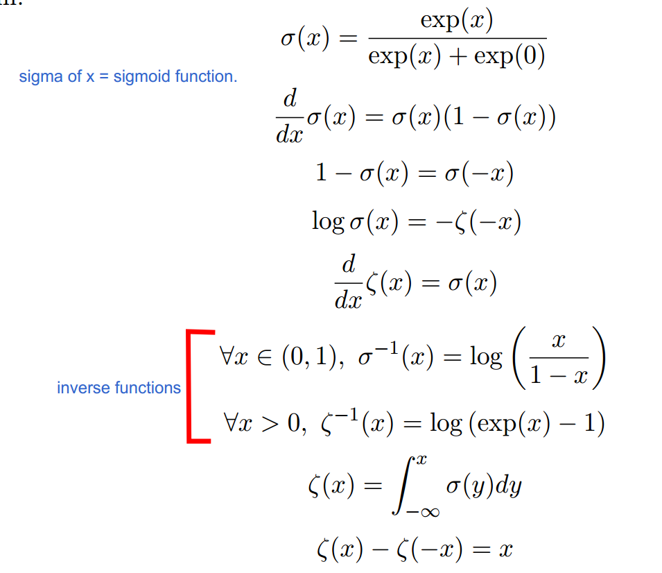
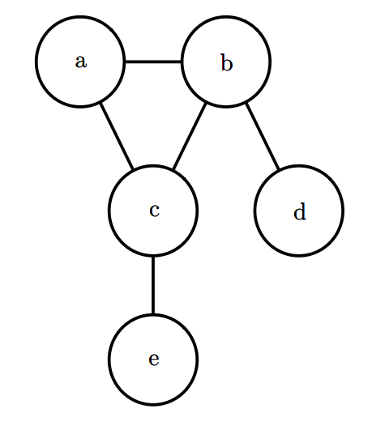

# Table of Contents

1. [Random Variables](#rv)
2. [Continuous Variables and Probability Density Functions](#pdfs)
3. [Marginal Probability](#marginal-distribution)
4. [Conditional Probability](#cp)
6. [Independence and Conditional Independence](#independence)
7. [Expectation, Variance and Covariance](#expectation)
8. [Bernoulli Distribution](#bernoulli)
9. [Multinoulli distribution](#multinoulli)
10. [Multivariate Normal Distribution](#multivariate_normal)
11. [Laplace Distribution](#laplace)
12. [Dirac Distribution](#dirac)
13. [Mixtures of Distributions](#mixture)
    - [Latent Variable](#latent)
14. [Useful Properties of Common Functions](#properties)
16. [Technical Details of Continuous Variables](#details)
17. [Information Theory](#information_theory)
16. [Kullback-Liebler Divergence](#kld)
17. [Cross-Entropy](#cross-entropy)
18. [Structured Probabilistic Models](#spm)
    1. [Directed Graphical Models](#dgm)
    2. [Un-Directed Graphical Models](#ugm)

# [Random Variables](https://docs.google.com/document/d/1hwV8jragvdL-sDUv8RsOHtB83iBXWJIKCcvu-DjHc38/edit#heading=h.76ktuxjm8bxo)

# [Continuous Variables and Probability Density Functions](https://docs.google.com/document/d/1hwV8jragvdL-sDUv8RsOHtB83iBXWJIKCcvu-DjHc38/edit#heading=h.pmbracoxoabf)

# Marginal Probability

- we know the probability distribution over a set of variables and we want to know the probability distribution over just a subset of them.
- this distribution over the **subset** is called **marginal probability distribution**.
- we have discrete random variables x and y, and we know P (x; y). We can find P (x)
  
- For continuous variables, 

# [Conditional Probability](https://docs.google.com/document/d/1hwV8jragvdL-sDUv8RsOHtB83iBXWJIKCcvu-DjHc38/edit#heading=h.n9648tjdwlzw)

# [Independence and Conditional Independence](https://docs.google.com/document/d/1hwV8jragvdL-sDUv8RsOHtB83iBXWJIKCcvu-DjHc38/edit#heading=h.s9rvpbuz3ej4)

# Expectation, Variance and Covariance

- Covariance matrix
  
  - i.e. x is a vector of dimensionality n.

# [Bernoulli Distribution](https://docs.google.com/document/d/1hwV8jragvdL-sDUv8RsOHtB83iBXWJIKCcvu-DjHc38/edit#heading=h.8nal59hd5qah)

# Multinoulli distribution

- this has a total of k states are possible, as opposed to only 2 states(x = 0 and x = 1) in Bernoulli distribution .
- 
- 
- The Bernoulli and Multinoulli distributions are sufficient to describe any distribution over their domain.
  - both are very generic descriptions of a p.d.f. since we don't exactly know how p,q(in Bernoulli) and p_1,p_2..p_k (in Multinoulli) are generated, they may very well be even complicated p.d.f.'s

# Multivariate Normal Distribution

- 

# Laplace Distribution

- place a sharp peak of probability mass at an arbitrary point  is the Laplace distribution
- 
- on increasing mu:
  
- on increasing gamma:
  

# Dirac Distribution

- 

# Mixtures of Distributions

- made up of several component distributions. 

- On each trial, the choice of which component distribution should generate the sample is determined by sampling a component identity from a Multinoulli distribution.

- 

  -  is the Multinoulli distribution over component identities
  - this distribution boil downs to basically, on each trial, randomly sample a p.d.f. followed by randomly sample a value for this r.v. using this sampled p.d.f.

- ## Latent Variable

  - is a random variable that we cannot observe directly. 
  - The component identity variable c of the mixture model provides an example. 
  - Latent variables may be related to x through the joint distribution, in this case, 

# Useful Properties of Common Functions

- **logistic sigmoid** 
- **softplus function** 
  - can be useful for producing the  parameter of a normal distribution because its range is .
  - this is a smoothened version of the ReLU function, 
  - , red = softplus, blue = ReLU.
- 

# Technical Details of Continuous Variables

- Suppose we have two random variables, x and y, such that y = g(x), where g is an invertible, continuous, differentiable transformation. 
- One might expect that py(y) = px(g−1(y)). 
- This is actually not the case. 
- As a simple example, suppose we have scalar random variables x and y.
- Suppose y = x2 and x ∼ U(0; 1). 
- If we use the rule py(y) = px(2y) then py will be 0 everywhere except the interval [0; 12], and it will be 1 on this interval. 
- This means, which  violates the definition of a probability distribution.
- Recall that the probability of x lying in an infinitesimally small region with volume δx is given by p(x)δx. 
- Since g can expand or contract space, the infinitesimal volume surrounding x in x space may have
  different volume in y space.
- 
- 
  - remaining !!!

# Information Theory

- basic intuition behind information theory is that learning that an unlikely event has occurred is more informative than learning that a likely event has occurred
- We would like to quantify information in a way that formalizes this intuition.
  - Likely events should have low information content, and in the extreme case, events that are  guaranteed to happen should have no information content whatsoever. 
  - Less likely events should have higher information content. 
  - Independent events should have additive information. 
  - For example, finding out that a tossed coin has come up as heads twice should convey twice as much information as finding out that a tossed coin has come up as heads once.
- Accordingly, **self-information** of an event x = x is 
  - this is written in units of *<u>nats</u>*. 
  - One nat is the amount of information gained by observing an event of probability 1/e. 
  - Other texts use base-2 logarithms and units called bits or shannons.
  -  -log(x) for x in the range [0,1]
- The amount of uncertainty is quantified in an entire probability distribution using the Shannon entropy
  
- this is the expected amount of information in an event drawn from that distribution.
- as we can conclude from the expression, highly probable event(or distributions which are nearly deterministic for a given value of x, the r.v.) will have low Shannon entropy, and a less likely event(or distributions much closer to the uniform, i.e. all events are equally likely) will have high entropy
- **Shannon entropy** for **continuous** R.V. is called **differential entropy**.

# Kullback-Liebler Divergence

- for measuring **deviation amongst probability distributions**, the KL-divergence is used
  - 
  -  the extra amount of information  needed to send a message containing symbols drawn from probability distribution P , when we use a code that was designed to minimize the length of messages drawn from probability distribution Q remaining !!! 
- as it is obvious from the formula, the divergence is **not commutative**, hence it matters whether you optimize 

# Cross-Entropy

- 
- Minimizing the cross-entropy with respect to Q is equivalent to minimizing the KL divergence, because Q does not participate in the omitted term.
  - ![This is the rendered form of the equation. You can not edit this directly. Right click will give you the option to save the image, and in most browsers you can drag the image onto your desktop or another program.](https://latex.codecogs.com/gif.latex?H%28%7B%5Ccolor%7Bred%7DP%7D%2C%20Q%29%20%3D%20H%28%7B%5Ccolor%7Bred%7DP%7D%29%20&plus;%20D_%7BKL%7D%28%7B%5Ccolor%7Bred%7DP%7D%7C%7CQ%29%20%3D%20-%5Cmathbb%7BE%7D_%7Bx%20%5Ctextrm%7B%20from%20%7D%20%7B%5Ccolor%7Bred%7DP%7D%7D%20log%28Q%28x%29%29%20%5Cnewline%20H%28%7B%5Ccolor%7Bred%7DQ%7D%2C%20P%29%20%3D%20H%28%7B%5Ccolor%7Bred%7DQ%7D%29%20&plus;%20D_%7BKL%7D%28%7B%5Ccolor%7Bred%7DQ%7D%7C%7CP%29%20%3D%20-%5Cmathbb%7BE%7D_%7Bx%20%5Ctextrm%7B%20from%20%7D%20%7B%5Ccolor%7Bred%7DQ%7D%7D%20log%28P%28x%29%29%20%5Cnewline%20min._%7BQ%7D%5Cleft%28%20H%28%7B%5Ccolor%7Bred%7DP%7D%2C%20Q%29%20%5Cright%20%29%20%3D%20min_%7BQ%7D%20%5Cleft%28%20-%5Cmathbb%7BE%7D_%7Bx%20%5Ctextrm%7B%20from%20%7D%20%7B%5Ccolor%7Bred%7DP%7D%7D%20log%28Q%28x%29%29%20%5Cright%20%29%20%5Cnewline%20min._%7BQ%7D%5Cleft%28D_%7BKL%7D%28%7B%5Ccolor%7Bred%7DP%7D%7C%7CQ%29%20%5Cright%20%29%20%3D%20min._%7BQ%7D%5Cleft%28%5Cmathbb%7BE%7D_%7Bx%20%5Ctextrm%7B%20from%20%7D%20%7B%5Ccolor%7Bred%7DP%7D%7D%20log%28P%28x%29%29-%5Cmathbb%7BE%7D_%7Bx%20%5Ctextrm%7B%20from%20%7D%20%7B%5Ccolor%7Bred%7DP%7D%7D%20log%28Q%28x%29%29%20%5Cright%20%29%20%5Cnewline%20%5Ctextrm%7B%20as%20the%20first%20term%20is%20independent%20of%20%7D%20Q%28x%29%20%5C%5C%20min._%7BQ%7D%5Cleft%28D_%7BKL%7D%28%7B%5Ccolor%7Bred%7DP%7D%7C%7CQ%29%20%5Cright%20%29%20%3D%20min._%7BQ%7D%5Cleft%28-%5Cmathbb%7BE%7D_%7Bx%20%5Ctextrm%7B%20from%20%7D%20%7B%5Ccolor%7Bred%7DP%7D%7D%20log%28Q%28x%29%29%20%5Cright%29)

# Structured Probabilistic Models

- Often, the multivariate probability distributions involve direct interactions between relatively few variables. 

  - Using a single function to describe the entire joint probability distribution can be very inefficient (both computationally and statistically).
  - Instead of using a single function to represent a probability distribution, we can split a probability distribution into many factors that we multiply together.
  - for instance, for 3 r.v.'s a,b,c, 

- When we represent this factorization of a probability distribution with a graph, we call it a structured probabilistic model, or graphical model.

- there are 2 main kinds: directed and undirected.

- ## Directed Graphical Models

  - directed edges define parent and child node relationship, wherein the origin of the edge is the parent node and the node to which the arrow-head points is the child node.
  - 
  - 
    

  - 

- ## Un-Directed Graphical Models

  - no notion of parent and child node.
  - **Clique**:  Any set of nodes that are all connected to each other in the graph 
  - each clique  is associated with a function, 
  - These factors are just functions, **not probability distributions**. 
  - The **output** of each factor **must be non-negative**, but there is no constraint that the factor must sum or integrate to 1 like a probability distribution.
  - 
  - as we can see, the cliques are (a,b,c), (b,d) , (c,e), hence the probability distribution function is 
    
  - find usage !!!

- 