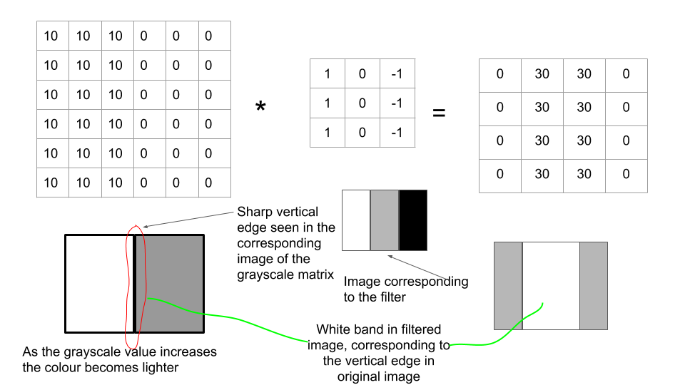
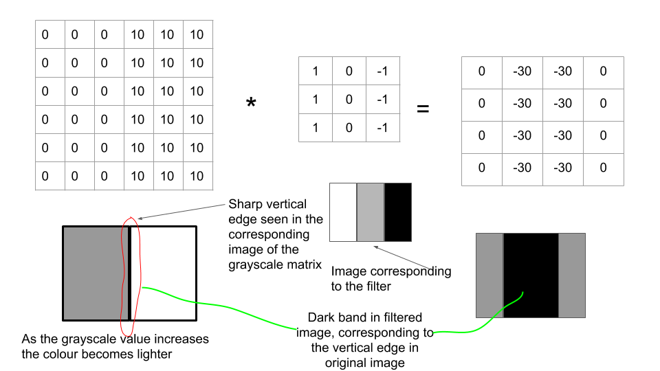
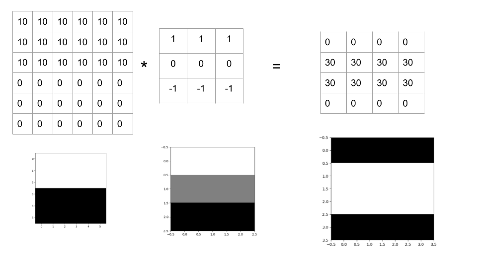
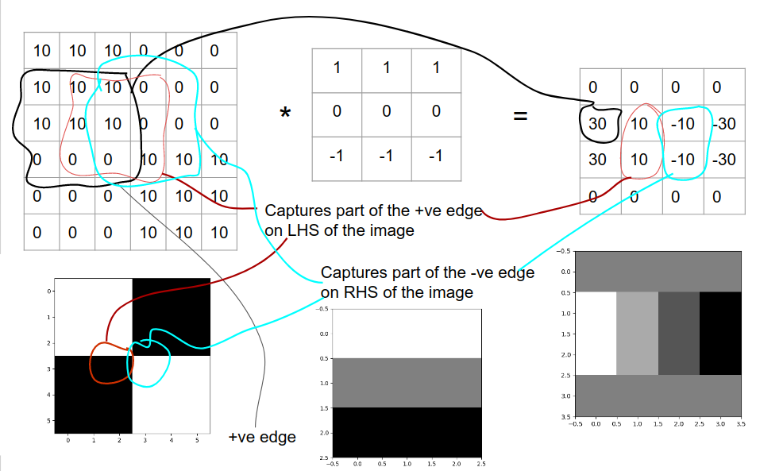

[Reference link for these notes](https://medium.com/@ageitgey/machine-learning-is-fun-part-3-deep-learning-and-convolutional-neural-networks-f40359318721)


# Table of Contents

1. [Andrew-NG](#resource1):
   1. [Lecture 1](#res1Lec1)


# Andrew-NG lectures <a name="resource1"></a>

## Lecture 1- Computer Vision

### Computer Vision Problems

1. Image classification: cat-identification, mnist number identification.
2. Object detection: self-driving cars have to not only detect other cars but also their position as well.
3. Neural Style Transfer: apps that *cartoonify* your face, apply some sort of neural transfer.

<span style="color:red;">1 of the few problems with CV </span>: inputs can get very big(suppose 64$\times$ 64$\times$ 3 (RGB channel) = 12288 features, but for a high resolution image, like 1000$\times$ 1000$\times$ 3(RGB channel) = 3M features) now if  a fully-connected layer is used, with the first hidden layer contains 1000 hidden units, then total weights = 1000$\times$ 3M matrix = 3B parameters. computational, memory requirements $\uparrow$ , difficult to get enough data to prevent NN from over-fitting.


To handle such large-res images, convolutions, and in turn CNNs are used.


## Lecture 2, 3- Edge-Detection

|  3   |  0   |  1   |  2   |  7   |  4   |
| :--: | :--: | :--: | :--: | :--: | :--: |
|  1   |  5   |  8   |  9   |  3   |  1   |
|  2   |  7   |  2   |  5   |  1   |  3   |
|  0   |  1   |  3   |  1   |  7   |  8   |
|  4   |  2   |  1   |  6   |  2   |  8   |
|  2   |  4   |  5   |  2   |  3   |  9   |

consider this $6\times 6\times 1$ grayscale image(resolution is $6\times 6$, number of colour channels = 1)  .

consider this $3\times 3$ filter(also called the $kernel$, by some research papers):

| 1    | 0    | -1   |
| ---- | ---- | ---- |
| 1    | 0    | -1   |
| 1    | 0    | -1   |

image is ***convoluted*** with the filter, Image_arr * filter (convolution operator).

output is $4\times 4 $: 


the  -16 encircled in purple ink is obtained when the last $3\times 3$ submatrix is convoluted with the filter: $(1\times 1 + 6\times 1 + 2\times 1)$ = <span style="color:red">9 + </span> $(7\times 0 + 2\times 0 + 3\times 0$)= <span style="color:red">0 + </span> $(8\times -1 + 8\times -1 + 9\times -1)$ = <span style="color:red">-25</span> = **-16**. 

Note: If you make the convolution operation in TensorFlow you will find the function `tf.nn.conv2d`. In keras you will find `Conv2d` function.



```python
import numpy as np
import matplotlib.pyplot as plt
import tensorflow as tf

temp = [10 for i in range(3)]
for i in range(3):
	temp.append(0)
img_list = []
for i in range(6):
	img_list.append(temp)
img_arr = np.array(img_list)

temp_filter = [1, 0, -1]
filter_arr = []
for i in range(3):
	filter_arr.append(temp_filter)
filter_arr = np.array(filter_arr)

img_arr = img_arr.reshape((1, 6, 6, 1))
filter_arr = filter_arr.reshape((3, 3, 1, 1))

# convert numpy arrays into tensors
x = tf.constant(img_arr, dtype=tf.float32)
kernel = tf.constant(filter_arr, dtype=tf.float32)

output = np.array(tf.nn.conv2d(x, kernel, strides=[1, 1, 1, 1], padding='VALID')).reshape(4, 4)
plt.imshow(output, cmap="gray")
```

Follow this link : [Intel® Optimization for TensorFlow* Installation Guide](https://software.intel.com/content/www/us/en/develop/articles/intel-optimization-for-tensorflow-installation-guide.html) to resolve the following error:

```bash
2020-05-13 12:36:39.938368: I tensorflow/core/platform/cpu_feature_guard.cc:145] This TensorFlow binary is optimized with Intel(R) MKL-DNN to use the following CPU instructions in performance critical operations:  SSE4.1 SSE4.2 AVX AVX2 FMA
To enable them in non-MKL-DNN operations, rebuild TensorFlow with the appropriate compiler flags.
2020-05-13 12:36:39.945654: I tensorflow/core/platform/profile_utils/cpu_utils.cc:94] CPU Frequency: 2394370000 Hz
2020-05-13 12:36:39.945884: I tensorflow/compiler/xla/service/service.cc:168] XLA service 0x562e49d11a90 executing computations on platform Host. Devices:
2020-05-13 12:36:39.945910: I tensorflow/compiler/xla/service/service.cc:175]   StreamExecutor device (0): Host, Default Version
2020-05-13 12:36:39.946144: I tensorflow/core/common_runtime/process_util.cc:115] Creating new thread pool with default inter op setting: 2. Tune using inter_op_parallelism_threads for best performance.
```




Since this is a dark to light transition(the reverse of the previous one), this corresponding effect is seen in the output image, where the central band is darker than its neighbours.

Observe that the filter itself has a light-to-dark transition. If suppose it was  

<table style="width: 100px" >
<tr>
    <td>-1</td>
    <td>0</td>
    <td>1</td>
</tr>
<tr>
    <td>-1</td>
    <td>0</td>
    <td>1</td>
</tr>
<tr>
    <td>-1</td>
    <td>0</td>
    <td>1</td>
</tr>    
</table>


, i.e. a dark-to-light transition, then for the case of light-to-dark input image, the convoluted image would be a central dark band with neighbouring lighter bands.

<span style="color: red;">negative edge:</span> go from darker to lighter band, <span style="color: blue">positive edge</span> : go from lighter to darker band

<span style="color: red; font-size: 20px;">all transitions are referred to when moving from left-to-right across any matrix</span>.

consider the filter:



Here we can see that horizontal edges are filtered out by the filter, due to its own colour-orientation. 

If a horizontal edge detection filter is used on the vertical edge image, or vice-versa, nothing is resolved, we obtain a dark image( $0_{4\times 4}$ ).

Consider the following image:


when convolved with a horizontal filter:




Sobel filter:

<table style="float: left; width: 300px">
    <tr>
        <td>1</td>
        <td>0</td>
        <td>-1</td>
    </tr>
    <tr>
        <td>2</td>
        <td>0</td>
        <td>-2</td>
    </tr>
    <tr>
        <td>1</td>
        <td>0</td>
        <td>-1</td>
    </tr>
</table>
<table style="float: right; width: 300px;">
    <caption>Schuss filter</caption>
    <tr>
        <td>3</td>
        <td>0</td>
        <td>-3</td>
    </tr>
    <tr>
        <td>10</td>
        <td>0</td>
        <td>-10</td>
    </tr>
    <tr>
        <td>3</td>
        <td>0</td>
        <td>-3</td>
    </tr>
</table>

<span style="color: red;">Question1:</span> Why only $3\times 3$ filters work? can filters (especially edge-detection ones) be of some other $m\times n$ ?

filters can also be learned (those 9 numbers, in the $3\times 3$ matrix) using backpropogation. 

in addition to vertical and horizontal edge filters, inclined edge filters(edge inclined at $45^{\circ}$ , $60^{\circ}$, etc.) can also be used to detect such types of edges. 

The method of learning $w_1$ to $w_9$ using NNs is much more effective than picking any filters by hand. Filters can basically be used to resolve low-level features of images, such as vertical, horizontal and inclined edges.


## Lecture-4 : Padding

image-$6\times 6$ * filter-$3\times 3$ = output-resolved-$4\times 4$ , or image-$n\times n$ * filter-$f\times f$ = output-resolved-$n-f+1\times n-f+1$

hence as the filter becomes bigger(f $\uparrow$) , the output-resolved image becomes smaller. for the 6$\times $6 image, the filter can be applied only for a few iterations, 6$\rightarrow$4$\rightarrow$2. It wouldn't be practical if every-time some low-level features like edges are detected(i.e. the filter is convoluted with the input image and the output resolved image obeys the edge-detection pattern) the input image shrinks.  This shrinking would be particularly troublesome in Deep-neural nets.

A lot of information is thrown away when the corner-pixels and edge-pixels of the image are used only once to obtain the convoluted output, whereas inner pixels are found to be overlapped in many f$\times $f sub-matrices of the input-image. 

To solve these issues, a *border* of pixels is added to the original image . hence an n $\times$ n image becomes an n+2 $\times$ n+2 image. Padding is usually done with 0's. Hence the convoluted output becomes n+2-f+1 = ($n-f+3 \times n-f+3$).  This is for when **p=1**. If suppose padding is with **p** number of borders, input = $\textrm{n+2p}\times \textrm{n+2p}$ , convoluted image is $\textrm{n+2p-f+1}\times \textrm{n+2p-f+1}$ . For our n=6, p=1,f=3, we can now operate as: $(\textrm{6}\rightarrow\textrm{8})\rightarrow \textrm{6}\rightarrow \textrm{4}\rightarrow \textrm{2}$, if suppose we use padding only once, i.e. *just for the input image*. This results in an increased contribution of the corner and edge pixels in the output-convoluted image.


Two common choices to select p-value, or rather decide whether to pad or not: Valid and Same convolutions.

### Valid Convolutions

* no padding


### Same Convolutions

* pad as much so that output-convoluted image-size is same as that of the original-unpadded image-size.
* suppose n, f. then choose a p such that, $\textrm{n}\rightarrow\textrm{n+2p}\rightarrow\textrm{n+2p-f+1}$, such that n+2p-f+1 = n, or $\textrm{p =} \frac{\textrm{f-1}}{\textrm{2}}$ .


By convention in CV, f = odd.<span style="color: red;">find why</span>. one reason might be because of the above equation for p, if f = even, we would need some sort of asymmetric padding(fractional p means padding is asymmetric.)


## Lecture-5 : Strided convolutions

