# Table of Contents

1. [Lecture 1 - Computer Vision](#res1lec1):
  1. [Computer Vision Problems](#lec1r1)
2. [Lecture 2, 3 - Edge Detection](#res1lec2)
3. [Lecture 4 - Padding](#res1lec4):
   1. [Valid convolutions](#validconv)
   2. [same convolutions](#sameconv)
4. [Lecture 5 - Strided Convolutions](#res1lec5)
5. [Lecture 6 - convolutions over volume](#res1lec6)
6. [Lecture-7 : 1-layer of Convolution](#res1lec7)
7. [Lecture-8 : convnet example](#res1lec8)
8. [Lecture-9: Max-pooling](#res1lec9) 
   1. [max-pooling procedure](#res1lec9unit1)
   2. [average-pooling](#res1lec9unit2)
9. [Lecture-10 : CNN example](#res1lec10)
10. [Lecture-11 : Why Convolutions?](#res1lec11):
  1. [Parameter-sharing](#lec11n1)
  2. [Sparsity of connections](#lec11n2)


# Lecture 1- Computer Vision<a name="res1lec1"></a>

## Computer Vision Problems<a name="lec1r1"></a>

[please find the lecture video link here](https://www.youtube.com/watch?v=ulpwvUOH_Ag&list=PL1w8k37X_6L9YSIvLqO29S9H0aZ1ncglu&index=1)

1. Image classification: cat-identification, mnist number identification.
2. Object detection: self-driving cars have to not only detect other cars but also their position as well.
3. Neural Style Transfer: apps that *cartoonify* your face, apply some sort of neural transfer.

: inputs can get very big(suppose 64$\times$ 643 (RGB channel) = 12288 features, but for a high resolution image, like 1000$\times$ 1000$\times$ 3(RGB channel) = 3M features) now if  a fully-connected layer is used, with the first hidden layer contains 1000 hidden units, then total weights = 1000$\times$ 3M matrix = 3B parameters. computational, memory requirements $\uparrow$ , difficult to get enough data to prevent NN from over-fitting.


To handle such large-res images, convolutions, and in turn CNNs are used.


# Lecture 2, 3- Edge-Detection<a name="res1lec2"></a>

[lecture-2 video link](https://www.youtube.com/watch?v=5lvG3FfP0lg&list=PL1w8k37X_6L9YSIvLqO29S9H0aZ1ncglu&index=2)

[lecture-3 video link](https://www.youtube.com/watch?v=5lvG3FfP0lg&list=PL1w8k37X_6L9YSIvLqO29S9H0aZ1ncglu&index=2)

|  3   |  0   |  1   |  2   |  7   |  4   |
| :--: | :--: | :--: | :--: | :--: | :--: |
|  1   |  5   |  8   |  9   |  3   |  1   |
|  2   |  7   |  2   |  5   |  1   |  3   |
|  0   |  1   |  3   |  1   |  7   |  8   |
|  4   |  2   |  1   |  6   |  2   |  8   |
|  2   |  4   |  5   |  2   |  3   |  9   |

consider this $6\times 6\times 1$ grayscale image(resolution is $6\times 6$, number of colour channels = 1)  .

consider this $3\times 3$ filter(also called the $kernel$, by some research papers):

| 1    | 0    | -1   |
| ---- | ---- | ---- |
| 1    | 0    | -1   |
| 1    | 0    | -1   |

image is ***convoluted*** with the filter, Image_arr * filter (convolution operator).

output is $4\times 4 $: 


the  -16 encircled in purple ink is obtained when the last $3\times 3$ submatrix is convoluted with the filter: $(1\times 1 + 6\times 1 + 2\times 1)$ = <span style="color:red">9 + </span> $(7\times 0 + 2\times 0 + 3\times 0$)= <span style="color:red">0 + </span> $(8\times -1 + 8\times -1 + 9\times -1)$ = <span style="color:red">-25</span> = **-16**. 

<span style="color:red;" >Question: How are exceedingly large or highly negative values handled?</span>

Note: If you make the convolution operation in TensorFlow you will find the function `tf.nn.conv2d`. In keras you will find `Conv2d` function.

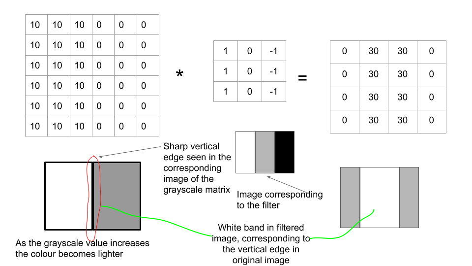

```python
import numpy as np
import matplotlib.pyplot as plt
import tensorflow as tf

temp = [10 for i in range(3)]
for i in range(3):
	temp.append(0)
img_list = []
for i in range(6):
	img_list.append(temp)
img_arr = np.array(img_list)

temp_filter = [1, 0, -1]
filter_arr = []
for i in range(3):
	filter_arr.append(temp_filter)
filter_arr = np.array(filter_arr)

img_arr = img_arr.reshape((1, 6, 6, 1))
filter_arr = filter_arr.reshape((3, 3, 1, 1))

# convert numpy arrays into tensors
x = tf.constant(img_arr, dtype=tf.float32)
kernel = tf.constant(filter_arr, dtype=tf.float32)

output = np.array(tf.nn.conv2d(x, kernel, strides=[1, 1, 1, 1], padding='VALID')).reshape(4, 4)
plt.imshow(output, cmap="gray")
```

Follow this link : [Intel® Optimization for TensorFlow* Installation Guide](https://software.intel.com/content/www/us/en/develop/articles/intel-optimization-for-tensorflow-installation-guide.html) to resolve the following error:

```bash
2020-05-13 12:36:39.938368: I tensorflow/core/platform/cpu_feature_guard.cc:145] This TensorFlow binary is optimized with Intel(R) MKL-DNN to use the following CPU instructions in performance critical operations:  SSE4.1 SSE4.2 AVX AVX2 FMA
To enable them in non-MKL-DNN operations, rebuild TensorFlow with the appropriate compiler flags.
2020-05-13 12:36:39.945654: I tensorflow/core/platform/profile_utils/cpu_utils.cc:94] CPU Frequency: 2394370000 Hz
2020-05-13 12:36:39.945884: I tensorflow/compiler/xla/service/service.cc:168] XLA service 0x562e49d11a90 executing computations on platform Host. Devices:
2020-05-13 12:36:39.945910: I tensorflow/compiler/xla/service/service.cc:175]   StreamExecutor device (0): Host, Default Version
2020-05-13 12:36:39.946144: I tensorflow/core/common_runtime/process_util.cc:115] Creating new thread pool with default inter op setting: 2. Tune using inter_op_parallelism_threads for best performance.
```


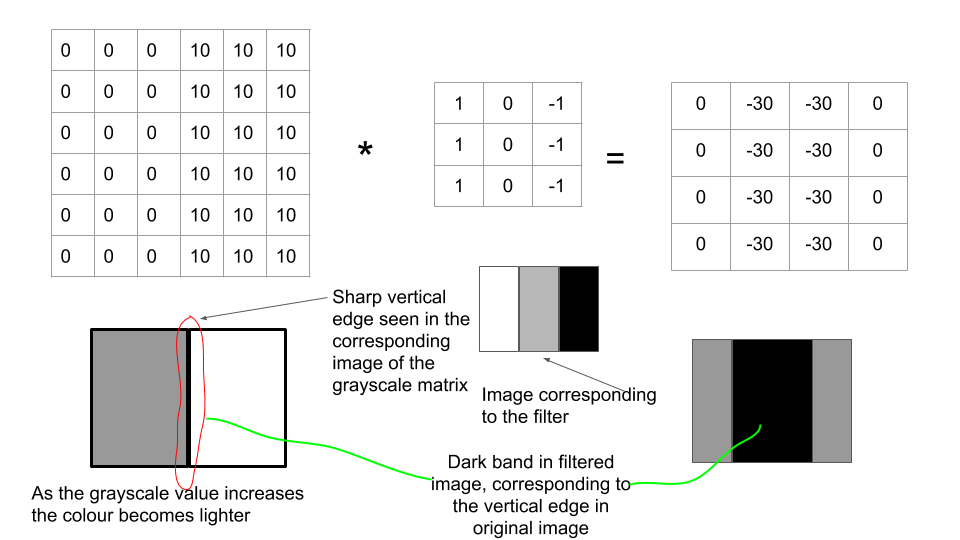

Since this is a dark to light transition(the reverse of the previous one), this corresponding effect is seen in the output image, where the central band is darker than its neighbours.

Observe that the filter itself has a light-to-dark transition. If suppose it was  

<table style="width: 100px" >
<tr>
    <td>-1</td>
    <td>0</td>
    <td>1</td>
</tr>
<tr>
    <td>-1</td>
    <td>0</td>
    <td>1</td>
</tr>
<tr>
    <td>-1</td>
    <td>0</td>
    <td>1</td>
</tr>    
</table>


, i.e. a dark-to-light transition, then for the case of light-to-dark input image, the convoluted image would be a central dark band with neighbouring lighter bands.

<span style="color: red;">negative edge:</span> go from darker to lighter band, <span style="color: blue">positive edge</span> : go from lighter to darker band

<span style="color: red; font-size: 20px;">all transitions are referred to when moving from left-to-right across any matrix</span>.

consider the filter:

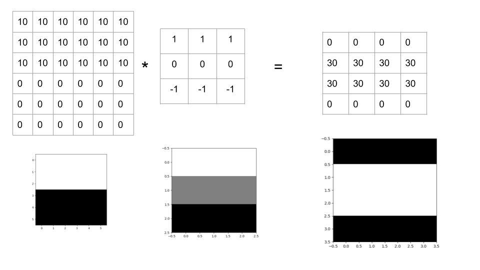

Here we can see that horizontal edges are filtered out by the filter, due to its own colour-orientation. 

If a horizontal edge detection filter is used on the vertical edge image, or vice-versa, nothing is resolved, we obtain a dark image( $0_{4\times 4}$ ).

Consider the following image:

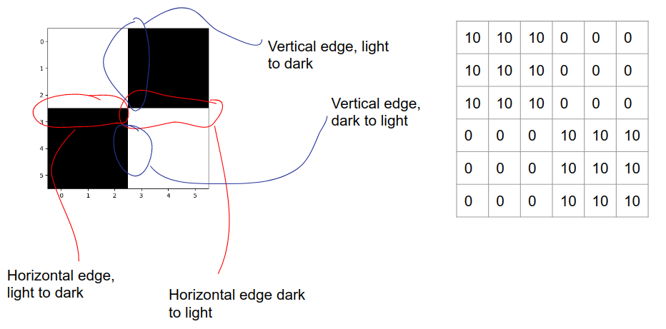

when convoluted with a horizontal filter:

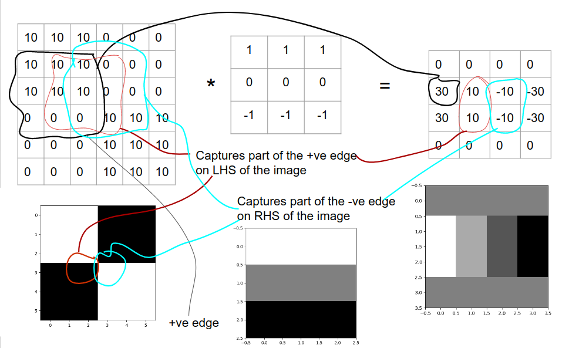


Sobel filter:

<table style="float: left; width: 300px">
    <tr>
        <td>1</td>
        <td>0</td>
        <td>-1</td>
    </tr>
    <tr>
        <td>2</td>
        <td>0</td>
        <td>-2</td>
    </tr>
    <tr>
        <td>1</td>
        <td>0</td>
        <td>-1</td>
    </tr>
</table>
<table style="float: right; width: 300px;">
    <caption>Schuss filter</caption>
    <tr>
        <td>3</td>
        <td>0</td>
        <td>-3</td>
    </tr>
    <tr>
        <td>10</td>
        <td>0</td>
        <td>-10</td>
    </tr>
    <tr>
        <td>3</td>
        <td>0</td>
        <td>-3</td>
    </tr>
</table>

<span style="color: red;">Question1:</span> Why only $3\times 3$ filters work? can filters (especially edge-detection ones) be of some other $m\times n$ ?

filters can also be learned (those 9 numbers, in the $3\times 3$ matrix) using backpropogation. 

in addition to vertical and horizontal edge filters, inclined edge filters(edge inclined at $45^{\circ}$ , $60^{\circ}$, etc.) can also be used to detect such types of edges. 

The method of learning $w_1$ to $w_9$ using NNs is much more effective than picking any filters by hand. Filters can basically be used to resolve low-level features of images, such as vertical, horizontal and inclined edges.


# Lecture-4 : Padding<a name="res1lec4"></a>

[please find the video link here](https://www.youtube.com/watch?v=JWlLkgbEDQM&list=PL1w8k37X_6L9YSIvLqO29S9H0aZ1ncglu&index=4)

image-$6\times 6$ * filter-$3\times 3$ = output-resolved-$4\times 4$ , or image-$n\times n$ * filter-$f\times f$ = output-resolved-$n-f+1\times n-f+1$

hence as the filter becomes bigger(f $\uparrow$) , the output-resolved image becomes smaller. for the 6$\times $6 image, the filter can be applied only for a few iterations, 6$\rightarrow$4$\rightarrow$2. It wouldn't be practical if every-time some low-level features like edges are detected(i.e. the filter is convoluted with the input image and the output resolved image obeys the edge-detection pattern) the input image shrinks.  This shrinking would be particularly troublesome in Deep-neural nets.

A lot of information is thrown away when the corner-pixels and edge-pixels of the image are used only once to obtain the convoluted output, whereas inner pixels are found to be overlapped in many f$\times $f sub-matrices of the input-image. 

To solve these issues, a *border* of pixels is added to the original image . hence an n $\times$ n image becomes an n+2 $\times$ n+2 image. Padding is usually done with 0's. Hence the convoluted output becomes n+2-f+1 = ($n-f+3 \times n-f+3$).  This is for when **p=1**. If suppose padding is with **p** number of borders, input = $\textrm{n+2p}\times \textrm{n+2p}$ , convoluted image is $\textrm{n+2p-f+1}\times \textrm{n+2p-f+1}$ . For our n=6, p=1,f=3, we can now operate as: $(\textrm{6}\rightarrow\textrm{8})\rightarrow \textrm{6}\rightarrow \textrm{4}\rightarrow \textrm{2}$, if suppose we use padding only once, i.e. *just for the input image*. This results in an increased contribution of the corner and edge pixels in the output-convoluted image.


Two common choices to select p-value, or rather decide whether to pad or not: Valid and Same convolutions.


## Valid Convolutions<a name="validconv"></a>

* no padding


## Same Convolutions<a name="sameconv"></a>

* pad as much so that output-convoluted image-size is same as that of the original-unpadded image-size.
* suppose n, f. then choose a p such that, $\textrm{n}\rightarrow\textrm{n+2p}\rightarrow\textrm{n+2p-f+1}$, such that n+2p-f+1 = n, or $\textrm{p =} \frac{\textrm{f-1}}{\textrm{2}}$ .


By convention in CV, f = odd.<span style="color: red;">find why</span>. one reason might be because of the above equation for p, if f = even, we would need some sort of asymmetric padding(fractional p means padding is asymmetric.)


# Lecture-5 : Strided convolutions<a name="res1lec5"></a>

[please find the video link here](https://www.youtube.com/watch?v=eJxFDAKDemA&list=PL1w8k37X_6L9YSIvLqO29S9H0aZ1ncglu&index=5)

stride=s,it basically means moving the filter by *s* number of steps, while convolution  with the input image. Till now we have been using s =1 . Hence when n=7, f=3, but s =2(instead of 1), our output image has resolution of ( {n - f} / s) +1, i.e. 3.

using n, f, s, p ; output-image size = <font size="5">$\lfloor{\frac{n+2p-f}{s}}\rfloor$</font>  + 1. Round this fraction **down**, in case its not an integer. this indicates that if part of the image couldn't convolve with the filter, then we ignore that entire f$\times $f sub-matrix .

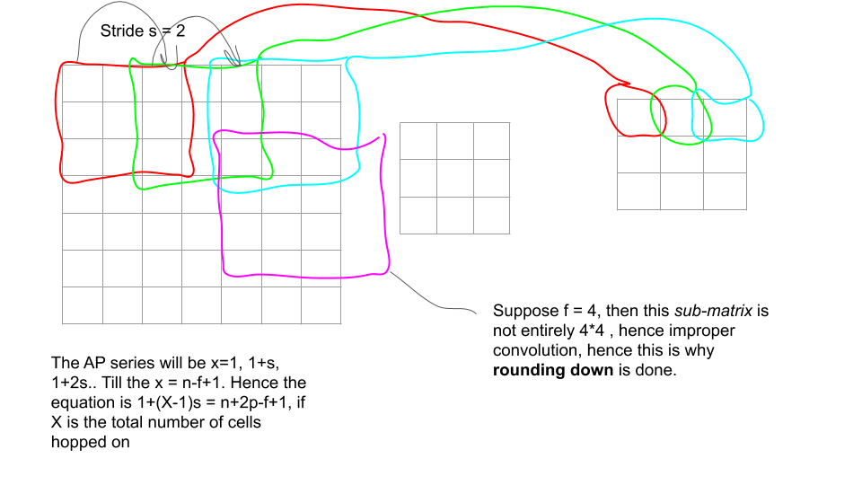


# Lecture-6 : Convolutions over volume<a name="res1lec6"></a>

[please find the video link here](https://www.youtube.com/watch?v=q2U9EPXeRKY&list=PL1w8k37X_6L9YSIvLqO29S9H0aZ1ncglu&index=6)

convolutions on RGB image, hence input image = $6\times 6\times 3$, hence the filter has to also be $3\times 3\times 3$ . Its obvious that number of channels in filter and input image should be the same. However, the output convoluted image has only **1 colour channel**.

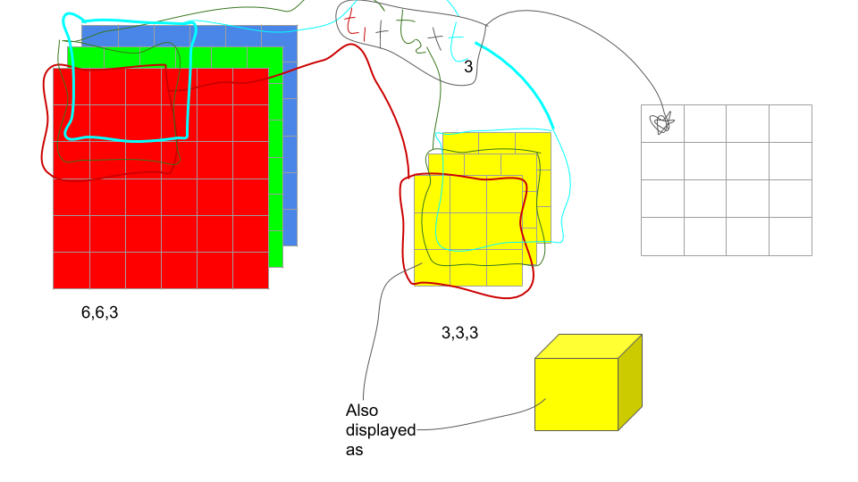

different choices of each filter-channel, different low-level features extracted from each input-image channel. 

As we can see here: 

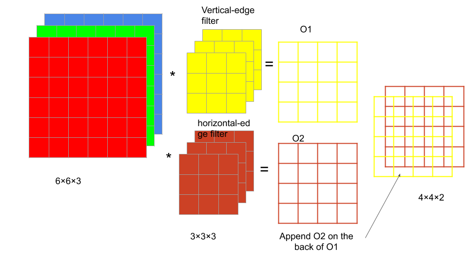

the output images from multiple filters have been *appended* together, in other words the number of channels for the output image have been increased.

Hence, now multiple low-level feature detection possible in input-image with RGB channel. The **depth of 3D volume** of the image also refers to the number of channels.


# Lecture-7 : 1-layer of Convolution<a name="res1lec7"></a>

[please find the video link here](https://www.youtube.com/watch?v=JPoVqmVcpz0&list=PL1w8k37X_6L9YSIvLqO29S9H0aZ1ncglu&index=7)

adding bias to each convoluted output(1-colour channel) from each filter. apply activation function, for instance Relu, after adding bias to output. Then stack the activated-biased outputs with each other. 

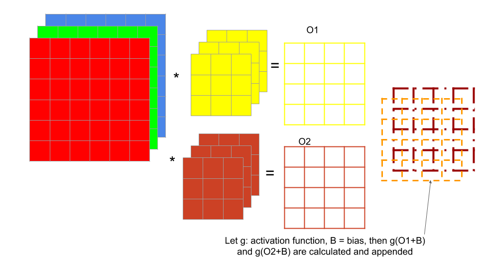This computation from $6\times 6\times 3$ to $4\times 4\times 2$ is 1 layer of CNN(this is what 1 layer of a CNN does).<span style="color:red;" >Question: How are exceedingly large or highly negative values handled?</span>

The g(O1+B) can be related to g($z^{[1]}$), hence now imagine how backprop could be used to choose filters(differential equations to optimise z$^{[1]}$, thus optimise O1, hence optimising the filter-values when taken as parameters).

To mathematically inform regarding the computation needed, suppose filter = 3$\times $3$\times $3, and we have 10 such filters. 27 parameters for each filter, hence 270 for filters and 10 for bias(if suppose different biases are to be used for each filter), so total of 280 parameters. 

<span style="color: red;">Note:</span>The optimisation doesn't depend on the image-size, rather the filter size and number of filters.

Let l denote the l$^{th}$ convolution layer. f$^{[l]}$ = filter size of the filter used for that layer,  p$^{[l]}$: padding for that layer. s$^{[l]}$ = stride, and so on the superscript is used for all the other quantities. 

Now, consider the l$^{th}$ layer. input-image to this layer would be of dimensions n$_H^{[l-1]}$ $\times$ n$_W^{[l-1]} \times $n$_C^{[l-1]}$  if suppose *same convolutions* method of padding is used. The relation between the input-size of l-1$^{th}$ layer and l$^{th}$ layer is :

$n^{[l]}$ = <font size="5">$\lfloor{\frac{n^{[l-1]} + 2p^{[l]} - f^{[l]} }{s^{[l]}} + 1} \rfloor$</font> , i.e. what was the output from previous layer, what will be the filter used, padding used and stride length used in the current layer. The formula applies for both height and width of the **output volume**. 

* each filter = $f^{[l]} \times f^{[l]}\times n_C^{[l-1]}$ since the number of filters depend upon the input-size of the current layer. 
* **Activations** a[l] = n$_H^{[l]}$ $\times$ n$_W^{[l]} \times $n$_C^{[l]}$  ., for mini-batch gradient descent, let m be the batch size(tensorflow convolution functions don't usually give the option of choosing different batch sizes for different layers ) for each layer, the A$^{[l]}$ = m$\times $ n$_H^{[l]}$ $\times$ n$_W^{[l]} \times $n$_C^{[l]}$ .
* **weights ** : $f^{[l]} \times f^{[l]}\times n_C^{[l-1]} \times $n$_C^{[l]}$ 


# Lecture-8 : example of simple ConvNet<a name="res1lec8" ></a>

[please find the video link here](https://www.youtube.com/watch?v=jA7G9hKjmFk&list=PL1w8k37X_6L9YSIvLqO29S9H0aZ1ncglu&index=8)

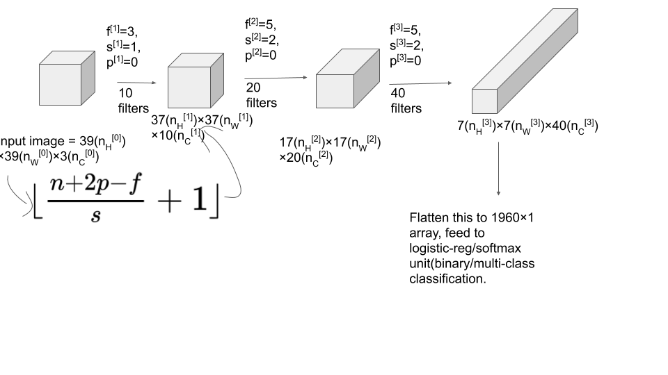

Types of layers in a CNN:

* convolution layer(Conv)
* pooling layer(Pool)
* fully-connected layer(FC)


# Lecture-9 : Pooling Layer<a name="res1lec9"></a>

[please find the video link here](https://www.youtube.com/watch?v=XTzDMvMXuAk&list=PL1w8k37X_6L9YSIvLqO29S9H0aZ1ncglu&index=9)

## Max-pooling<a name="res1lec9unit1"></a>

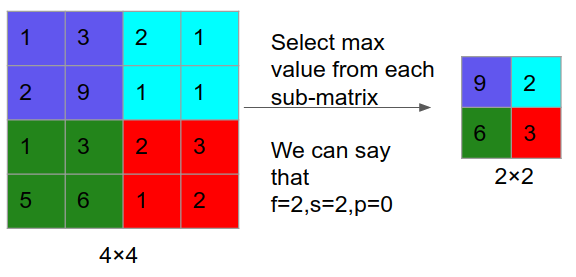

Think of the 4$\times$4 input as a middle-layer or activation-layer for some features, a large number means that some particular features is detected(recall that if an edge existed, the output would have either the negatively or positively highest value, and if a feature doesn't exist or isn't detected by the current filter, the output-cell value for that feature would be  very small.) 

Hence, it may be that the **9** represents some sort of a stark feature. 

Hence if a feature is detected, then its value for that sub-matrix is high, and max-pooling would be used to preserved that *high value detected, which actually corresponds to that particular feature*. 

Any low values might indicate that some feature isn't detected, or is very minutely present.

for max-pooling, the gradient descent doesn't learn anything from them, once f,s are fixed, since there is no such thing as filter-values. 

Since there is no concept of *number of filters*, number of channels of the input = number of channels of the output(in other words, for **max-pooling layers** n$_C^{[l-1]}$ = n$_C^{[l]}$). Each channel of input the max-pooling is performed to get the corresponding output for that channel.


## Average-Pooling<a name="res1lec9unit2"></a>

* take the average of numbers, instead of max-value. 
* Isn't used very often, when compared to max-pooling.

common choice of hyperparameters : f=2, s=2, usually padding isn't used here. this reduces the input-image size to half of its original value(use the n-f/s equation.)


# Lecture-10 : CNN example<a name="res1lec10"></a>

[please find the video link here](https://www.youtube.com/watch?v=Nkj9O-kmzjc&list=PL1w8k37X_6L9YSIvLqO29S9H0aZ1ncglu&index=10)

number-recognition from image, RGB channel used, **inspired from** LeNet5(by Hyan mikun) 

Layer l = conv$^{[l]}$ + pool$^{[l]}$ , this is because pooling layers don't need any hyperparameter optimisation, hence can be clubbed together with the previous convolution layer.

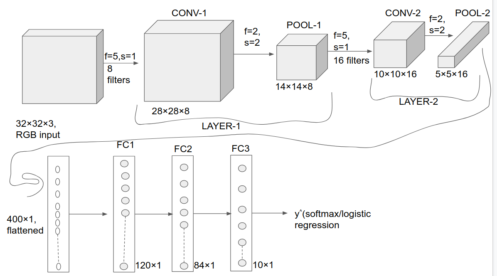

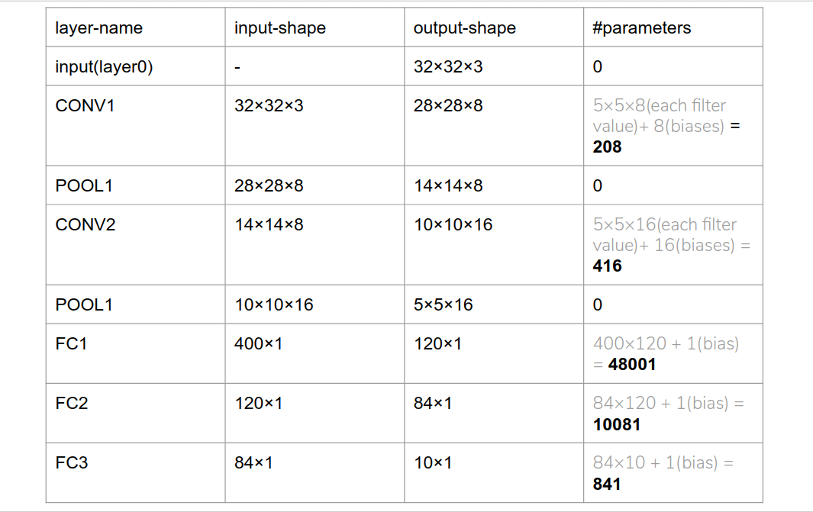

Observe that the number of parameters are very large for fully-connected layers, when compared to those of the CONVs.


# Lecture-11 : Why convolutions?<a name="res1lec11"></a>

[please find the video link here](https://www.youtube.com/watch?v=qLq3mDl_bGk&list=PL1w8k37X_6L9YSIvLqO29S9H0aZ1ncglu&index=11)

consider the previous example. Consider the CONV1 layer. if suppose instead of convolution, a fully-connected layer had been used, keeping the input-output dimensionality same. then #parameters = 32$\times$32$\times$3$\times$28$\times$28$\times$8 = 19,267,584. Hence fully-connected layer isn't computationally feasible.


## Parameter-sharing<a name="lec11n1"></a>

Once the values of a filter are learned, it can be used with different parts of the same image, i.e. for different sub-matrices of size f$\times$f of the image.


## Sparsity of connections<a name="lec11n2"></a>

* number of computations only depend upon the filter-size f. 
* for each layer the output values depend on only a small number of inputs. 
* for eg. consider the vertical-edge detection case, any output-pixel depends only on the 9-values of the sub-matrix of the input-image, and not the *entire image*. 
* hence connections are sparse, as in not all pixels are used to calculate value of 1 cell of output. 


this operation is *immune to shifting of images*, or technically referred to as **translational invariance**.[Refer here](https://medium.com/@ageitgey/machine-learning-is-fun-part-3-deep-learning-and-convolutional-neural-networks-f40359318721)
