# Table of Contents

1. [Lecture-2 : Classic CNNs](#res1lec13)
   1. [LeNet5](#lec13n1)
   2. [AlexNet](#lec13n2)
   3. [VGG-16](#lec13n3)
2. [Lecture 3, 4 : ResNets](#res1lec14):
   1. [Residual Block](#lec2n1)
   2. [ResNet](#lec2n2)
3. [Lecture-5 : Network in Network](#res1lec15)
4. [Lecture-6, 7 : Inception Network](#res1lec15)
   1. [Motivation](#lec16n1)
   2. [Inception-module](#lec16n2)
   3. [Inception-network](#lec16n3)
5. [Lecture-8 : Transfer learning](#res1lec20)
6. [Lecture-9 : Data Augmentation](#res1lec21)
7. [Lecture-10 : State of computer Vision](#res1lec22)

Note : [Lecture-1]() is just insights into different case studies, it doesn't have any theoretical-content, hence not mentioned here.

# Lecture-2 : Classic CNNs

## LeNet - 5

this was trained on grayscale images of handwritten numbers. main task was to recognise handwritten number. the POOL1 uses average pooling, since back when this paper was being written average pooling was popular, Search why it was so.

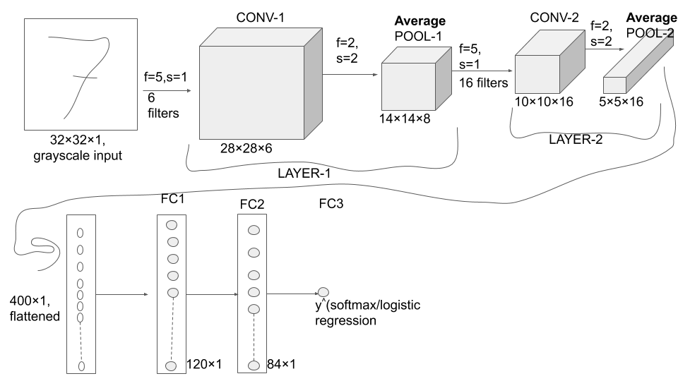

total number of parameters = (150+6)+0+(400+16)+0+(48000+1)+(10080+1) = 58,653.

Observations:

* n$_H$, n$_W \downarrow$ n$_C \uparrow$ 

[Le-Cuhn et. al, 1998](https://github.com/akshayDev17/NNProjects/blob/master/notes/research_papers/Lecun98.pdf)

* sigmoid and tanh activations were used in place of Relu. 
* back then, to optimise computation time and parameter-updation, it had different filters looking at different channels of the input-image block.
* it used sigmoid activation even after pooling.

## AlexNet

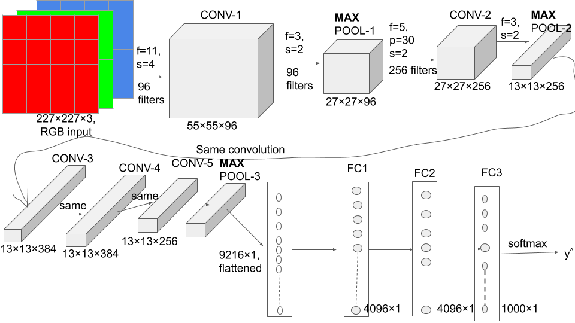

same indicates [same convolutions](#sameconv) 

total parameters = (11$\times$11$\times$96+96)+(5$\times$5$\times$256+256)+(3$\times$3$\times$384+384)+(3$\times$3$\times$384+384)+(3$\times$3$\times$256+256)+(4096$\times$9216+1)+(4096$\times$4096+1)+(4096$\times$1000+1) = 58,650,563 $\approx$ 60M .

Relu activation made it much better. 

had a complicated way of training on 2-GPUs since at that time(2014), GPUs were new and slower, layers  split across 2-gpus, gpus then communicate with each other. 

*Local Response normalisation layer*: consider  an intermediate image block(or volume); normalise along z-axis(or channel-axis). this was later dropped by future works, since researchers found that this didn't seem to work that much.

[AlexNet paper](https://github.com/akshayDev17/NNProjects/blob/master/notes/research_papers/alexnet.pdf)

## VGG-16 

f = 3, s = 1, same convolution padding, MAX-POOL : 2$\times $2, s = 2 .

the *16*  = 16 layers with updatable parameters. [CONV 64]$\times $2 means 2 CONV layers with each having 64 number of filters. number of parameters are 138 million parameters. observe the channel doubling 64$\rightarrow$128$\rightarrow$256$\rightarrow$512.  **VGG-19** is the bigger version of the same deepCNN architecture, VGG-16 does almost as well as VGG-19 . 

[VGG.pdf](https://github.com/akshayDev17/NNProjects/blob/master/notes/research_papers/vgg16.pdf)

# Lecture-3, 4 :  ResNets

resnet - residual networks. exploding/vanishing gradient: in very deep neural nets, the deeper layers have this problem during the gradient-update step.

## Residual Block

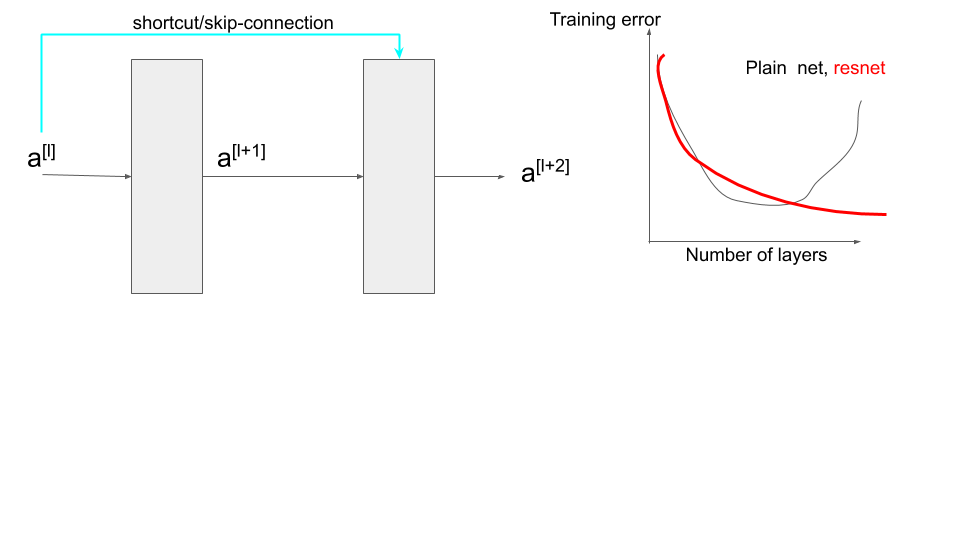

the normal path for neural network flow is in blue. whereas in the residual net, a$^{[l]}$ is inserted directly before the "Reluing", i.e. just after obtaining z$^ {[l+2]} $ to get a$^{[l+2]}$  This can be seen as a$ ^{[l]}$ passing its information deep into the NN.

The number of layers denote those in the plain network(vanilla deep-NN). once the skip-connection is made, then it can be called a ResNet.

Why does it work?.

Residual block mainly used to solve the exploding/vanishing gradient problem.How?.

usually in deep-NNs, *weight-decay* is used, after each update, the weights are multiplied by a factor slightly less than 1. This prevents the weights from growing too large, and can be seen as gradient descent on a quadratic regularization term. It may so happen that weights at the end of a deep NN are learnt to be zero, but using ResNets, its possible to prevent this from affecting the activation,. as depicted above with a$^{[l]}$ and        a$^{[l+2]}$ .

since a $\ge$ 0, g(a$^{[l]}$) = a$^{[l]}$  , adding residual block works with Relu activation, since the activation is merely copying a$^{[l]}$  2 steps forward, and learning this is much easy, since no particular weights are involved in this block, hence doesn't worsen the performance of NN, in terms of training time.

The simple deep-NN(with no residual blocks) has the problem that it finds difficult to learn even this identity function(choose suitable parameters, learn the fact  that W=0, b=0, and that a$^{[l+2]}$ = a$^{[ l ]}$), at that depth.

to ensure that dimensionality of z$^{[l+2]}$ and a$^{[l]}$ remains the same(since they are being added, it has to be the same), we can use same-convolutions CNN in place of normal fully-connected neural net-layers as the layers that form our residual block. The number of parameters for the residual block will be less in the former case than in the latter.

If suppose same convolutions isn't used, hence the dimensionality is different, use a weight W$_\textrm{s}$  matrix, such that W$_\textrm{s}$ $ \times$ a$^{[l]}$ has the same shape as a$^{[l+2]}$ .

## ResNet

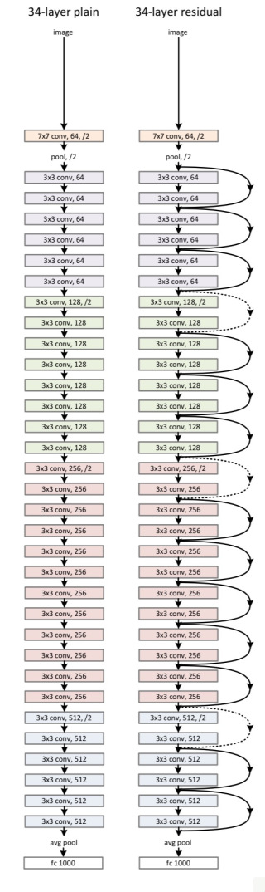

the **,/2** at the start indicates that a halving-pooling layer will be applied their to half the initial-input-image size. The last FC-1000 is for indicating softmax prediction. most of the *conv* layers have 3$\times$3 , same-convolutions. In the ResNet architecture, the pooling layers have been used in the middle as well, hence the dimensional inequality will be observed and for that we need the  W$_\textrm{s}$  matrix.

# Lecture-5 : Network in Network and 1$\times$1 convolutions

the 32-neuron FC layer(with 32 different parameters, for 1 filter(kernel) ) is replaced by a 1$\times$1 convolution(f=1, s=1), for a filter the values used across all channels is the same, we only have 1 value to be trained. 

1$\times$1 convolutions are usually used to reduce number of channels in the input-image.

**To summarise**:

* pooling layers to shrink n$_H$ and n$_W$
* 1$\times$1 convolutions to shrink n$_C$

# Lecture-6,7 : Inception Network

## Motivation

* 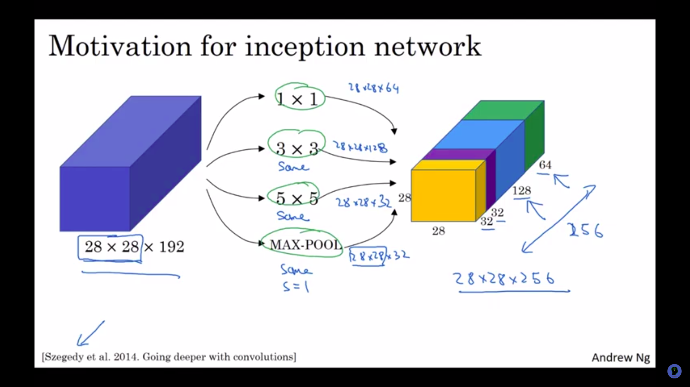
* trying different-size kernels and clubbing all their results together into the output-block. 
* The number of kernels tried for each of these different-size kernels can be equal/unequal. 
* For the max-pooling, we would have to use padding to ensure dimensional validation.
* [research paper](https://github.com/akshayDev17/NNProjects/blob/master/notes/research_papers/networkInNetwork.pdf)
* computational cost with the inception layer:
  * 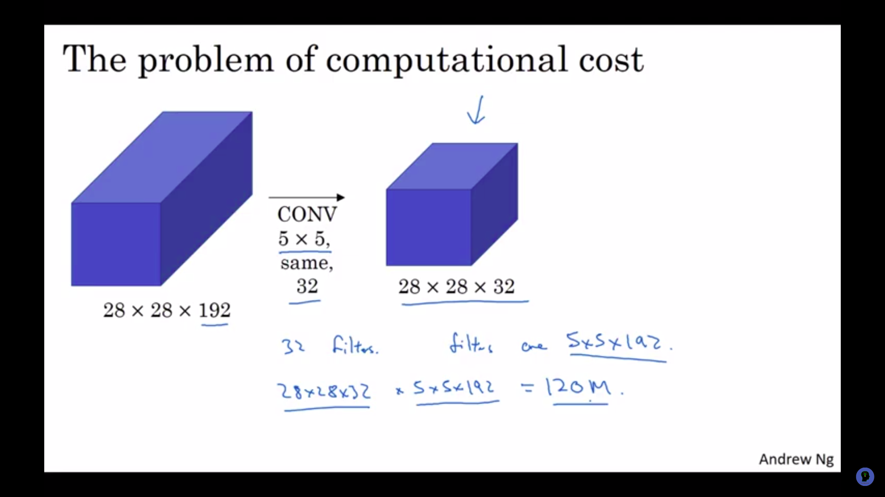
  * number of multiplications  = total-number-of-output-values $\times$multiplication-cost-for-each-value = (28$\times$28$\times$32) $\times  $ (5$\times$5$\times$192) = 120,422,400.
* using **1$ \times $1**  convolutions:
  * 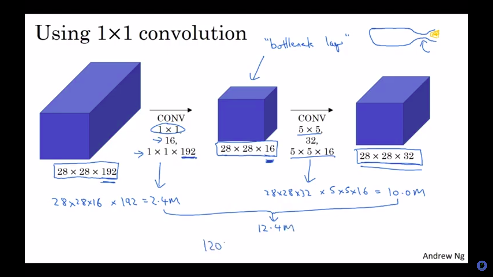
  * as discussed previously, since 1$\times$1 convolutions are used for decreasing n$_C$, it has been used to reduce n$_C^{[0]}$ =192 to n$_C^{[1]}$ = 16, and then the main 5$\times$5 CONV.
  * this 1$\times$1 convolution here is referred to as the *bottleneck layer* .
  * multiplications:
    * for the bottle-neck layer :  total-number-of-output-values $\times$multiplication-cost-for-each-value = (28$\times$28$\times$16) $\times  $ (1$\times$1$\times$192) = 2,408,448
    * for the Main layer :  total-number-of-output-values $\times$multiplication-cost-for-each-value = (28$\times$28$\times$32) $\times  $ (5$\times$5$\times$16) = 20,070,400
    * **total = 12,443,648**
    * hence using 1$\times$1 convolutions, number of multiplications has become $\approx$ 1/10th.
    * number of additions is very similar to number of multiplications, hence not mentioned here.

## Inception Module

* 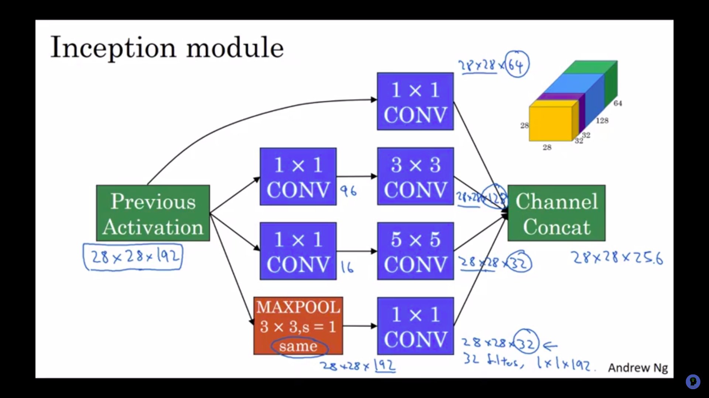
* the 1$\times$1 conv layer is added to the max-pool layer so that the number of channels is reduced, even for that path, to ensure dimension reduction, to ease the number of multiplications.
* channel concat refers to the clubbing up of the output-volumes from different kernels.

## Inception Network 

* This is stacking up of various inception modules.
* 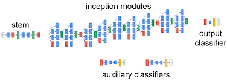
* [research paper](https://github.com/akshayDev17/NNProjects/blob/master/notes/research_papers/inception.pdf)
* each block is the inception module, with the exact same colour coding as that of the module.
* both the last layers of the  uppermost main-path and those of the 2 side-branches have:  FC$\rightarrow$ softmax-layer$\rightarrow$ prediction
* fun fact: the word **inception** actually comes from the movie itself, the research paper given above actually cites a meme made from that movie: 
  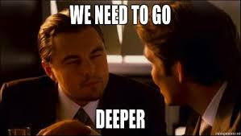

# Lecture-8 : Transfer Learning

*classification problem* = cat-detector, to recognise pet-cat, tigger/misty: 2 common cat names, ignore the case of both tigger and misty appearing at the same time

since we don't have that many pictures for either of tigger/misty, what can we do?

* get the implementation for a high-performing and open-source NN.
* scrape that NNs softmax layer off, and put your tigger/misty/neither classifying softmax instead.
* freeze all parameters of this NN, except those for the ending softmax layer.
* a small trick that could speed up this training is pre-compute the weights of the frozen-layers:
  * since the frozen-layers' parameters aren't to be tampered with, it basically means that the frozen layers map input-X to some intermediate output $f$(X).
  * to compute this $f$(X) again and again is futile, while training the desired softmax layer.
  * save the activations from the frozen-layers to disk.
* 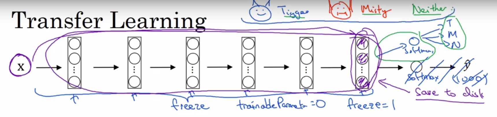

if we have a considerably large dataset, we could freeze only some of the hidden layers, and keep the rest unfrozen, while training.

As and when the dataset size increases, we could drop a bit more hidden layers, replace them with a model sized-NN. We could also just take the architecture, but initialise and train weights for all layers by choice.

# Lecture-9 : Data Augmentation

* 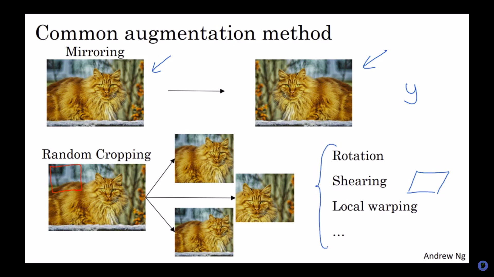
* Mirroring on the vertical(Y)-axis:
  * good technique if data is preserved.(for instance, cat-identification-NN, flipping an image containing cat will still have a cat.)
* Random-cropping : 
  * different example to train NN-model.
* Rotation
* Shearing
* Colour shifting :
  * 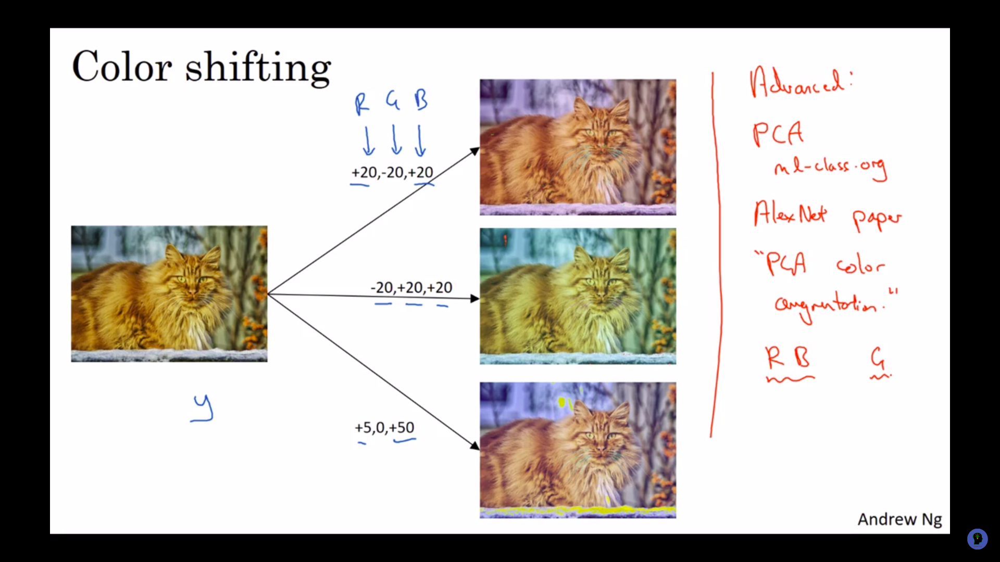
  * add some x,y,z to RGB values of the image-pixels.(these x,y,z extracted from a uniform distribution at random.)
  * good if data is preserved.(if suppose the task if coloured-identification of a cat, i.e. identify if white-cat/black-cat/golden-cat, then don't use this .)
  * PCA-augmentation : suppose if image is mainly purple and a very little green, add-subtract:(a lot of red, a very little green), to keep the overall colour of the tint the same.[AlexNet paper](https://github.com/akshayDev17/NNProjects/blob/master/notes/research_papers/alexnet.pdf)

Why does this work?, Benefits of augmentation?

for large-training set:

* use CPU thread(s) to implement the above suggested distortions(augmentations) on the same image.
* hence a mini-batch of data is formed from the same input-image.

# Lecture-10 : State of Computer Vision

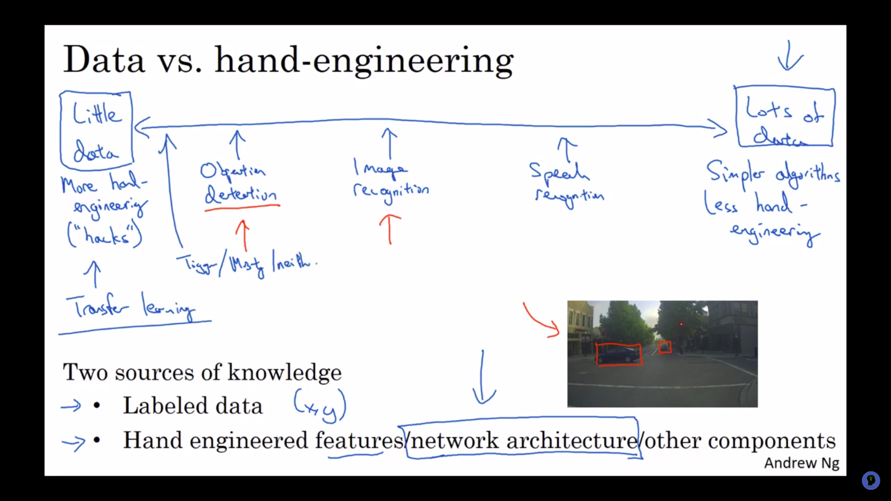

labelled-data $\downarrow$ , extent of hand-engineering $\uparrow$ . 

Tips for doing well in benchmarks:

* Ensembling:
  * train several NNs and average their outputs (y). 
  * Why does this work?
* Multi-crop at test-time :
  * multi-cropping on multiple versions of testing images(these multiple versions could be generated from the aforementioned [augmentation methods](#res1lect21)) .
  * 10-crop : 
    * generate 3 images from a testing image, via the augmentation methods. hence we have 4 images in total, im1 - original testing image, im2, im3. im4 - augmented ones.
    * for im1 and im3 - crop a major portion and feed that into the classifier. hence 2-images
    * for im2 and im4 - crop upper-left-hand portion,  upper-right-hand portion, lower-left-hand portion, lower-right-hand portion . hence 8-images.
    * average out the results(outputs) from all these 10-images.
    * Why does this work?
