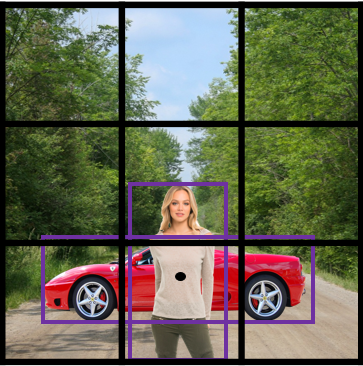

# Table of Contents

18. [Lecture-1 : Object Localisation](#res1lec23)
19. [Lecture-2 : LandMark Detection](#res1lec24)
20. [Lecture-3, 4 : Object Detection](#res1lec25):
    1. [Sliding-window](#lec25n1)
    2. [convert FC to CONV](#lec25n2)
    3. [CONV implementation of sliding window](#lec25n3)
21. [Lecture-5 : Bounding Box Predictions](#res1lec27)
22. [Lecture-6 : Intersection over union](#res1lec28)
23. [Lecture-7 : Anchor boxes](#res1lec30)
7. [Lecture-9 : YOLO algorithm]():
   1. [YOLO implementations](#lec9n1)
8. [Lecture-10 : Region Proposals](#lec10)
   1. [Segmentation Algorithm](#lec10n1)

# Lecture-1 : Object Localisation

draw a bounding box to indicate the position of the identified object.

usually 1 object in input-image while performing localisation.

background - neither of 3 classes detected. add the layer to output a bounding box(b$_x$, b$_y$, b$_h$, b$_w$), along with outputting the class of object. Hence the **labels** of the **training set** need to be appropriately **modified** to **have** the bounding-box values**(b$_x$, b$_y$, b$_h$, b$_w$)**  as well. 

$\begin{bmatrix}p_c\\b_x\\b_y\\b_h\\b_w\\c_1\\c_2\\c_3 \end{bmatrix}$ = target-label (y) , where p_c = probability that an object of class c exists., if c $\epsilon$ {valid-objects}, then bounding boxes are given by (b$_x$, b$_y$, b$_h$, b$_w$). here c$_\textrm{1}$,c$_\textrm{2}$,c$_\textrm{3}$ represent the elements of valid class-set. p$_{\textrm{c}}$=0 means no object could be identified. if p$_{\textrm{c}}$=1, $\exists$ $ \textrm{c}_\textrm{i}$ , c$_\textrm{i} \epsilon$ C(valid class set), such that  c$_\textrm{i} $ = 1 .

Loss-function $\mathcal{L} $($\hat{\textrm{y}}$, y) =  $\begin{cases} \sum\limits_{i}(\hat{y_i}-y_i)^{2} ,\, \quad if \; y_1 \ne 0\\ (\hat{y_1}-y_1)^{2} ,\qquad if \; y_1 = 0\end{cases}$ ,  i ranges from 1 to size of target-label-vector.

Loss-functions suggested:

* log-likelihood loss to softmax output for class-prediction.
* squared-error for bounding box coordinates
* logistic-loss for p$_\textrm{c}$ 

# Lecture-2 : Landmark Detection 

* consider the problem of **face recognition** , suppose a *sub-problem* is to *locate corner of the eye* :
  * modify the final-output layer to output (x, y) for the corner, as values l$_x$, l$_y$. 

* This is referred to as a **landmark**. 
* For L number of landmarks, output 2L values. 
* Thus modify the labels of the training set to incorporate these 2L values for each image.
* total number of outputs for the aforementioned tasks will be 2L+1(is this a face or not).
* CG effects, such the AR filters of snapchat, use this landmark detection technique to locate key points on the face and place the desired *snapchat-filter*.
* this landmark detection can be extended to any problem.

# Lecture-3, 4 : Object Detection

## Sliding-window detection

* 
* pick size of window
* keep on sliding it across the image, whatever inside will be cropped and sent to CONV for image recog.
* keep doing this : repeat the sliding but with a larger window.
* it may be necessary to resize the window-cropped image to the input-size compatible with the CONV.
* based on the intuition that if the object to be detected actually exists, then there would be a window capable of recognising the object.
* if step-size for the window, or the step-size for increasing the size of the window is increased, then a computational-cost/accuracy tradeoff would occur.Computational-cost, and not parameter-optimisation cost.
* to decrease this computational cost, instead of fully-connected layers, CONV layers would be used:

## Convert FC to CONV

* 
* using 5$\times$5$\times$16 filter for the 5$\times$5$\times$16 CONV layer, we convert it to a 1$\times$1$\times$400 by using 400 such filters.(use the  $\lfloor{\frac{n+2p-f}{s}}\rfloor$  + 1 equation.)
* use the 1$\times$1$\times$400 filter , and 400 such filters to replace the next FC layer.
* for the softmax FC, 1$\times$1$\times$400 filter and 4 such filters.
* the softmax had 4 possible outputs, pertaining to pedestrian/car//background classes, hence the last layer has 4.

## Convolution implementation of sliding windows

* 
* [research paper](https://github.com/akshayDev17/NNProjects/blob/master/notes/research_papers/CONVslidingWindow.pdf)
* the yellow-colour region along with blue denotes the training image, the blue part will be the window size.
* since the computations for all subimages(from the sliding window) is mere duplication, we actually use the dimensionality of the original image.
* but, we always highlight the sliding window part of the image at each layer.
* the final layer is a 2$\times$2 with the :
  * top-left hand corner giving output for the top-left part cropped by the window
  * bottom-left hand corner giving output for the bottom-left part cropped by the window
  * bottom-right hand corner giving output for the bottom-right part cropped by the window
  * top-right hand corner giving output for the top-right part cropped by the window
  * hence all such duplicate-calculations are avoided.

# Lecture-5 : Bounding Box Predictions

* tackle the inaccurate bounding-box predictions from NN.
* **YOLO algorithm**(you only look once):
  * [research paper](https://arxiv.org/pdf/1506.02640.pdf)
  * 
  * place a grid on the image.
  * apply image recognition and localisation to each of the grid-cells.
  * for each grid, specify a label y = $\begin{bmatrix}p_c\\b_x\\b_y\\b_h\\b_w\\c_1\\c_2\\c_3 \end{bmatrix}$
  * objects are assigned to their respective grid cell, if on using the bounding box parameters, the centre of the box thus calculated lies in that grid.
  * assumption: each grid cell contains at-most 1 object.
  * a convolution implementation would be used, similar to the sliding window , so that the output is total output volume = 3$\times$3$\times$8, where 8 = size of label, 3 = grid height, 3 = grid width. where each 1$\times$1$\times$8 denotes output for each grid.
* **Specify bounding boxes**:
  * the (b$_x$, b$_y$, b$_h$, b$_w$) are given by the fraction of the grid-cell size.
  * the b$_h$, b$_w$ values can be greater than 1, if the bounding box spans over multiple grid-cells.
  * exponentiation(to ensure +ve) and sigmoid(to ensure value is between 0 and 1) generally used for generating the bounding box parameters so that their values lie between 0 and 1.

# Lecture-6 : Intersection over union

* Compute $\frac{\textrm{size of intersection}}{\textrm{size of union}}$ = IoU , correct prediction regarding localisation if IoU $ \ge $ 0.5. 
* *size of intersection* is the intersection between the predicted box and ground truth and *size of union* is the size of union of these 2 regions.
* This maps localisation with accuracy of prediction.

# Lecture-7 : Non-Max Suppression

* way to ensure an object is detected only once, rather than detecting the same object multiple times.
* if the object being detected(consider car detection) is being shared among multiple grid-cells, hence each of these grid cells will output the same objected detected.(IoU $\ge$0.5 for all these cells.)
* this technique used to clean up these multiple detections per object.
* 

## Algorithm

* discard all p$_C \le $ 0.6 bounding boxes.
* choose the grid-cell with the max p$_{\textrm{C}}$ value that has detected the object under consideration, and suppress all those bounding boxes having p$_{\textrm{C}}$ values with their predicted bounding box lesser than this max value  .
* In a **While loop, iterate the following **:
  * when there are remaining boxes inside the same grid-cell, pick the box with largest p$_{\textrm{C}}$.
  * discard any remaining boxes if IoU $>$ 0.5 with the box output from the previous step(numerator will be the size of all the boxes having IoU $>$ 0.5 but a smaller p$_{\textrm{C}}$, and denominator will the size of the above selected bounding box, while calculating this IoU). 
* If there are multiple classes/object types **C** you want to detect, you should run the Non-max suppression **C** times, once for every output class.

# Lecture-8 : Anchor boxes

* 
* midpoint of pedestrian and car fall in the same grid-cell.
* 
* Pre-define 2 different shapes called anchor-boxes shape(anchor box 1 & 2)( more than 2 anchor boxes could also be used, its only for simplicity that the case of 2 anchor boxes is discussed.)
* repeat the column vector representation for all anchor boxes.
* vertically concatenate these label-vectors:
  * suppose there are B number of anchor boxes.
  * 
* Assign an object to a (grid cell, anchor-box) pair  only if:
  * the object's midpoint falls in that grid **AND**
  * the bounding-box of the object(ground-truth bounding box) has the highest IoU with a particular anchor box.
  * Hence the car is now encoded as (grid-cell-8, anchor-box 2) and the lady is now encoded as (grid-cell-8, anchor-box 1). 
    Note : Initially both of them were assigned to the same grid-cell, hence the encoding wasn't unique.
  * 
  * the yellow-green coloured column vector indicates that there is an object present for each kind of bounding box for that grid, whereas the *car-only* vector has the anchor box-1 p$_{\textrm{C}}$ = 0, which states that no object exists having a bounding box of IoU $\ne$ 0 with anchor box-1, or in other words, only 1 object had its centre inside the grid-cell.

Questions:

* search if there is a way of picking : 
  * the optimum number of anchor boxes
  * orientation of each anchor box
* how to handle if two objects have the same anchor-box shapes:
  * is there any tie-breaking method implemented ?

# Lecture-9 : YOLO algorithm

[Research Paper]()

consider a simplistic self-driving model:

* 3 output classes: pedestrian, car, motorcycle(the $\textrm{4}^{\textrm{th}}$ class, neither is handled with p$_{\textrm{C}}$ = 0)
* 2 anchor boxes
* hence the y is now 3$\times$3(grid-dimension)$\times$2(number of anchor boxes)$\times$8(parametric representation for each object):
  * the column vector notation [here](#res1lec30) is just for 1 grid-cell, and we have 3$\times$3 such cells.
  * or we can decompose it to 3$\times$3$\times$16
* 
* 

this is obtained when on running the ConvNet with non-max suppression, with 2 anchor-boxes. 2 bounding-boxes per grid-cells is highly noticeable.

get rid of low-probability predictions.

* 

get the best probability followed by the IOU filtering:

the YOLO algorithm is not suitable for detecting smaller objects.

[YOLO9000](https://arxiv.org/abs/1612.08242) is usually used for this.

## YOLO implementations

1. https://github.com/allanzelener/YAD2K
2. https://github.com/thtrieu/darkflow
3. https://pjreddie.com/darknet/yolo/

# Lecture-10 : Region Proposals

[Research paper]()

* R-CNN(regions with CNN) model proposed. 
* Its a modification to the YOLO algorithm. 
* Many of the regions of an image cropped by the grid don't actually have any object(background). 
* This model instead picks few regions to run the CONVNET classifier on. 
* The region-picking algorithm could be a segmentation algorithm.

## Segmentation Algorithm

*  
* locate a blob, as shown, pick a box that bounds that blob, and run the CONVNET classifier.
* suppose there are about 2000 such blobs, this could potentially contain much lesser computations than the initial plain YOLO algorithm.

There has been a lot of work regarding R-CNN tried to make it faster:

- R-CNN:
  - Propose regions(using some algorithm, similar to how segmentation was used) . Classify proposed regions one at a time. Output label(just the class) + bounding box.
  - **Downside** is that its **slow**.
  - [Girshik et. al, 2013. Rich feature hierarchies for accurate object detection and semantic segmentation](https://arxiv.org/abs/1311.2524)
- Fast R-CNN:
  - Propose regions. Use convolution implementation of sliding windows to classify all the proposed regions.
  - [Girshik, 2015. Fast R-CNN](https://arxiv.org/abs/1504.08083)
- Faster R-CNN:
  - Use convolutional network to propose regions.
  - [Ren et. al, 2016. Faster R-CNN: Towards real-time object detection with region proposal networks](https://arxiv.org/abs/1506.01497)
- Mask R-CNN:
  - https://arxiv.org/abs/1703.06870

Most of the implementation of **faster R-CNN** are still slower than YOLO .

Andrew Ng thinks that the idea behind YOLO is better than R-CNN because you are able to do all the things in just one time(classify at once) instead of two times(propose regions then classify).

Other algorithms that uses one shot to get the output includes **SSD** and **MultiBox**.

- [[Wei Liu, et. al 2015 SSD: Single Shot MultiBox Detector\]](https://arxiv.org/abs/1512.02325)

**R-FCN** is similar to Faster R-CNN but more efficient.

- [[Jifeng Dai, et. al 2016 R-FCN: Object Detection via Region-based Fully Convolutional Networks \]](https://arxiv.org/abs/1605.06409)

