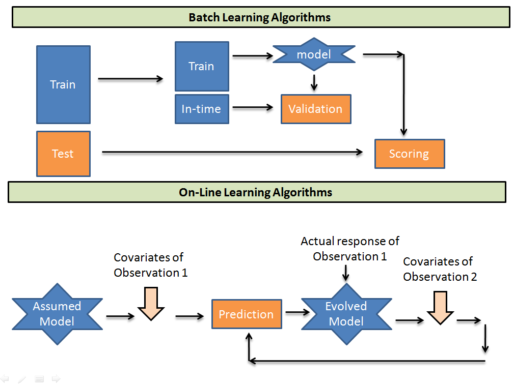

# Table of Contents

1. [Online Learning](#online_learning)
   1. [Horizontal vs Vertical Scalability](#scalability)
      1. [Vertical Scalability](#vs)
      2. [Horizontal Scalability](#hs)
   2. [Example where O.L. is highly effective](#eg)
   3. [Possible problems](#probs)
   4. [Scaling related issues](#sri)
   5. [Incremental learning libraries](#ill)
      1. [Simple sklearn example](#sklearn_example)
2. [Maximum Likelihood estimation](#mle)
   1. [Probability Density Estimation](#pd_estimation)
   2. [Defining likelihood function](#likelihood_function)
   3. [Usage in ML](#ml_usage)
3. [Argmax](#argmax)
4. [Preprocessing for NLP tasks](#preproc_NLP)


# Online Learning<a name="online_learning"></a>

[reference tutorial](https://medium.com/value-stream-design/online-machine-learning-515556ff72c5)

A.K.A. - incremental learning of out-of-core learning.

usually ML models are static in nature - once parameters are learned, only inferencing can take place. 

They are also ***horizontally scalable***.


## Horizontal vs Vertical Scalability<a name="scalability"></a>

### Vertical Scalability<a name="vs"></a>

1. adding more resources (CPU/RAM/DISK) to your server (database or application server is still remains one) as on demand.
2. most commonly used in applications and products of middle-range as well as small and middle-sized companies. 
3. One of the most common examples is to buy an expensive hardware and use it as a Virtual Machine hypervisor (VMWare ESX).
4. usually means upgrade of server hardware. 
5. Some of the reasons to scale vertically includes increasing IOPS (Input / Output Operations), amplifying CPU/RAM capacity, as well as disk capacity.
6. However, even after using virtualisation, whenever an improved performance is targeted, the risk for down-times with it is much higher than using horizontal scaling.

### Horizontal scalability<a name="hs"></a>

1. means that higher availability of services required, adding more processing units or physical machines to your server/database
2. growing the number of nodes in the cluster
3. reducing the responsibilities of each member node by spreading the key space wider and providing additional end-points for client connections. 
4. Horizontal Scaling has been historically much more used for high level of computing and for application and services.
5. **Although this does not alter the capacity of each individual node**, the load is decreased due to the distribution between separate server nodes.
6. why organisations prefer this largely over *<u>vertical scalability</u>* is because of increasing I/O concurrency, reducing the load on existing nodes, and increasing disk capacity can be achieved with it.


ML practitioners do the following to *update*(learn from newer data-set)

1. They manually train on newer data, and deploy the resulting model once they are happy with its performance
2. They schedule training on new data to take place, say, once a week and automatically deploy the resulting model<a name="daywise"></a>.
   1. this could be achieved using crontab.

**Ideal requirement**: learn as well as predict in *real time*.


## Example where O.L. is highly effective<a name="eg"></a>

Consider the following case:

* news website, displayed news article are according to type of topics clicked, and by whom they are clicked.
* predict type of news that users like, serve aptly.
* suppose government issues emergency, *everyone* is interested in domestic affairs
  * When presented with a news piece about the conference, a huge percentage of the audience clicks it to learn more.
* if [day-wise learning](#daywise) was used, model would be stuck at the same position, since its update-rate is too slow.
* With **online learning** there is no such thing as *yesterday's news*.


## Possible problems<a name="probs"></a>

1. algorithm itself might not be suitable
2. the model might fail to generalise well
3. the learning rate might be wrong
4. the regularisation might be too low or too high….......... 

In the accuracy/performance vs recent-knowledge trade-off, the latter is chosen many a times, to make the best possible decisions right *now,* its un-affordable to have a model that only knows about things that happened yesterday. 

* On exposing the model to *internet*, biased learning leading to skewed-classes.
* if learning rate too high, model might forget info learnt a second ago
* overfit/underfit
* DDoS attacks fry up the model.
* requires fast access to data.

* typically use in-memory storage like Redis(google this as well!!!).

* *Big data* processing frameworks aren’t of much help. 
* If you want to to both batch and online learning, Spark isn’t enough. 
* If you do only online learning, Spark is useless.


## Scaling-related issues<a name="sri"></a>

* model usually change from second to second, thus cannot instantiate several instances.

* technical architecture  can't be horizontally scalable.
* only a single model, parameters get updated with newer data dumps,
* most important part   **vertical scalability**
* may be unfeasible to distribute between threads as well[please google this!!!]


## Incremental learning libraries<a name="ill"></a>

[Vowpal Wabbit](https://github.com/VowpalWabbit/vowpal_wabbit) and [the scikit inspired Creme](https://creme-ml.github.io/)


### Using sklearn<a name="sklearn_example"></a>

```python
import numpy as np
from sklearn import linear_model
n_samples, n_features = 1, 500
y = np.random.randn(n_samples)
X = np.random.randn(n_samples, n_features)
clf = linear_model.SGDRegressor()
import time
start_time = time.time()
clf.partial_fit(X, y)
elapsed_time = time.time() - start_time
print(elapsed_time)
>>> 0.0008502006530761719
```

factoring in, 10ms for request processing, we could handle about 520 requests a second, or about *45 million* requests a day.


## O.L. vs Batch learning



* Batch learning creates  batches of specific sizes, out of training samples, and for each batch, the parameters are updated.
* in O.L., an initially guessed model takes each sample as an input, and all weights associated with the model are updated.
* **Computationally much faster and more space efficient**
  * single pass on each sample, whereas in batch learning, multiple passes, hence faster.
  * since training happens only on newer examples, no need to store previous examples.
* **Usually easier to implement**
  * implementing a one-pass algorithm is pretty easy, as the training samples come from a continous stream.
* 
  * require a service that continously provides the *stream of data* to the model.
  *  If data changes and feature selectors no longer produce useful output
  * if major network latency between servers of feature selectors
  * if server(s) goes down
  * all this would lead the learner to tank , output is garbage.
* 
  * primary requirement of this method: no distributional assumptions(about any train/test data)
  * there is actually no *test data for evaluation*
  * no way to get a representative set that characterizes your data, 
    * thus best option to evaluate performance: <u>simply look at how well the algorithm has been doing recently.</u>
* very hard to get the algorithm to behave “correctly” on an automatic basis. 
  * It can be hard to diagnose whether your algorithm or your infrastructure is misbehaving.


# Maximum Likelihood estimation<a name="mle"></a>

[All thanks to Jason Brownlee](https://machinelearningmastery.com/what-is-maximum-likelihood-estimation-in-machine-learning/)

* given a probability distribution and distribution parameters, this involves defining a likelihood function for calculating the conditional probability


## Probability Density Estimation<a name="pd_estimation"></a>

**Joint probability distribution**

1. suppose we have a quantity X which can have any value from the observation space .
   1. it can also be a list of values X =  .
   2. this is referred to as *drawing out a sample* from the observation space.
2. want to estimate probability of X= or X =  using a function which takes in argument the value  or  *and some additional parameters*, and returns this probability value.
   1. this resulting function  p.d.f.
   2. usually, all  assumed to be IID, i.e. independent and identically distributed.
3. this problem becomes more difficult when the size of sample drawn out is small
   1. this leads to a lot of noise, thus causing erroneous probability prediction.
4. 2 common approaches for estimation:
   1. MAP(maximum a posteriori) - Bayesian method.
      1. allows prior information about the form of the solution to be harnessed.
   2. MLE(maximum likelihood estimation) - frequentist method.
      1. assumes that all solutions are equally likely beforehand


## Defining Likelihood function<a name="likelihood_function"></a>

given a specific probability distribution function and its parameters, A.K.A , maximise the probability of the joint distribution over data X.

* conditional probability =  =  , here the "|" is dropped, *";" is used* since  is *not a random variable*, but an *unknown parameter*.
* this *conditional probability* representation is called the *likelihood* function, L(X; ).


MLE deals with maximising this likelihood function, for a given value of X, by modifying the parameters .

max.(L(X; ) ) = max(L(; )) = max. 

since all probabilities are very small values, to avoid floating-point related errors, we actually consider *log likelihood function*, :

* L(X; ) = log(P(X; )), objective: maximise L(X; )

* thus L(X; ) =   

  since its common in ML practices to aim for *minimisation of a cost function*, this is transformed into: , i.e. minimise the negative log-likelihood(NLL) function.


## Usage in ML<a name="ml_usage"></a>

* fitting an ML model to generate a p.d.f. 
  * find &theta;, this is to be *predicted*, that best explains the dataset **X**.
  * cost function is the NLL function itself
* this function is typically used in *unsupervised learning*, such as <u>Clustering</u>, *Using the expected log joint probability as a key quantity for learning, in a probability model with hidden variables is better known in the context of the celebrated “<u>expectation maximisation</u>” or EM algorithm.*
  * Page 365, [Data Mining: Practical Machine Learning Tools and Techniques](https://amzn.to/2lnW5S7), 4th edition, 2016.
* it can also be used in <u>supervised learning</u>
  * for predicting Y, given sample X, and parameters &theta;.  

**as the size of the dataset increases, the quality of the MLE estimator continues to improve.**


# Argmax<a name="argmax"></a>

given a function f(x, y, z, ....) that depends on such parameters, argmax will return the values of all these input parameters which yield the maximum value of f.

for instance:

- f(1) = 1^2 = 1
- f(2) = 2^2 = 4
- f(3) = 3^2 = 9
- f(4) = 4^2 = 16
- f(5) = 5^2 = 25

then argmax(f(x)) will return 5.

this function means *return the arguments of a function that yield its maximum value*.


# NLP Preprocessing<a name="preproc_NLP"></a>

* stemming.
  * search stemming *with noise removal*:
    * punctuation removal
    * special character removal
    * numbers removal
    * HTML formatting removal
    * domain specific keyword removal(e.g. ‘RT’ for retweet)
    * source code removal
    * header removal.
    * **ETC.**
  * all the above constitutes noise removal.
* stop-word removal
* normalisation
  * For example, the word “gooood” and “gud” can be transformed to “good”, its canonical form. 
  * this is referred to as *text normalisation*.