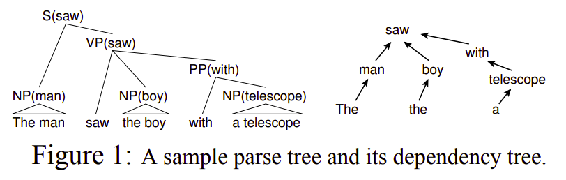
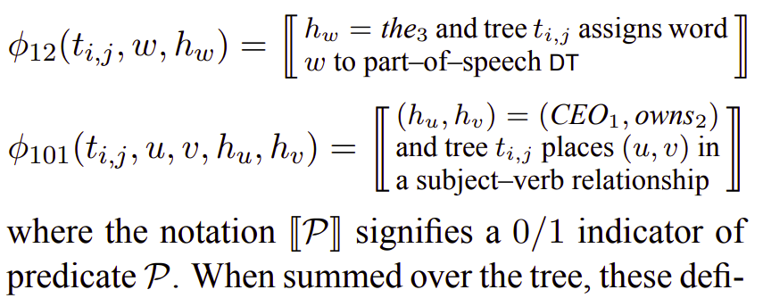
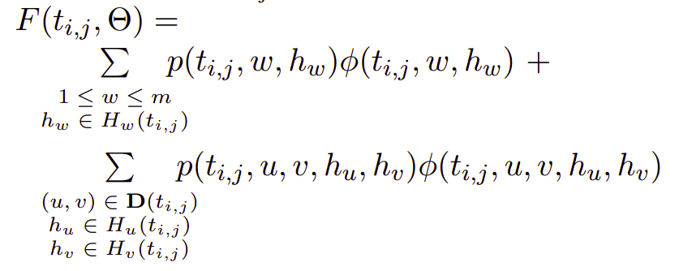
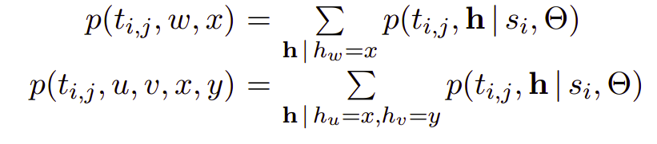

# Table of Contents

1. [The model](#model)
   1. [Localising feature vectors](#localising_vectors)
2. [Training the model](#training)
   1. [Derivation](#derivation)
   2. [Local-feature representation](#decompose)

[Please find the paper here.](https://www.aclweb.org/anthology/H05-1064/)

# The model

* based on conditional log–linear models.
*  Each sentence  for i = 1 . . . n in our training data has a set of  (each sentence has  number of parse trees) candidate parse trees  , which are the output of an N–best baseline parser. 
* Each candidate parse has an associated F–measure score,indicating its similarity to the gold–standard parse.
  *  parse tree with highest F-score for .
* for a parse tree  this model assigns hidden variables to each word in this tree.
  * if  spans *m* words, then the hidden-variable value domain will be for each word are the sets  
* global hidden-value assignment: assigns a hidden-variable value to each word in  
  *  where  or the cardinal product across domain of each word.
  * hence a hidden-variable value is attached to each word.
  *  is a d-dimensional feature vector defined 
    *  component  = count of some substructure
    * for instance, 
       might be number of times the word *the* occurs with hidden value  and part of speech tag DT in . 
       might be number of times  appears as the subject of  in . 
    * parameter vector  used along with parse-tree and hidden-variable vectors to generate a log-likelihood distribution:   
* after marginalising out the global assignment(**h**), we have  
* NLL w.r.t. &Theta;  =  
* the number of global assignments  increases exponentially with the increase in number of words in the sentence.
  * hence need to restriction to local space.
  * this is achieved using dependency structure.

## Localising feature vectors

* Its the graph formed by joining any 2 words u,v &epsilon;  with an edge, if and only if a *head-modified dependency* exists between them.

  * denoted by  , which contains the set of edges (u, v) for all word-pairs that follow the aforementioned constraint.

* w,u,v - word indices( words of sentence ),  *single-variable local feature vector*  and pair-wise local feature vector  ([we already know what h-u, h-v are](#global_assgn_word)).

* on decomposing the global feature vector as a sum of these local feature vectors, we get  

*  

  this tells us that each component of the local feature vectors is indicative of a count of occurrences of a particular feature .

  * after summing up these local feature vectors over the parse tree, we get  or  , as defined [here](#global_rep).

# Training the model

as define [here]() the loss function was  

gradient:
 , where  .

## Derivation

1. ![equation](https://latex.codecogs.com/gif.latex?%5Cbegin%7Balign*%7D%20%5Cfrac%7B%5Cpartial%5Ctextrm%7BL%7D%7D%7B%5Cpartial%20%5CTheta%7D%20%26%3D%20-%5Csum%5Climits_%7B%5Ctextrm%7Bi%7D%7D%20%5Cfrac%7B1%7D%7B%20%5Ctextrm%7Bp%7D%28%5Ctextrm%7Bt%7D_%7B%5Ctextrm%7Bi%2C%201%7D%7D%20%7C%20%5Ctextrm%7Bs%7D_%7B%5Ctextrm%7Bi%7D%7D%2C%20%5CTheta%29%20%7D%20%5Cfrac%7B%5Cpartial%20%5Ctextrm%7Bp%7D%28%5Ctextrm%7Bt%7D_%7B%5Ctextrm%7Bi%2C%201%7D%7D%20%7C%20%5Ctextrm%7Bs%7D_%7B%5Ctextrm%7Bi%7D%7D%2C%20%5CTheta%29%7D%7B%5Cpartial%20%5CTheta%7D%20%5C%5C%20%5CRightarrow%26%20-%5Csum%5Climits_%7B%5Ctextrm%7Bi%7D%7D%20%5Cfrac%7B1%7D%7B%20%5Ctextrm%7Bp%7D%28%5Ctextrm%7Bt%7D_%7B%5Ctextrm%7Bi%2C%201%7D%7D%20%7C%20%5Ctextrm%7Bs%7D_%7B%5Ctextrm%7Bi%7D%7D%2C%20%5CTheta%29%20%7D%20%5Csum%5Climits_%7B%5Ctextrm%7B%5Ctextbf%7Bh%7D%7D%5C%2C%20%5Cepsilon%5C%2C%20%5Ctextrm%7B%5Ctextbf%7BH%7D%28%7D%5Ctextrm%7Bt%7D_%7B%5Ctextrm%7Bi%2C%201%7D%7D%20%29%7D%20%5Cfrac%7B%5Cpartial%20%5Ctextrm%7Bp%7D%28%5Ctextrm%7Bt%7D_%7B%5Ctextrm%7Bi%2C%201%7D%7D%2C%20%5Ctextrm%7B%5Ctextbf%7Bh%7D%7D%5C%2C%20%7C%20%5Ctextrm%7Bs%7D_%7B%5Ctextrm%7Bi%7D%7D%2C%20%5CTheta%29%7D%7B%5Cpartial%20%5CTheta%7D%20%5Cend%7Balign*%7D)

2. now,  

   1. hence the inner derivative can be expressed as ![equation](https://latex.codecogs.com/gif.latex?%5Cbegin%7Balign*%7D%20%26%20%5Cfrac%7B%5Cpartial%28%5Cfrac%7B%5Ctextrm%7Bf%7D%7D%7B%5Ctextrm%7Bg%7D%7D%29%7D%7B%5Cpartial%20%5CTheta%7D%20%3D%20%5Cfrac%7B1%7D%7B%5Ctextrm%7Bg%7D%7D%5Cfrac%7B%5Cpartial%20%5Ctextrm%7Bf%7D%7D%7B%5Cpartial%20%5CTheta%7D%20-%20%5Cfrac%7B%5Ctextrm%7Bf%7D%7D%7B%5Ctextrm%7Bg%7D%7D.%5Cfrac%7B1%7D%7B%5Ctextrm%7Bg%7D%7D.%5Cfrac%7B%5Cpartial%20%5Ctextrm%7Bg%7D%7D%7B%5Cpartial%20%5CTheta%7D%20%5C%5C%20%5CRightarrow%26%20%5Ctextrm%7Bwhere%20%7D%20%5Ctextrm%7Bf%7D%20%3D%20%5Ctextrm%7Be%7D%5E%7B%5CPhi%28%5Ctextrm%7Bt%7D_%7B%5Ctextrm%7Bi%2C%201%7D%7D%2C%20%5Ctextrm%7B%5Ctextbf%7Bh%7D%7D%29.%5CTheta%7D%20%5Ctextrm%7B%20and%7D%20%5C%5C%20%26%5Ctextrm%7Bg%20%3D%20%7D%20%5Csum%5Climits_%7B%5Ctextrm%7Bj%7D%27%3D1%7D%5E%7B%5Ctextrm%7Bn%7D_%7B%5Ctextrm%7Bi%7D%7D%7D%5Csum%5Climits_%7B%5Ctextrm%7B%5Ctextbf%7Bh%7D%7D%5C%2C%20%5Cepsilon%20%5C%2C%20%5Ctextrm%7B%5Ctextbf%7BH%7D%7D%28%5Ctextrm%7Bt%7D_%7B%5Ctextrm%7Bi%2C%20j%7D%27%7D%29%7D%20%5Ctextrm%7Be%7D%5E%7B%5CPhi%28%5Ctextrm%7Bt%7D_%7B%5Ctextrm%7Bi%2C%20j%7D%27%7D%2C%20%5Ctextrm%7B%5Ctextbf%7Bh%7D%7D%29.%5CTheta%7D%20%5Cend%7Balign*%7D)
   2. hence, the entire derivative can be expressed as ![equation](https://latex.codecogs.com/gif.latex?%5Cdpi%7B120%7D%20-%5Csum%5Climits_%7B%5Ctextrm%7Bi%7D%7D%5Cfrac%7B%5Ctextrm%7B1%7D%7D%7B%5Ctextrm%7Bp%28%7D%5Ctextrm%7Bt%7D_%7B%5Ctextrm%7Bi%2C%201%7D%7D%5C%2C%20%7C%20%5Ctextrm%7Bs%7D_%7B%5Ctextrm%7Bi%7D%7D%2C%20%5CTheta%29%7D%5Cfrac%7B1%7D%7B%5Ctextrm%7Bg%7D%7D%5Csum%20%5Climits_%7B%5Ctextrm%7B%5Ctextbf%7Bh%7D%7D%20%5C%2C%20%5Cepsilon%20%5C%2C%20%5Ctextrm%7B%5Ctextbf%7BH%7D%28%7D%20%5Ctextrm%7Bt%7D_%7B%5Ctextrm%7Bi%2C%201%7D%7D%20%29%7D%5Cfrac%7B%5Cpartial%20%5Ctextrm%7Bf%7D%7D%7B%5Cpartial%20%5CTheta%7D%20&plus;%20%5Csum%5Climits_%7B%5Ctextrm%7Bi%7D%7D%5Cfrac%7B%5Ctextrm%7B1%7D%7D%7B%5Ctextrm%7Bp%28%7D%5Ctextrm%7Bt%7D_%7B%5Ctextrm%7Bi%2C%201%7D%7D%5C%2C%20%7C%20%5Ctextrm%7Bs%7D_%7B%5Ctextrm%7Bi%7D%7D%2C%20%5CTheta%29%7D%5Cfrac%7B1%7D%7B%5Ctextrm%7Bg%7D%7D%5Cfrac%7B%5Ctextrm%7Bf%7D%7D%7B%5Ctextrm%7Bg%7D%7D%20%5Csum%20%5Climits_%7B%5Ctextrm%7B%5Ctextbf%7Bh%7D%7D%20%5C%2C%20%5Cepsilon%20%5C%2C%20%5Ctextrm%7B%5Ctextbf%7BH%7D%28%7D%20%5Ctextrm%7Bt%7D_%7B%5Ctextrm%7Bi%2C%201%7D%7D%20%29%7D%5Cfrac%7B%5Cpartial%20%5Ctextrm%7Bg%7D%7D%7B%5Cpartial%20%5CTheta%7D)

3. hence the first term  becomes  , the steps are as follows:

   1. ![equation](https://latex.codecogs.com/gif.latex?%5Cbegin%7Balign*%7D%20%26%5Cfrac%7B%5Cpartial%20%5Ctextrm%7Bf%7D%7D%7B%5Cpartial%20%5CTheta%7D%20%3D%20%5CPhi%28%5Ctextrm%7Bt%7D_%7B%5Ctextrm%7Bi%2C%201%7D%7D%2C%20%5Ctextrm%7B%5Ctextbf%7Bh%7D%7D%29%5Ctextrm%7Be%7D%5E%7B%5CPhi%28%5Ctextrm%7Bt%7D_%7B%5Ctextrm%7Bi%2C%201%7D%7D%2C%20%5Ctextrm%7B%5Ctextbf%7Bh%7D%7D%29.%5CTheta%7D%20%5C%5C%20%26%5Ctherefore%20%5C%2C%20%2C%20%5C%2C%20%5Cfrac%7B1%7D%7B%5Ctextrm%7Bg%7D%7D%5Cfrac%7B%5Cpartial%20%5Ctextrm%7Bf%7D%7D%7B%5Cpartial%20%5CTheta%7D%20%3D%20%5Cfrac%7B%5CPhi%28%5Ctextrm%7Bt%7D_%7B%5Ctextrm%7Bi%2C%201%7D%7D%2C%20%5Ctextrm%7B%5Ctextbf%7Bh%7D%7D%29%5Ctextrm%7Be%7D%5E%7B%5CPhi%28%5Ctextrm%7Bt%7D_%7B%5Ctextrm%7Bi%2C%201%7D%7D%2C%20%5Ctextrm%7B%5Ctextbf%7Bh%7D%7D%29.%5CTheta%7D%7D%7B%5Csum%20%5Climits_%7B%5Ctextrm%7Bj%7D%27%20%3D%20%5Ctextrm%7B1%7D%7D%5E%7B%5Ctextrm%7Bn%7D_%7B%5Ctextrm%7Bi%7D%7D%7D%20%5Csum%5Climits_%7B%5Ctextrm%7B%5Ctextbf%7Bh%7D%7D%5C%2C%5Cepsilon%5C%2C%20%5Ctextrm%7B%5Ctextbf%7BH%7D%28%7D%5Ctextrm%7Bt%7D_%7B%5Ctextrm%7Bi%2C%20j%7D%27%7D%20%29%20%7D%20%5Ctextrm%7Be%7D%5E%7B%5CPhi%28%5Ctextrm%7Bt%7D_%7B%5Ctextrm%7Bi%2C%201%7D%7D%2C%20%5Ctextrm%7B%5Ctextbf%7Bh%7D%7D%29.%5CTheta%7D%7D%20%5C%5C%20%5Cend%7Balign*%7D)
   2. hence, the first term of  can be expressed as ![equation](https://latex.codecogs.com/gif.latex?%5Cbegin%7Balign*%7D%20%26%5Csum%5Climits_%7B%5Ctextrm%7B%5Ctextbf%7Bh%7D%7D%5C%2C%5Cepsilon%5C%2C%20%5Ctextrm%7B%5Ctextbf%7BH%7D%28%7D%5Ctextrm%7Bt%7D_%7B%5Ctextrm%7Bi%2C%201%7D%7D%20%29%20%7D%20%5Cfrac%7B%5CPhi%28%5Ctextrm%7Bt%7D_%7B%5Ctextrm%7Bi%2C%201%7D%7D%2C%20%5Ctextrm%7B%5Ctextbf%7Bh%7D%7D%29%5Ctextrm%7Be%7D%5E%7B%5CPhi%28%5Ctextrm%7Bt%7D_%7B%5Ctextrm%7Bi%2C%201%7D%7D%2C%20%5Ctextrm%7B%5Ctextbf%7Bh%7D%7D%29.%5CTheta%7D%7D%7B%5Csum%20%5Climits_%7B%5Ctextrm%7Bj%7D%27%20%3D%20%5Ctextrm%7B1%7D%7D%5E%7B%5Ctextrm%7Bn%7D_%7B%5Ctextrm%7Bi%7D%7D%7D%20%5Csum%5Climits_%7B%5Ctextrm%7B%5Ctextbf%7Bh%7D%7D%5C%2C%5Cepsilon%5C%2C%20%5Ctextrm%7B%5Ctextbf%7BH%7D%28%7D%5Ctextrm%7Bt%7D_%7B%5Ctextrm%7Bi%2C%20j%7D%27%7D%20%29%20%7D%20%5Ctextrm%7Be%7D%5E%7B%5CPhi%28%5Ctextrm%7Bt%7D_%7B%5Ctextrm%7Bi%2C%201%7D%7D%2C%20%5Ctextrm%7B%5Ctextbf%7Bh%7D%7D%29.%5CTheta%7D%7D%20%5C%5C%20%26%20%5CRightarrow%20%5Csum%5Climits_%7B%5Ctextrm%7B%5Ctextbf%7Bh%7D%7D%5C%2C%5Cepsilon%5C%2C%20%5Ctextrm%7B%5Ctextbf%7BH%7D%28%7D%5Ctextrm%7Bt%7D_%7B%5Ctextrm%7Bi%2C%201%7D%7D%20%29%20%7D%20%5Cleft%28%5Cfrac%7B%5Ctextrm%7Be%7D%5E%7B%5CPhi%28%5Ctextrm%7Bt%7D_%7B%5Ctextrm%7Bi%2C%201%7D%7D%2C%20%5Ctextrm%7B%5Ctextbf%7Bh%7D%7D%29.%5CTheta%7D%7D%7B%5Csum%20%5Climits_%7B%5Ctextrm%7Bj%7D%27%20%3D%20%5Ctextrm%7B1%7D%7D%5E%7B%5Ctextrm%7Bn%7D_%7B%5Ctextrm%7Bi%7D%7D%7D%20%5Csum%5Climits_%7B%5Ctextrm%7B%5Ctextbf%7Bh%7D%7D%5C%2C%5Cepsilon%5C%2C%20%5Ctextrm%7B%5Ctextbf%7BH%7D%28%7D%5Ctextrm%7Bt%7D_%7B%5Ctextrm%7Bi%2C%20j%7D%27%7D%20%29%20%7D%20%5Ctextrm%7Be%7D%5E%7B%5CPhi%28%5Ctextrm%7Bt%7D_%7B%5Ctextrm%7Bi%2C%201%7D%7D%2C%20%5Ctextrm%7B%5Ctextbf%7Bh%7D%7D%29.%5CTheta%7D%7D%20%5Cright%29%20.%5CPhi%28%5Ctextrm%7Bt%7D_%7B%5Ctextrm%7Bi%2C%201%7D%7D%2C%20%5Ctextrm%7B%5Ctextbf%7Bh%7D%7D%29%20%5Cend%7Balign*%7D) 
   3. which eventually becomes  , and then using the outer summation  over i, ![equation](https://latex.codecogs.com/gif.latex?%5Cbegin%7Balign*%7D%20%26%20%5Csum%20%5Climits_%7B%5Ctextrm%7Bi%7D%7D%5Cfrac%7B1%7D%7B%5Ctextrm%7Bp%7D%28%5Ctextrm%7Bt%7D_%7B%5Ctextrm%7Bi%2C%201%7D%7D%5C%2C%20%7C%20%5C%2C%20%5Ctextrm%7Bs%7D_%7B%5Ctextrm%7Bi%7D%7D%2C%20%5CTheta%29%7D%20%5Csum%5Climits_%7B%5Ctextrm%7B%5Ctextbf%7Bh%7D%7D%5C%2C%5Cepsilon%5C%2C%20%5Ctextrm%7B%5Ctextbf%7BH%7D%28%7D%5Ctextrm%7Bt%7D_%7B%5Ctextrm%7Bi%2C%201%7D%7D%20%29%20%7D%20%5Ctextrm%7Bp%7D%28%5Ctextrm%7Bt%7D_%7B%5Ctextrm%7Bi%2C%201%7D%7D%2C%20%5Ctextrm%7B%5Ctextbf%7Bh%7D%7D%20%7C%20%5Ctextrm%7Bs%7D_%7B%5Ctextrm%7Bi%7D%7D%2C%20%5CTheta%29%20.%5CPhi%28%5Ctextrm%7Bt%7D_%7B%5Ctextrm%7Bi%2C%201%7D%7D%2C%20%5Ctextrm%7B%5Ctextbf%7Bh%7D%7D%29%20%5C%5C%20%26%5CRightarrow%20%5Csum%20%5Climits_%7B%5Ctextrm%7Bi%7D%7D%20%5Cleft%28%20%5Cfrac%7B%5Csum%5Climits_%7B%5Ctextrm%7B%5Ctextbf%7Bh%7D%7D%5C%2C%5Cepsilon%5C%2C%20%5Ctextrm%7B%5Ctextbf%7BH%7D%28%7D%5Ctextrm%7Bt%7D_%7B%5Ctextrm%7Bi%2C%201%7D%7D%20%29%20%7D%20%5Ctextrm%7Bp%7D%28%5Ctextrm%7Bt%7D_%7B%5Ctextrm%7Bi%2C%201%7D%7D%2C%20%5Ctextrm%7B%5Ctextbf%7Bh%7D%7D%20%7C%20%5Ctextrm%7Bs%7D_%7B%5Ctextrm%7Bi%7D%7D%2C%20%5CTheta%29%20.%5CPhi%28%5Ctextrm%7Bt%7D_%7B%5Ctextrm%7Bi%2C%201%7D%7D%2C%20%5Ctextrm%7B%5Ctextbf%7Bh%7D%7D%29%7D%7B%5Ctextrm%7Bp%7D%28%5Ctextrm%7Bt%7D_%7B%5Ctextrm%7Bi%2C%201%7D%7D%5C%2C%20%7C%20%5C%2C%20%5Ctextrm%7Bs%7D_%7B%5Ctextrm%7Bi%7D%7D%2C%20%5CTheta%29%7D%20%5Cright%20%29%20%5C%5C%20%5Cend%7Balign*%7D)
   4.  which is nothing but 

4. As for the second term, 

   1. the negative sign cancels out with the outer negative sign(NLL), hence this term has a net positive sign.

   2. in  , the term  is actually  , term g is actually independent of the value **h**, thus the second term becomes ![equation](https://latex.codecogs.com/gif.latex?%5Csum%5Climits_%7B%5Ctextrm%7Bi%7D%7D%20%5Cfrac%7B%5Ctextrm%7B1%7D%7D%7B%5Ctextrm%7Bp%28%7D%5Ctextrm%7Bt%7D_%7B%5Ctextrm%7Bi%2C%201%7D%7D%5C%2C%7C%5C%2C%20%5Ctextrm%7Bs%7D_%7B%5Ctextrm%7Bi%7D%7D%2C%20%5CTheta%29%7D%5Cfrac%7B%5Ctextrm%7B1%7D%7D%7B%5Csum%5Climits_%7B%5Ctextrm%7Bj%7D%27%3D%5Ctextrm%7B1%7D%7D%5E%7B%5Ctextrm%7Bn%7D_%7B%5Ctextrm%7Bi%7D%7D%7D%20%5Csum%5Climits_%7B%5Ctextrm%7B%5Ctextbf%7Bh%7D%7D%20%5C%2C%20%5Cepsilon%20%5Ctextrm%7B%5Ctextbf%7BH%7D%28%7D%20%5Ctextrm%7Bt%7D_%7B%5Ctextrm%7Bi%2C%20j%7D%27%7D%20%29%7D%20%5Ctextrm%7Be%7D%5E%7B%5CPhi%28%20%5Ctextrm%7Bt%7D_%7B%5Ctextrm%7Bi%2C%20j%7D%27%7D%2C%5C%2C%20%5Ctextrm%7B%5Ctextbf%7Bh%7D%7D%29.%5CTheta%7D%7D%20%5Csum%5Climits_%7B%5Ctextrm%7B%5Ctextbf%7Bh%7D%7D%20%5C%2C%20%5Cepsilon%20%5Ctextrm%7B%5Ctextbf%7BH%7D%28%7D%20%5Ctextrm%7Bt%7D_%7B%5Ctextrm%7Bi%2C%201%7D%7D%29%7D%20%5Ctextrm%7Bp%28%7D%5Ctextrm%7Bt%7D_%7B%5Ctextrm%7Bi%2C%201%7D%7D%2C%20%5Ctextrm%7B%5Ctextbf%7Bh%7D%7D%20%5C%2C%20%7C%5C%2C%20%5Ctextrm%7Bs%7D_%7B%5Ctextrm%7Bi%7D%7D%2C%20%5CTheta%29%20%5Cfrac%7B%5Cpartial%20%5Ctextrm%7Bg%7D%7D%7B%5Cpartial%20%5CTheta%7D) 

   3. for  , 

   4. as we can see,  is independent of any outer summations(other than the outermost summation over i, obviously), hence it can be brought outside the summation as  

   5. hence, we are left with  , which becomes ![equation](https://latex.codecogs.com/gif.latex?%5Cdpi%7B150%7D%20%5Csum%5Climits_%7B%5Ctextrm%7Bi%7D%7D%20%5Cfrac%7B%20%5Csum%5Climits_%7B%5Ctextrm%7Bj%3D1%7D%7D%5E%7B%5Ctextrm%7Bn%7D_%7B%5Ctextrm%7Bi%7D%7D%7D%20%5Csum%5Climits_%7B%5Ctextrm%7B%5Ctextbf%7Bh%7D%7D%20%5C%2C%20%5Cepsilon%20%5C%2C%20%5Ctextrm%7B%5Ctextbf%7BH%7D%28%7D%20%5Ctextrm%7Bt%7D_%7B%5Ctextrm%7Bi%2C%20j%7D%27%7D%20%29%7D%20%5Ctextrm%7Be%7D%5E%7B%5CPhi%28%5Ctextrm%7Bt%7D_%7B%5Ctextrm%7Bi%2C%20j%7D%27%7D%2C%20%5C%2C%20%5Ctextrm%7B%5Ctextbf%7Bh%7D%7D%29.%5CTheta%7D.%5CPhi%28%5Ctextrm%7Bt%7D_%7B%5Ctextrm%7Bi%2C%20j%7D%27%7D%2C%20%5C%2C%20%5Ctextrm%7B%5Ctextbf%7Bh%7D%7D%29%20%7D%20%7B%20%5Csum%5Climits_%7B%5Ctextrm%7Bj%3D1%7D%7D%5E%7B%5Ctextrm%7Bn%7D_%7B%5Ctextrm%7Bi%7D%7D%7D%20%5Csum%5Climits_%7B%5Ctextrm%7B%5Ctextbf%7Bh%7D%7D%20%5C%2C%20%5Cepsilon%20%5C%2C%20%5Ctextrm%7B%5Ctextbf%7BH%7D%28%7D%20%5Ctextrm%7Bt%7D_%7B%5Ctextrm%7Bi%2C%20j%7D%27%7D%20%29%7D%20%5Ctextrm%7Be%7D%5E%7B%5CPhi%28%5Ctextrm%7Bt%7D_%7B%5Ctextrm%7Bi%2C%20j%7D%27%7D%2C%20%5C%2C%20%5Ctextrm%7B%5Ctextbf%7Bh%7D%7D%29.%5CTheta%7D%20%7D) , which on rearranging becomes, ![equation](https://latex.codecogs.com/gif.latex?%5Cdpi%7B150%7D%20%5Csum%5Climits_%7B%5Ctextrm%7Bi%7D%7D%20%5Csum%5Climits_%7B%5Ctextrm%7Bj%3D1%7D%7D%5E%7B%5Ctextrm%7Bn%7D_%7B%5Ctextrm%7Bi%7D%7D%7D%20%5Csum%5Climits_%7B%5Ctextrm%7B%5Ctextbf%7Bh%7D%7D%20%5C%2C%20%5Cepsilon%20%5C%2C%20%5Ctextrm%7B%5Ctextbf%7BH%7D%28%7D%20%5Ctextrm%7Bt%7D_%7B%5Ctextrm%7Bi%2C%20j%7D%27%7D%20%29%7D%20%5Cleft%28%20%5Cfrac%7B%20%5Ctextrm%7Be%7D%5E%7B%5CPhi%28%5Ctextrm%7Bt%7D_%7B%5Ctextrm%7Bi%2C%20j%7D%27%7D%2C%20%5C%2C%20%5Ctextrm%7B%5Ctextbf%7Bh%7D%7D%29.%5CTheta%7D%20%7D%20%7B%20%5Csum%5Climits_%7B%5Ctextrm%7Bj%3D1%7D%7D%5E%7B%5Ctextrm%7Bn%7D_%7B%5Ctextrm%7Bi%7D%7D%7D%20%5Csum%5Climits_%7B%5Ctextrm%7B%5Ctextbf%7Bh%7D%7D%20%5C%2C%20%5Cepsilon%20%5C%2C%20%5Ctextrm%7B%5Ctextbf%7BH%7D%28%7D%20%5Ctextrm%7Bt%7D_%7B%5Ctextrm%7Bi%2C%20j%7D%27%7D%20%29%7D%20%5Ctextrm%7Be%7D%5E%7B%5CPhi%28%5Ctextrm%7Bt%7D_%7B%5Ctextrm%7Bi%2C%20j%7D%27%7D%2C%20%5C%2C%20%5Ctextrm%7B%5Ctextbf%7Bh%7D%7D%29.%5CTheta%7D%20%7D%20%5Cright%20%29%20.%5CPhi%28%5Ctextrm%7Bt%7D_%7B%5Ctextrm%7Bi%2C%20j%7D%27%7D%2C%20%5C%2C%20%5Ctextrm%7B%5Ctextbf%7Bh%7D%7D%29) ==>  ====> ![equation](https://latex.codecogs.com/gif.latex?%5Cdpi%7B120%7D%20%5Cbegin%7Balign*%7D%20%26%20%5Csum%5Climits_%7B%5Ctextrm%7Bi%7D%7D%20%5Csum%5Climits_%7B%5Ctextrm%7Bj%3D1%7D%7D%5E%7B%5Ctextrm%7Bn%7D_%7B%5Ctextrm%7Bi%7D%7D%7D%20%5Csum%5Climits_%7B%5Ctextrm%7B%5Ctextbf%7Bh%7D%7D%20%5C%2C%20%5Cepsilon%20%5C%2C%20%5Ctextrm%7B%5Ctextbf%7BH%7D%28%7D%20%5Ctextrm%7Bt%7D_%7B%5Ctextrm%7Bi%2C%20j%7D%27%7D%20%29%7D%20%5Ctextrm%7Bp%28%7D%20%5Ctextrm%7Bt%7D_%7B%5Ctextrm%7Bi%2C%20j%7D%27%7D%2C%20%5C%2C%20%5Ctextrm%7B%5Ctextbf%7Bh%7D%7D%20%5C%2C%20%7C%20%5Ctextrm%7Bs%7D_%7B%5Ctextrm%7Bi%7D%7D%2C%20%5CTheta%20%29%20.%5CPhi%28%5Ctextrm%7Bt%7D_%7B%5Ctextrm%7Bi%2C%20j%7D%27%7D%2C%20%5C%2C%20%5Ctextrm%7B%5Ctextbf%7Bh%7D%7D%29%20%5C%5C%20%26%5CRightarrow%20%5Csum%5Climits_%7B%5Ctextrm%7Bi%7D%7D%20%5Csum%5Climits_%7B%5Ctextrm%7Bj%3D1%7D%7D%5E%7B%5Ctextrm%7Bn%7D_%7B%5Ctextrm%7Bi%7D%7D%7D%20%5Cfrac%7B%20%5Cleft%28%20%5Csum%5Climits_%7B%5Ctextrm%7B%5Ctextbf%7Bh%7D%7D%20%5C%2C%20%5Cepsilon%20%5C%2C%20%5Ctextrm%7B%5Ctextbf%7BH%7D%28%7D%20%5Ctextrm%7Bt%7D_%7B%5Ctextrm%7Bi%2C%20j%7D%27%7D%20%29%7D%20%5Ctextrm%7Bp%28%7D%20%5Ctextrm%7Bt%7D_%7B%5Ctextrm%7Bi%2C%20j%7D%27%7D%2C%20%5C%2C%20%5Ctextrm%7B%5Ctextbf%7Bh%7D%7D%20%5C%2C%20%7C%20%5Ctextrm%7Bs%7D_%7B%5Ctextrm%7Bi%7D%7D%2C%20%5CTheta%20%29%20.%5CPhi%28%5Ctextrm%7Bt%7D_%7B%5Ctextrm%7Bi%2C%20j%7D%27%7D%2C%20%5C%2C%20%5Ctextrm%7B%5Ctextbf%7Bh%7D%7D%29%20%5Cright%29%7D%20%7B%5Ctextrm%7Bp%28%7D%20%5Ctextrm%7Bt%7D_%7B%5Ctextrm%7Bi%2C%20j%7D%27%7D%5C%2C%20%7C%20%5Ctextrm%7Bs%7D_%7B%5Ctextrm%7Bi%7D%7D%2C%20%5CTheta%20%29%7D%20%5Ctimes%5Ctextrm%7Bp%28%7D%20%5Ctextrm%7Bt%7D_%7B%5Ctextrm%7Bi%2C%20j%7D%27%7D%5C%2C%20%7C%20%5Ctextrm%7Bs%7D_%7B%5Ctextrm%7Bi%7D%7D%2C%20%5CTheta%20%29%20%5C%5C%20%5Cend%7Balign*%7D) ======> ![equation](https://latex.codecogs.com/gif.latex?%5Cdpi%7B120%7D%20%5Cbegin%7Balign*%7D%20%26%5CRightarrow%20%5Csum%5Climits_%7B%5Ctextrm%7Bi%7D%7D%20%5Csum%5Climits_%7B%5Ctextrm%7Bj%3D1%7D%7D%5E%7B%5Ctextrm%7Bn%7D_%7B%5Ctextrm%7Bi%7D%7D%7D%20%5Cleft%28%20%5Cfrac%7B%20%5Csum%5Climits_%7B%5Ctextrm%7B%5Ctextbf%7Bh%7D%7D%20%5C%2C%20%5Cepsilon%20%5C%2C%20%5Ctextrm%7B%5Ctextbf%7BH%7D%28%7D%20%5Ctextrm%7Bt%7D_%7B%5Ctextrm%7Bi%2C%20j%7D%27%7D%20%29%7D%20%5Ctextrm%7Bp%28%7D%20%5Ctextrm%7Bt%7D_%7B%5Ctextrm%7Bi%2C%20j%7D%27%7D%2C%20%5C%2C%20%5Ctextrm%7B%5Ctextbf%7Bh%7D%7D%20%5C%2C%20%7C%20%5Ctextrm%7Bs%7D_%7B%5Ctextrm%7Bi%7D%7D%2C%20%5CTheta%20%29%20.%5CPhi%28%5Ctextrm%7Bt%7D_%7B%5Ctextrm%7Bi%2C%20j%7D%27%7D%2C%20%5C%2C%20%5Ctextrm%7B%5Ctextbf%7Bh%7D%7D%29%20%7D%20%7B%5Ctextrm%7Bp%28%7D%20%5Ctextrm%7Bt%7D_%7B%5Ctextrm%7Bi%2C%20j%7D%7D%5C%2C%20%7C%20%5Ctextrm%7Bs%7D_%7B%5Ctextrm%7Bi%7D%7D%2C%20%5CTheta%20%29%7D%20%5Cright%29%20%5Ctimes%5Ctextrm%7Bp%28%7D%20%5Ctextrm%7Bt%7D_%7B%5Ctextrm%7Bi%2C%20j%7D%7D%5C%2C%20%7C%20%5Ctextrm%7Bs%7D_%7B%5Ctextrm%7Bi%7D%7D%2C%20%5CTheta%20%29%20%5C%5C%20%26%5CRightarrow%20%5Csum%5Climits_%7B%5Ctextrm%7Bi%7D%7D%20%5Csum%5Climits_%7B%5Ctextrm%7Bj%3D1%7D%7D%5E%7B%5Ctextrm%7Bn%7D_%7B%5Ctextrm%7Bi%7D%7D%7D%20%5Ctextrm%7BF%28%7D%20%5Ctextrm%7Bt%7D_%7B%5Ctextrm%7Bi%2C%20j%7D%7D%2C%20%5CTheta%20%29%20.%20%5Ctextrm%7Bp%28%7D%20%5Ctextrm%7Bt%7D_%7B%5Ctextrm%7Bi%2C%20j%7D%7D%5C%2C%20%7C%20%5Ctextrm%7Bs%7D_%7B%5Ctextrm%7Bi%7D%7D%2C%20%5CTheta%20%29%20%5Cend%7Balign*%7D)

      

       

## Local-feature representation

since   increases exponentially, direct calculation of  is impractical. Instead, on decomposing the global features into local feature-vectors, we get 

*  where  is the normalisation constant.
*  
  these are the marginalised probabilities  and  .
* the normalisation constant and marginalised probabilities can be computed using [belief propagation](https://dl.acm.org/doi/10.5555/779343.779352), a DP technique.
* using this technique of gradient calculation, minimise the loss using SGD(stochastic)